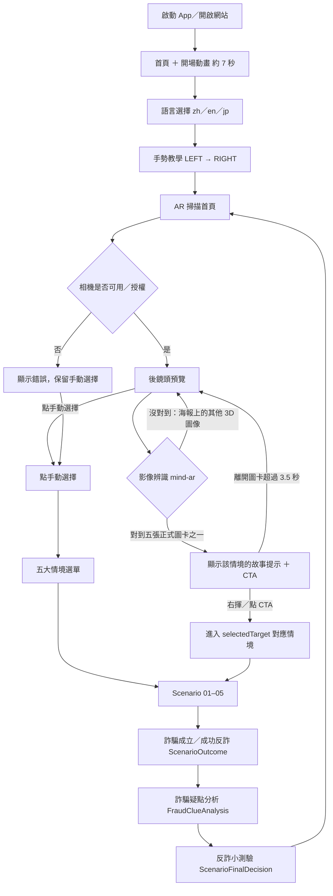

# CIBAR 系統規格書
## 刑事警察局 AR 詐騙互動體驗系統｜System Specification + Architecture Reference + Scenario Flow + Acceptance Checklist

| 文件基本資料 | 內容 |
| --- | --- |
| 文件名稱 | CIBAR 系統規格書（四合一：系統規格／架構參考／情境流程／驗收檢核） |
| 專案名稱 | 虛擬實境詐騙教育館－AR 詐騙互動體驗 |
| 建置單位 | 全球動力科技股份有限公司 |
| 製作人 | 陳昱華 Eric |
| 文件日期 | 【待更新：正式送審日期】 |
| 掃描基準 | `main` 分支實際程式碼（2026-08-26 完整重新掃描並實機 walkthrough）；本次校正的重點為**已完成但規格仍記為 `PLANNED` 的三件事**——Android App 封裝與 OTA、AR 影像辨識、離線執行——以及工作人員入口、二選一數量等實作與文件的落差。**未修改任何 production code** |

### 本文件的三個用途

1. **系統規格書**：讓新工程師理解 CIBAR 的架構——五個 Scenario、各自使用哪些 App module、哪些 UI 是共用的、角色／定位／多語／素材如何管理。
2. **Scenario 流程文件**：讓任何人知道玩家實際會從哪裡走到哪裡，包含每一次自動跳轉與每一個分支。
3. **驗收文件**：拿著手機從 Scenario 01 跑到 Scenario 05，直接依 `AR1-01`、`AR1-02` 逐項在「測試結果」欄勾選 `☐ 通過` 或 `☐ 未通過`。

> **驗收與規格使用同一組 Step ID。**本專案**不另外維護獨立的 QA Checklist 或流程文件**——規格定義玩家應該經歷什麼，驗收就是逐步確認實際系統是否符合這個流程。流程一旦修改，就更新該 Scenario 的 Flow & Acceptance 表格，規格與驗收永遠不會不同步。

### 狀態標記

| 標記 | 意義 |
| --- | --- |
| `IMPLEMENTED` | 目前程式已完成，可直接驗收。 |
| `PARTIAL` | 部分完成：已有實作但覆蓋不完整，或架構方向已定但仍有殘留。 |
| `PLANNED` | 已知需求，但目前程式尚未完成。**不得列為驗收通過項目。** |
| `LEGACY` | 舊架構殘留：仍在程式中，但已不是目前的正確歸屬。 |
| `SHARED`／`SCENARIO-SPECIFIC` | 共用層擁有／單一 Scenario 擁有。 |

### 開發環境與正式系統的區別

> **GitHub（Repository、Pull Request、branch、GitHub Actions、預覽發布）以及開發過程使用的 AI 編碼代理工具，全部屬於 `Development workflow only`，不是 CIBAR 的正式系統架構。**
>
> 目前 GitHub 的角色僅為：**開發階段的 source control／collaboration environment 與開發期間的預覽用途**。
>
> **CIBAR 的執行環境分兩層，不可混為一談（詳見附錄 A）：**
>
> - **Development / Browser Build**：React／Vite 的純靜態產物，瀏覽器可直接執行，供開發與內部測試使用。**GitHub／PR／Actions／預覽發布只屬於這一層的開發流程。**
> - **Final Exhibition Runtime（`IMPLEMENTED`）**：正式展場執行載體為**單一 Android App「反詐AR體驗」**（`android/`），以佐臻 JJSDK 驅動 AR 眼鏡的 RGB 相機與 ToF 手勢，並以 WebView 呈現 CIBAR。**APK 內建完整的 `webapp/dist`，由本機 https origin（`https://appassets.androidplatform.net/ScamAware-AR/`）提供**，安裝後第一次啟動即可全程離線；`INTERNET` 權限只用於背景 OTA 取得新的 web bundle。
>
> **「純前端靜態站台」只描述 browser build，不是交付形態。**正式交付形態是上面那支 APK。

### 目錄

| # | 章節 |
| --- | --- |
| 1 | [CIBAR System Overview](#1-cibar-system-overview) |
| 2 | [System Architecture](#2-system-architecture) |
| 3 | [Architecture Principles](#3-architecture-principles) |
| 4 | [Shared Modules Specification](#4-shared-modules-specification) |
| 5 | [Scenario 01 — 財富陷阱（假投資詐騙）](#5-scenario-01--財富陷阱假投資詐騙) |
| 6 | [Scenario 02 — 戀愛劇本（假交友詐騙）](#6-scenario-02--戀愛劇本假交友詐騙) |
| 7 | [Scenario 03 — 權威陷阱（假檢警詐騙）](#7-scenario-03--權威陷阱假檢警詐騙) |
| 8 | [Scenario 04 — 黑箱包裹（假賣家騙買家）](#8-scenario-04--黑箱包裹假賣家騙買家) |
| 9 | [Scenario 05 — 幽靈訂單（假買家騙賣家）](#9-scenario-05--幽靈訂單假買家騙賣家) |
| 10 | [Localization Specification](#10-localization-specification) |
| 11 | [Asset Ownership](#11-asset-ownership) |
| 12 | [Cross-System Acceptance](#12-cross-system-acceptance) |
| 13 | [Architecture Debt / Legacy Findings](#13-architecture-debt--legacy-findings) |
| A–D | [附錄](#附錄-a執行環境與部署需求) |

---

# 1. CIBAR System Overview

## 1.1 系統目的

CIBAR 是一套以手機直式畫面為主要操作介面的**反詐騙教育 Web App**。參與者選擇語言後進入 AR 掃描首頁，掃描（或手動選擇）進入五種詐騙劇本之一；每個劇本以模擬的社群、交友、通訊、投資、銀行、購物、物流或客服介面呈現真實詐騙話術，透過玩家的每一次選擇、即時風險警示、結局結算與反詐小測驗建立辨識能力。

建置目的：

1. 以沉浸式、可操作的模擬情境，使參與者辨識常見詐騙話術與風險節點。
2. 呈現停止付款、保存證據、向平台反映及撥打 165 查證等正確處置觀念。
3. 支援正體中文、English、日本語三語展演。
4. 以純前端架構降低現場部署複雜度，同時保留相機、定位與本機狀態等瀏覽器能力；正式展場以**單一 Android App 封裝出貨**（`IMPLEMENTED`，見附錄 A）。
5. 讓情境、模擬 App、共用介面、角色與素材可依模組獨立維護。

## 1.2 五個反詐情境

| 編號 | 正式名稱 | 詐騙類型 | 路由 | Route 數 |
| --- | --- | --- | --- | --- |
| 01 | 財富陷阱 Money Trap | 假投資詐騙 | `/scenario01-investment` | 12 |
| 02 | 戀愛劇本 Love Script | 假交友詐騙 | `/scenario02-romance` | 20 |
| 03 | 權威陷阱 Authority Trap | 假檢警詐騙 | `/scenario03-police` | 16 |
| 04 | 黑箱包裹 Black Parcel | 假賣家騙買家 | `/scenario04-shopping` | 27 |
| 05 | 幽靈訂單 Ghost Order | 假買家騙賣家 | `/scenario05-atm`（`LEGACY` 路由名） | 15 |

## 1.3 整體體驗



**玩家一旦進入「詐騙成立」或「成功反詐」，模擬劇情就結束了。**從那一刻起的三個畫面
（結算 → 詐騙疑點分析 → 反詐小測驗）都是 CIBAR 自己的教育 UI，由共用的 Outcome System
擁有（§4.3），不再帶任何模擬 App、手機外殼、瀏覽器或警政外框。流程固定且單向：

```text
Final Decision → ScenarioOutcome → FraudClueAnalysis → 反詐小測驗 → 返回 AR 掃描
```

**每一輪體驗的終點是共用的「反詐小測驗」，作答後按「返回掃描」回到 AR 掃描首頁**，讓下一位參與者直接開始；不再回到情境選單。

**影像辨識的架構歸屬（`IMPLEMENTED`，見 §2.10 與附錄 A L-02）：Image Recognition 屬於 CIBAR application capability，不屬於特定 AR 眼鏡品牌的 business logic。**概念責任鏈固定為：

```text
Camera source / hardware frame        由裝置（手機相機或 AR 眼鏡）提供影像
        ▼
Recognition module                    CIBAR 擁有：比對圖卡目標，輸出目標索引
        ▼
scenarioId                            CIBAR 擁有：目標索引 → 情境識別
        ▼
Scenario router                       CIBAR 擁有：導向對應 Scenario
```

硬體只負責提供 frame；「這張圖卡是哪一個情境」與「接下來進入哪一個 Scenario」永遠由 CIBAR 決定，**更換 AR 眼鏡品牌不應改變這條責任鏈的歸屬**。

**目前狀態：`IMPLEMENTED`。**辨識引擎為 `mind-ar` `^1.2.5`（搭配 `@tensorflow/tfjs`），比對資料集為 `public/assets/shared/ar/image-targets.mind`（由 `npm run build:image-targets` 依 `lib/ar/scenarioTargetMap.js` 的 `IMAGE_TARGETS` 順序編譯）。相機來源由 `lib/ar/cameraSource.js` 決定：AR 眼鏡上使用 `window.__jorjinCamera` 的 MJPEG 串流，桌機／手機瀏覽器才退回 `getUserMedia`；**眼鏡上絕不 fallback 到手機鏡頭**。五張圖卡與情境的對應見 §2.10。

## 1.4 共用入口 Flow & Acceptance

| 步驟 | 階段 | 測試重點與畫面/話術邏輯 | 預期結果與跳轉邏輯 | 測試結果 |
| --- | --- | --- | --- | --- |
| AR0-00 | 開場動畫 | 冷啟動 App（或重新載入頁面），確認首頁**第一幀就是首頁背景**，其上播放約 7 秒的純 CSS 開場動畫：中文主標先出現、英文與日文其後，最後動畫收掉、首頁 UI 顯示。全程不得出現黑畫面、白畫面或背景重新載入。 | 動畫結束後 overlay **unmount**，語言按鈕可按；動畫播放期間不接受任何點擊。同一次頁面載入內返回首頁**不重播**。現場需要略過時，於畫面**右上角 1.5 秒內連點 3 下**（隱藏的工作人員捷徑）。 | ☐ 通過<br>☐ 未通過 |
| AR0-01 | 語言選擇 | 啟動 App／開啟網站，確認語言選擇頁顯示正體中文、English、日本語三個選項，擇一點選。 | 記住所選語言並進入**手勢教學頁**（`/gesture-tutorial`）；重新整理後語言不變。 | ☐ 通過<br>☐ 未通過 |
| AR0-01a | 手勢教學（LEFT） | 手勢教學頁沿用語言首頁同一張 Hero 圖為全螢幕背景，主文字置中且以所選語言顯示「請向左揮動／Wave left／左に手を振ってください」。**先向右揮動一次**，再向左揮動。 | 向右揮動**完全無反應**（不進入下一步、進度點不變）；真正的 `LEFT` 才進入下一步。畫面上**不得出現任何跳過或前進按鈕**（下一步／跳過／返回／開始體驗皆不得存在），也不得以鍵盤通過。**兩個步驟面板本身是可點擊的觸控備援**（`GestureTutorial` 的 `.gesture-tutorial-step`）：點左側面板等同一次 `LEFT`，而且只有「目前這一步」的面板可按，另一個是 `disabled`——它完成的是同一個步驟，不是跳過教學。 | ☐ 通過<br>☐ 未通過 |
| AR0-01b | 手勢教學（RIGHT → 完成） | 進入第二步後確認主文字為「很好！接著向右揮動／Great! Now wave right／いいですね！次は右に手を振ってください」。**先向左揮動一次**，再向右揮動。 | 向左揮動**完全無反應**；真正的 `RIGHT` 才完成，顯示「手勢教學完成／Gesture tutorial complete／ジェスチャー練習完了」約 1 秒後**自動**進入 AR 掃描首頁，不需再按任何按鈕。 | ☐ 通過<br>☐ 未通過 |
| AR0-01c | 手勢教學（重新進入與不重播） | 由 `/language` 重新選一次語言再次進入教學；另完成任一情境後由反詐小測驗「返回掃描」。 | 每次由語言頁進入都從第一步（向左揮動）重新開始，不保留上一輪進度；情境結束只回到 AR 掃描首頁，**不再重播教學**（手勢教學只在語言選擇後執行一次）。 | ☐ 通過<br>☐ 未通過 |
| AR0-02 | 所在地設定 | 於語言頁按右上角的**齒輪（工作人員設定）**按鈕（或長按隱藏入口：左上角 logo 區域按住 5 秒）進入所在地設定，確認可取得目前位置或手動選擇縣市與行政區，並顯示對應的警察局、地檢署、地方法院與市話區碼。 | 儲存後所在地被鎖定，可交付玩家；未設定時系統採臺北市信義區預設資料。 | ☐ 通過<br>☐ 未通過 |
| AR0-02a | 工作人員設定入口（語言頁） | 在語言選擇頁上逐一檢視所有可見元素，確認**有且僅有一個**可見的工作人員入口——右上角的**齒輪圖示按鈕**（`.language-location-button`，無文字標籤，`aria-label` 為「工作人員設定／Staff settings／スタッフ設定」）——且 Touch 與 Mouse 皆可點擊、點擊後進入既有的所在地設定畫面；除它之外不得有其他可見的 `/staff-setup` 入口；短按左上角 logo 區域確認無作用。 | 玩家／現場人員看得到三個語言選項＋一個齒輪按鈕；隱藏 5 秒長按仍可用（§2.7.2）。**若齒輪按鈕不存在，或除它以外另有可見入口，即為未通過。** | ☐ 通過<br>☐ 未通過 |
| AR0-03 | 工作人員設定 | 分別測試拒絕定位、定位逾時、瀏覽器不支援定位與無網路四種情況。 | 各自顯示對應提示訊息，且仍可改用手動設定完成所在地。 | ☐ 通過<br>☐ 未通過 |
| AR0-04 | AR 掃描 | 允許相機權限，確認掃描首頁顯示即時影像與依語言切換的導引主視覺。眼鏡上應為眼鏡自身的 RGB 相機（MJPEG），瀏覽器上為後鏡頭。 | 可看到即時影像；離開此頁後相機使用指示應停止。**眼鏡上不得改用手機鏡頭**。 | ☐ 通過<br>☐ 未通過 |
| AR0-05 | AR 掃描 | 拒絕相機權限或在無鏡頭裝置開啟，確認錯誤提示與手動選擇按鈕。 | 顯示錯誤訊息但仍可點手動選擇進入情境選單。 | ☐ 通過<br>☐ 未通過 |
| AR0-06 | AR 掃描 | 以五張正式圖卡分別對準鏡頭測試影像辨識，每張至少各測一次（`IMPLEMENTED`）。對到之後**先不要做任何動作**，等 10 秒。 | 對到圖卡時**不得自動進入情境**：底部提示換成該情境的第一句故事＋CTA（文案見 §2.10），相機繼續運作。等 10 秒仍停在掃描頁。 | ☐ 通過<br>☐ 未通過 |
| AR0-06a | AR 掃描 | 接續 AR0-06，對到圖卡後**右揮**；另一張改用**觸控點 CTA**。 | 兩者都進入該圖卡對應的情境（對應表見 §2.10），且走的是同一個 `enterSelectedScenario()`。沒有對到任何圖卡時右揮**不得有任何反應**，也不得回到上一張對到過的圖卡。 | ☐ 通過<br>☐ 未通過 |
| AR0-06b | AR 掃描 | 對到圖卡後輕微晃動鏡頭讓追蹤短暫中斷（1～2 秒），再對回同一張；接著把鏡頭完全移開超過 5 秒。 | 短暫中斷時提示與 CTA **不得閃掉**；完全移開超過容忍時間（3.5 秒）後才清除，回到「移動鏡頭，尋找隱藏的線索」。 | ☐ 通過<br>☐ 未通過 |
| AR0-06c | AR 掃描 | 把鏡頭對準海報上與情境無關的 3D 圖像（非五張正式圖卡）。 | 維持正常掃描狀態：不跳頁、不顯示「辨識失敗」、不震動、不出現任何錯誤，畫面停在「移動鏡頭，尋找隱藏的線索」。 | ☐ 通過<br>☐ 未通過 |
| AR0-07 | 情境選單 | 確認五大情境卡（財富陷阱、戀愛劇本、權威陷阱、黑箱包裹、幽靈訂單）名稱與副標正常顯示，並在三種語言下各檢視一次。 | 名稱與副標依語言切換；點選任一情境進入該情境的案件簡報。 | ☐ 通過<br>☐ 未通過 |
| AR0-08 | 情境選單 | 玩到一半返回情境選單後再次進入同一情境。 | 情境從頭開始，不殘留上一輪的進度、對話或註冊狀態。 | ☐ 通過<br>☐ 未通過 |
| AR0-09 | 反詐小測驗 | 於任一情境結束時的反詐小測驗點「返回掃描」。 | 回到 AR 掃描首頁，下一位參與者可直接開始。 | ☐ 通過<br>☐ 未通過 |
| AR0-10 | 例外處理 | 清除瀏覽器資料後直接輸入掃描頁、手勢教學頁或情境選單網址；另輸入不存在的網址。 | 未選語言時一律導回語言選擇頁（手勢教學頁同樣受 `RequireLanguage` 保護）；不存在的網址導回首頁，不出現空白或錯誤畫面。 | ☐ 通過<br>☐ 未通過 |

---

---

# 2. System Architecture

## 2.1 CIBAR 是什麼

CIBAR 不是「五個各自實作 UI 與流程的詐騙情境網頁」，而是：

> **一個共用的 CIBAR Experience Platform，承載五個詐騙 Scenario。Scenario 只負責故事編排（story orchestration）；可重複使用的模擬 App、共用互動介面、角色、所在地資料、多語與素材，全部由平台層的共用模組負責。**

這個轉向已在程式中大幅完成，並由三支自動化邊界檢查把關（`validate:boundaries`、`validate:line`、`validate:shared-ui-ownership`）。尚未完成的部分逐項標記為 `PARTIAL`，並列入 §13 Architecture Debt。

## 2.2 Architecture Map（依實際目錄繪製）

```text
CIBAR Experience Platform
│
├─ Shell / Routing Layer                                            [IMPLEMENTED]
│   ├─ src/main.jsx · App.jsx · routes.jsx        單一路由註冊表（HashRouter）
│   ├─ src/shell/AppShell.jsx · TopBar.jsx        固定直式舞台、頂部列
│   ├─ src/shell/useFitStage.js                   舞台縮放
│   ├─ src/shell/StageClassContext.jsx            由頁面宣告舞台主題 class
│   ├─ src/lib/RequireLanguage.jsx                語言守門
│   └─ src/lib/RequireLocationProfile.jsx         所在地守門（僅 Scenario 03）
│
├─ Scenario Layer            src/pages/scenarioNN/                  [IMPLEMENTED]
│   ├─ Scenario 01 財富陷阱      ├─ Scenario 02 戀愛劇本
│   ├─ Scenario 03 權威陷阱      ├─ Scenario 04 黑箱包裹
│   └─ Scenario 05 幽靈訂單
│       職責：劇情順序、對話腳本、玩家決策、詐騙推進、跨 App／LINE／電話的
│             handoff、run state、結局條件、教育結算內容。
│
├─ App Module Layer          src/apps/                              [IMPLEMENTED]
│   ├─ gugo-invest    GuGo Invest 股購投資       S01              [IMPLEMENTED]
│   ├─ coin-winner    幣勝客 Coin Winner         S02              [IMPLEMENTED]
│   ├─ blackpi        黑皮購物 BlackPi           S04              [IMPLEMENTED]
│   ├─ mydondon       買東東 MyDonDon            S05              [IMPLEMENTED]
│   ├─ meetu          MeetU 覓友交友 App         S02              [IMPLEMENTED]
│   ├─ hpe-logistics  黑皮通 HPE Logistics       S04 ＋ S05        [IMPLEMENTED]
│   └─ line           LINE 對話外殼              S01／S02／S03     [IMPLEMENTED]
│
├─ Host / Adapter Layer      src/pages/scenarioNN/                  [IMPLEMENTED]
│   ├─ pages/scenario02/CoinWinnerScreens.jsx + coinWinnerAppState.js
│   ├─ pages/scenario04/blackpi/{hosts.jsx, appState.js, routes.js}
│   └─ pages/scenario05/Marketplace*.jsx + useMarketplaceNav.js
│       App 與 Scenario 之間的唯一接點：host 讀 run state、以 props 餵給 App，
│       再把 App 發出的語意事件（「買家開啟了商品」「付款完成了」）翻譯回
│       store 寫入與 route 導航。App 不知道自己身處某個劇情，也不知道有 URL。
│
├─ Shared Experience         src/components/, src/shared/           [IMPLEMENTED / PARTIAL]
│   ├─ ScenarioEntryBriefing      五情境共用 Briefing               [SHARED]
│   ├─ ScenarioFinalDecision      五情境共用「反詐小測驗」          [SHARED]
│   ├─ components/outcome/        Outcome System（CIBAR 自有教育 UI）[SHARED]
│   │   ├─ ScenarioOutcome        詐騙成立／成功反詐結算            [SHARED]
│   │   ├─ FraudClueAnalysis      詐騙疑點分析                      [SHARED]
│   │   ├─ outcomeContract        state → tone／刑事熊 的唯一解析點  [SHARED]
│   │   ├─ outcomeStrings         結算與流程固定字彙（zh/en/jp）     [SHARED]
│   │   └─ resultMascots          10 張結局刑事熊的唯一映射          [SHARED]
│   ├─ FraudWarningBanner         防詐警示浮層                      [PARTIAL：S05 未使用]
│   ├─ Button / ButtonGroup / Card 基本控制項                       [SHARED]
│   ├─ shared/phone/PhoneHome     手機桌面外殼                      [PARTIAL：僅 S05]
│   ├─ Phone / Call               來電與通話                        [SCENARIO-SPECIFIC：僅 S03]
│   │     （裝置外殼 PhoneShell 與幽靈訂單網站外框已依 AD-07 歸還 S03／S05）
│   └─ Notification               通知                              [SCENARIO-SPECIFIC：三份實作]
│
├─ AR Interaction Contract   src/lib/arInteraction/                [PHASE 3 BRIDGED]
│       畫面宣告語意互動幾何（display／single／dual），未來 Gesture Bridge
│       只讀宣告，不數畫面上的按鈕、不碰 DOM（§4.12）。
│       Phase 1 只接三個代表畫面；Phase 2 已全面 migrate 五情境
│       （135 個 story surface，清單見 docs/ar-interaction-phase2-migration.md）。
│
├─ Shared Data
│   ├─ Characters / Casting   src/experience/characters/            [IMPLEMENTED]
│   │     roles.js · names.js · visuals.js · casting.js
│   ├─ Location / Context     src/lib/location/, src/lib/session/   [IMPLEMENTED]
│   │     LocationManager · RegionAgencyResolver · LocationProfileStore
│   │     data/location/locationDataset.js · session/ScenarioSessionFactory.js
│   └─ Localization           src/shared/i18n/, pages/*/i18n*.js    [IMPLEMENTED]
│         查表機制 shared/i18n/createTranslator.js（不含文案）
│         App 自有字典 src/apps/<app>/i18n/（§10.2；§13 AD-14 已解決）
│
├─ Styling Layer                                                    [IMPLEMENTED]
│   ├─ src/styles/global.css              全域 foundation，且只有 foundation：
│   │                                     reset／`:root` 變數／`.ar-stage`／`.app`／
│   │                                     shell 列／base typography／`.btn`／`.hero`
│   │                                     與跨模組共用的 keyframes（26 條規則）
│   ├─ src/styles/scenarioNN.css          Scenario 專屬（S01／S02／S03），main.jsx 載入
│   ├─ src/pages/**/<Page>.css            單一頁面／該 Scenario 自有元件專屬，
│   │                                     由該頁面或元件自行 import
│   ├─ src/components/**/<Component>.css  共用元件專屬，由該元件自行 import
│   └─ src/apps/<app>/styles/             App module 專屬，由該模組自行 import
│       規則由「誰 render 這個 class」決定，不由名稱決定；`validate:shared-ui-ownership`
│       在 `prebuild` 內把關（§13 AD-04／AD-05／AD-06）。
│
└─ Asset System                                                     [IMPLEMENTED]
    ├─ public/assets/shared/characters/<visualId>/   角色素材（跨情境）
    ├─ public/assets/shared/ui/                      共用 UI 素材（無 shared/brand/：品牌圖由 App module 擁有）
    ├─ public/assets/scenarios/scenario-0N/<kind>/   情境專屬故事素材（images／videos／audio）
    ├─ src/apps/<app>/assets/                        App 專屬品牌素材
    ├─ src/assets/scenarios/scenario-0N/images/      需 Vite 指紋化的情境素材
    └─ webapp/asset-sources/                         原始母檔（不出貨、不打包）
        `validate:asset-ownership` 在 `prebuild` 內把關七條不變式（§11.6）。
```

## 2.3 Scenario Layer

| 項目 | 說明 |
| --- | --- |
| 位置 | `webapp/src/pages/scenario01/` ～ `scenario05/` |
| 擁有 | 劇情順序、對話腳本與節點、玩家決策分支、詐騙推進、警示觸發時機、跨平台 handoff、run state、結局條件、教育結算文案 |
| 不擁有 | 模擬 App 的介面與平台功能、LINE 對話外殼、結算版面、測驗版面、角色資料、所在地資料、素材路徑 |
| Run state | `scenario01Store.js`、`scenario02Store.js`、`scenario03Store.js`、`shoppingStore.js`（S04）、`scenario05Store.js`；一律以 `cibar-scenarioNN-` 前綴儲存 |
| Run 起點 | `lib/enterScenario.js`：`prepareScenarioEntry()`（S03／S04／S05 由選單或 AR 進入時重設）、`useScenarioRunStart()`（S01／S02 於 Briefing 重設，因為它們也可從情境內部重新開始） |

## 2.4 App Module Layer

**核心原則：Scenario ≠ App。** MyDonDon 是一個模擬二手交易平台 App；Scenario 05「幽靈訂單」是發生在該平台上的詐騙故事。Scenario 05 可以使用 MyDonDon，但 **MyDonDon 不等於 Scenario 05**。同樣地，MeetU 是一個獨立的模擬交友 App；Scenario 02「戀愛劇本」使用 MeetU，但 **MeetU 不等於 Scenario 02**：MeetU 只負責 App 介面與互動呈現，並以 callback 回報玩家的 like／skip／選擇，由 Scenario 02 決定劇情如何前進。同樣原則適用於每一個 App。

| App module | 品牌 | 使用者 | 模組內容 | 狀態 |
| --- | --- | --- | --- | --- |
| `apps/gugo-invest/` | GuGo Invest／股購投資 | S01 | 完整平台：品牌、註冊與投資 onboarding gate、首頁／行情／個股／持股／帳戶、圖表、store、i18next 字典、樣式、型別、公開 API；以 splat route `/platform-register/*` 掛載自己的子路由。onboarding 進度以 `GUGO_ONBOARDING_STAGES`（`register`／`deposit`／`funded`）經 `onOnboardingStageChange` 回報給 host——只描述平台自身狀態，不含任何 Scenario step／route | `IMPLEMENTED` |
| `apps/coin-winner/` | 幣勝客 Coin Winner | S02 | landing／register／home／deposit／trading／withdrawal 六個畫面 ＋ brand 常數 ＋ catalog（策略 id 與啟用金額）、home visit 詞彙、`useEventCallback`、**自有三語字典（`i18n/`）**、模組樣式（`styles/index.css`，110 條規則，由 `index.js` 自行 import） | `IMPLEMENTED`：樣式歸屬已完成，`styles/global.css` 不再有任何 `bition-*` 規則（§13 AD-04 RESOLVED）。無 `components/`／`assets/`：六個畫面無共用子元件，全模組不使用任何圖檔。App ↔ Scenario 邊界已完成（不 import scenario store／pages，不含 route literal） |
| `apps/blackpi/` | 黑皮購物 BlackPi | S04 | 商城 shell、底部導覽、商品卡、聊天畫面、Toast、12 個畫面、商品目錄、**自有三語字典（`i18n/`）**、**商品素材表（`data/assetMap.js`，唯一 consumer 即本模組）**、模組樣式、brand、公開 API。無 `assets/`：本模組不持有品牌圖檔，它解析的商品照片是 Scenario 04 的故事素材（§11.3、§13 AD-15） | `IMPLEMENTED` |
| `apps/mydondon/` | 買東東 MyDonDon | S05 | 商城 shell、header／bottom nav、商品照片、聊天 UI、5 個畫面、商品目錄、**自有三語字典（`i18n/`）**、品牌素材、模組樣式、公開 API | `IMPLEMENTED` |
| `apps/meetu/` | MeetU 覓友 | S02 | App shell（header／bottom nav）、品牌 logo 與 app icon 素材、人物卡與滑動互動、like／skip 控制項、配對浮層、站內聊天介面、建議回覆、頭像、通知式 interstitial、桌面圖示磚、入口／滑卡畫面、模組樣式、公開 API | `IMPLEMENTED` |
| `apps/hpe-logistics/` | 黑皮通 HPE Logistics | S04 ＋ S05 | 品牌、外殼、託運單卡、狀態徽章、物流時間軸、追蹤畫面、物流狀態 API、**自有三語字典（`i18n/`）**、模組樣式與素材 | `IMPLEMENTED` |
| `apps/line/` | LINE 對話外殼 | S01／S02／S03 | 對話 shell、body/scroll 幾何、直接／群組 header、頭像、進出訊息與系統訊息、時間戳與已讀、typing、快速回覆、footer slot、LINE CSS | `IMPLEMENTED` |

**尚未模組化的 App（`PARTIAL`）**

- **模擬網路銀行**：`pages/scenario03/BankApp.jsx`，目前只有一個使用者，尚無重用需求。

**邊界契約與自動化把關**

- `validate:boundaries`：禁止 `apps/**` import 任何 scenario 路徑，禁止 `apps/**` import 任何 Scenario-owned 字典（`shared/i18n/scenarioNN*`、`pages/scenarioNN/i18n`——App 有自己的 `i18n/`，§13 AD-14），禁止不同 `pages/scenarioNN` 互相 import，並以兩條規則擋住 App 讀取 scenario run state：已完成解耦的 App（`apps/blackpi`、`apps/coin-winner`、`apps/mydondon`）不得 import `lib/scenarioNNStore`／`data/scenarioNN*`／`pages/scenarioNN`；**所有 App 都不得**以 module 名稱 import run state store（`scenarioNNStore`、`shoppingStore`、`scenarioNNCharacters`，extensionless 與 `.js`／`.jsx`／`.mjs`／`.cjs`／`.ts`／`.tsx` 一律涵蓋）——`SCENARIO_STATE_DEBT` 例外清單已清空，不再有任何 App 被豁免。掃描 325 個原始檔。
- `validate:i18n`：逐 localization unit 檢查三語鍵值缺漏與 EN／JP 鍵集合一致（Scenario 02／04／05 各一，五個 App 各一），並掃描全部 34 個字典模組的原始碼找重複鍵（§10.2）。**在 `prebuild` 內**。
- `validate:line`：禁止 consumer 自行複製 LINE header／bubble 標記。
- `validate:outcome-ownership`：**Outcome System 歸屬**（§4.3）。結算與詐騙疑點分析畫面由 render 誰決定、不由檔名決定，接著逐條檢查：（A）十個結算與五個分析畫面必須就是預期的那一組——某個情境靜靜地不再 render 共用元件，或多長出第二個結局頁，都會被擋；（B）這些頁面不得 import 任何 App module 的**元件**（資料可以：S05 的損失金額來自 MyDonDon 商品目錄），也不得 import 或 render `PhoneShell`／`PoliceFrame`／`BrowserChrome`／`SuqubianSiteHeader`／`AppShell`，更不得呼叫 `useStageClassName`；（C）這些頁面不得出現任何 `className`，且 `components/outcome/` 以外的樣式檔不得宣告 `cibar-*` class；（D）`classPrefix`／`theme`／`embedded` 三個逃生口在元件與呼叫端都必須不存在；（E）結算頁只能指向唯一一個 route，且必須是該情境的詐騙疑點分析；（F）分析頁只能指向唯一一個 route，且必須是該情境的 `/quiz`；（G）不得出現 `/scenario-menu`、`/ar-scan`、`/language`、restart、再玩一次、體驗另一件商品、完整分析、五項評估、個人化分析、進行關鍵判斷；（H）10 張結局 artwork 只能由 `components/outcome/resultMascots.js` 擁有——任何其他檔案寫出 `images/results/` 路徑或讀 `RESULT_MASCOTS` 都是違規。（I）五個 `pages/scenarioNN/Quiz.jsx` 由「render 誰」認定，必須只 render `<ScenarioFinalDecision>`、不得包任何外框／fragment／第二顆 CTA，不得帶 `className` 或自帶樣式表，不得使用 `useStageClassName`／`useARInteraction`／`useNavigate`／React state，且只能傳 `t`／`question`／`options`／`correctIndex`／`explanation`／`backTo`；（J）`.antifraud-quiz-*`／`.quiz-option`／`.quiz-explain` 只能由 `components/ui/ScenarioFinalDecision.css` 宣告、只能由 `ScenarioFinalDecision.jsx` render；（K）**共用 Ending 元件 render 但沒有命名空間前綴的 state class**（目前是結算金額列的 `.is-emphasis` 與作答後選項的 `.correct`／`.wrong`）同樣只能由三個 Ending 樣式表宣告——這組由「三個 Ending 樣式表宣告了什麼、扣掉前綴已涵蓋的部分」推導，不列舉名字，明日多一個 modifier 當天就受保護；markup 面刻意不擴張（`correct`／`wrong` 是三份字典裡真的會出現的英文字），因為 modifier 只有掛在 C／J 已擁有的元素上才會生效；（L）**Ending System 的 stage 永遠中性**：十五個 Ending 頁面、三個共用元件、以及三個共用元件在 `src/` 內 import 到的每一個模組，都不得出現 `useStageClassName`／`StageClassContext`／`StageClassProvider`／`ar-stage`——context 是通往 stage 元素的一條路，用 class 名字把它找出來是另一條。另外檢查 C 的 markup 面（`components/outcome/` 以外的檔案不得 render `cibar-outcome*`／`cibar-analysis*`，`cibar-` 前綴同時是本專案的 localStorage 命名空間，因此只擋這兩族），三個元件各自 import 自己的樣式表，且情境頁不得自行拼出 `詐騙成立`／`成功反詐`／兩個 CTA 的字串。C／J／K 的 CSS 比對一律先去除註解——`global.css` 檔頭會引用這些選擇器來說明它們搬去哪了，說明去向的檔案不該讀成宣告它們的檔案。由 `test:outcome-ownership` 以真實 render 覆蓋同一組規則，並由 `test:anti-fraud-quiz` 以 mutation 驅動真正的 validator 覆蓋 I／J。
- `test:outcome-reachability`：**十個結局真的走得到**（§4.3、§13 AD-23）。與上面那一條問的是不同的問題：歸屬檢查回答「誰擁有這個畫面」，這一條回答「玩家走不走得到」。AD-23 之所以能長期存活，正是因為舊檢查只確認「某個檔案裡出現過某個 route 字串」——`PrivateChat.jsx` 寫著 `/scenario02-romance/topup-warning`、`TopupWarning.jsx` 寫著 `/scenario02-romance/stopped-result`，兩句都是真的，而 Scenario 02 的成功反詐仍然沒有任何操作可以抵達。因此這一支完全不用 `source.includes('/route')`：五個情境各有一個小 adapter，從該情境**真正的 final decision** 出發推導兩個結局的落點——S01 掛載 `WithdrawFail` 跑它宣告的兩個分支、S02 從 dialogue tree 讀 `s22-choice` 再跑 `RedWarning`／`GuaranteePage`、S03 掛載 `FinalDecision` 並從 165 通話自己的 continue handler 續走、S04 走訪客服對話樹找出真正分岔的兩個 terminal node 再把 `PlatformSupportChat` 掛在各自的 terminal 上讀它導去哪、S05 從 `buyer.s07.explain` 沿 redirect 走到 `OrderGone`。刻意不建立通用 graph engine，也不為了統一格式重寫五個情境。只要兩個分支再度匯流、少掉一個 outcome route、final decision 被繞過，或某個結局重新變成只有 URL 打得開的死頁，這支就會 FAIL。
- `validate:asset-ownership`：檢查素材歸屬的七條不變式（§11.6），其中 RULE 2 是素材面的邊界規則——Scenario 不得引用另一個 Scenario 的素材資料夾。`shared/`、App module 自己的 `assets/`、以及共用 registry 都是合法路徑；App module 不是 Scenario，因此 BlackPi 解析 Scenario 04 的店面照片不算跨界。
- `validate:shared-ui-ownership`：檢查共用 UI 歸屬（363 個原始檔／CSS）。四個面向：（1）舊有的共用元件歸屬與 Scenario 不得自行複製 shell；（2）App module 樣式歸屬——已擁有樣式的 App，其樣式表必須由模組自己 import，且「consumer 全在該模組內」的 class 不得定義在模組外（依 className 使用者推導，不列舉 selector 名稱）；（3）LINE 樣式歸屬八條規則：（1）只有一份 LINE stylesheet；（2）其他樣式檔不得宣告 LINE 擁有的 class；（3a）**共用 LINE 元件 render 的 class 必須由 LINE stylesheet 宣告**——反向 invariant，少了它，把 `.line-header` 從 `line.css` 刪掉、`Line.jsx` 仍 render `line-header` 會全數通過；（3b）該些 class 不得由 Scenario／全域樣式定義；（4）`global.css` 不得再出現 `line-` 命名空間的規則（**無任何例外**：原本唯一豁免的 shell stage variant `.ar-stage.line-stage` 已隨 AD-06 移入 `styles/scenario01.css`，因為它的兩個 consumer 都是 Scenario 01 畫面）；（5）LINE 模組不得佔用未加前綴的全域選擇器；（6）LINE 樣式引用的 keyframe 與 custom property 必須由模組自己宣告；（7）樣式 import 由模組自己持有。兩項抽取一律用真正的 parser／scanner，不用 regex：class surface 由 `apps/line/components/Line.jsx` 的 **JSX AST**（oxc，經 `rolldown/experimental`，與 `scripts/jsx-test-loader.mjs` 同一個 parser）反推，因此只存在於 conditional template literal 的 modifier（`line-app-full`／`line-quick-replies-picked`／`line-quick-pill-active`）也會被算進來；selector 抽取改為 **brace-aware、nesting-aware** 的掃描，`@media`／`@supports`／`@container` 與多層巢狀內的規則一律讀得到，`@keyframes` 內容整段略過。新增畫面自動納入檢查，由 `test:line-style-ownership` 以 fixture 驅動真正的 validator 覆蓋。（4）**`global.css` 只能是全域 foundation**（AD-06）：`global.css` 內任何一條規則，若它 style 的 class 全部由**單一 owner**（某個 Scenario、某個 App module、某個共用元件、入口頁面群或工作人員頁面群）render，或全樹**零 consumer**，一律報錯並指出該去哪個檔案。owner 由 consumer 路徑推導，不列舉 selector 名稱；`:not()` 內的 class 不算被 style（`h1:not(.gugo-app *)` 是 element 規則）；compound 到共用 primitive 上的 variant（`.btn.danger`）跟著 primitive 走。class surface 另補上抽取缺口：讀得穿 `` `a ${b}`.trim() `` 這類 method call，也讀得穿 `let cls = '…'; cls += '…'` 這種區域變數累加；runtime 才組出來的 class（`` `${p}-theme-${theme}` ``）以 pattern 比對，因此 Outcome System 用 `` `cibar-outcome-${tone}` `` 組出來的那一組不會被誤判為死碼。**method call 逐一按該方法真正的語意處理，不整批放行**：`.map()` 是轉換而非透傳（會綁定 callback 參數後求值 callback 的回傳值，讀不了就回 UNKNOWN，絕不改用陣列元素本身），`.join()` 只在分隔字元為空白時等價於元素集合（`join()` 預設逗號、`join('-')` 會把兩個 class 黏成一個名字，都回 UNKNOWN），`.concat()` 區分字串串接與陣列串接，`.trim()`／`.toString()` 只對非陣列透傳。誤報可接受，**捏造出一個沒人 render 的 class 名字不可接受**——那會同時造成錯誤 ownership 與錯誤的死碼判定。
- `routes.jsx` 只從各模組的公開 API（`apps/<app>/index.js`）匯入畫面；若該 App 需要 scenario run state，則改由該 Scenario 的 host 匯入（BlackPi 走 `pages/scenario04/blackpi`，Coin Winner 走 `pages/scenario02/CoinWinnerScreens.jsx`，MyDonDon 走 `pages/scenario05/Marketplace*.jsx`）。

**邊界現況**：已無任何 App module import Scenario 的 run state store，也已無任何 App module import Scenario 的字典（§13 AD-14）。`apps/blackpi`、`apps/coin-winner`、`apps/mydondon` 都只接收 props 並發出語意事件，run state 分別由 `pages/scenario04/blackpi`、`pages/scenario02/{CoinWinnerScreens.jsx,coinWinnerAppState.js}`、`pages/scenario05/Marketplace*.jsx` 持有。導航方向：Coin Winner 與 BlackPi 的導航決策也都已移出（Coin Winner 不呼叫 `switchToLine()`、不含任何 `/scenario02-romance/` route literal；BlackPi 不再持有 `BottomNav` 分頁與各 screen 的 `/scenario04-shopping/*`，route 集中在 `pages/scenario04/blackpi/{hosts.jsx,routes.js}`）。兩者皆不含任何 scenario route literal、不 import router。**檔案位置、導航方向與資料方向的分離皆已完成**（§13 AD-01 RESOLVED，含 AD-01a／AD-01b／AD-01c；AD-02、AD-02b RESOLVED）。

## 2.5 Shared Experience Components

見 §4 Shared Modules Specification 的逐一規格。

## 2.6 Character / Casting

角色系統把「角色是誰」「角色長什麼樣」「這一輪由誰演」分開：

| 元件 | 內容 |
| --- | --- |
| **Role 定義** `roles.js` | `roleId`（如 `scenario05.buyerStrollerMom`）、性別、命名風格（`casual`／`cute`／`formal`）、可用情境 `scenarioScope`、視覺策略（`fixed`／`random`／`none`）、命名策略 |
| **Fixed characters** | `fixed: true` ＋ `resolvedNames`：S01 陳老師／股海小白／財富自由ing、S05 三位買家人設。姓名與臉每輪相同 |
| **Random pools** `names.js` | `NAME_POOLS.female.casual/cute`、`NAME_POOLS.male.casual`，**zh／en／jp 各自獨立的姓名池**；正式男性姓名（員警／檢察官）由 `MALE_FORMAL_NAME_PARTS` 以姓＋名組合，中英配對、日文獨立 |
| **Visual registry** `visuals.js` | 每個視覺一個 ID 與一個資料夾 `assets/shared/characters/<visualId>/`；宣告 `gender`、`randomEligible`、`eligibleRoles`、`scenarioScope`，以及該視覺擁有的 avatar／profilePhoto／largePhotos／videos bundle |
| **Casting** `casting.js` | 每輪由 `resolveCast(scenarioId, roleRequests)` 解析：先檢查隨機槽位是否超出可用池（**不足直接丟錯，不用重複的臉補位**），再逐一指派視覺與三語姓名，同輪內姓名與臉都不重複 |
| **Scenario adapter** | `lib/scenario01Characters.js`、`scenario02Store.js` 的 cast 區塊、`scenario05Store.js`、`data/scenario05Characters.js`、`pages/scenario01/avatars.js`：只負責「這輪要哪些角色」與「保存解析結果」，**不擁有姓名、圖片路徑或視覺定義** |
| **App profile identity** | 角色在 App 內的身分（如 MyDonDon 買家的「已加入 4 年」「共同社團」）由 Scenario adapter 提供文案鍵，視覺仍來自 registry |

**關鍵約束**：選角是每輪一次的快照（存在該情境的 storage），不是每次 render 重抽。`characterSystem.test.js`（12 項）驗證池不足報錯、同輪不重複、三語姓名一致性。

## 2.7 Location / Context

**資料如何進入 Scenario：**

```text
工作人員（#/staff-setup）
   │  按「取得目前位置」或手動選擇
   ▼
LocationManager.js          navigator.geolocation（高精確度、20 秒 timeout、禁用快取位置）
   │  錯誤正規化：unsupported / permission-denied / position-unavailable / timeout / offline
   ▼
RegionAgencyResolver.js     Haversine 距離比對本機 locationDataset：
   │                        縣市中心 → 縣市；該縣市行政區樣本 → 行政區（>15 km 不指定）
   │                        再查出警察局、地檢署、地方法院、市話區碼
   ▼
LocationProfileStore.js     profile = { source, coords, county, district, agencies, areaCode, updatedAt }
   │                        IndexedDB `cibar-location` → LocalStorage 鏡像 → 記憶體降級
   ▼
RequireLocationProfile.jsx  Scenario 03 全部 16 個 route 的守門
   ▼
ScenarioSessionFactory.js   每輪產生一次 session 快照：案件編號、startedAt、
   │                        承辦員警／檢察官姓名（走 Character layer）、
   │                        含連續 165 且符合區碼的模擬市話、帳號與期限
   ▼
Scenario 03 畫面            假來電號碼、LINE 案件卡、假案件網站機關名稱、
                            公文案號與時間戳（時間＝ startedAt ＋ SCENE_MINUTE_OFFSETS）
```

| 資料 | 來源 | 使用的 Scenario |
| --- | --- | --- |
| GPS 座標 | `navigator.geolocation`（只在工作人員設定頁呼叫） | 僅寫入 profile，不出現在任何 Scenario 畫面 |
| 縣市／行政區 | 本機 `locationDataset.js` 比對 | S03（S02 另以縣市產生主線角色 bio 的城市名） |
| 警察局／分局 | 警察局由縣市資料表提供；**分局由所在地實際轄區決定，deterministic，不隨機、不依資料排列順序、不需工作人員填寫** | S03 |
| 跨分局行政區 | 5 個行政區實際跨兩個分局轄區（見 2.7.1），以 explicit jurisdiction rule 判定；資料不足時標記為 `ambiguous jurisdiction` | S03 |
| 派出所／分駐所 | 分局確定後，**每輪 Scenario 03 從該分局實際轄下的派出所／分駐所中隨機選 1 間**，寫入該輪 session | S03 |
| 地檢署／地方法院 | 本機資料表 | S03 |
| 市話區碼 | 本機資料表 → 假電話產生器 | S03 |
| 案件編號 | `ScenarioSessionFactory` 每輪產生 | S03 |
| Fallback | 未設定時使用臺北市信義區預設 profile；**遊戲途中永不要求玩家定位** | S03 |

警察組織資料（縣市 → 警察局 → 分局 → 派出所／分駐所）集中於 `src/data/location/policeOrganization.js`，為唯一 source of truth；22 縣市、165 個分局／警察所、1,497 個下轄單位。Scenario 元件一律讀取該輪 session snapshot，不得自行隨機。

### 2.7.1 分局轄區解析（含跨分局行政區）

解析順序（由精確到粗略，任何一層都不使用隨機）：

1. **boundary polygon** — 尚未具備。介面已預留（`SPLIT_JURISDICTIONS[...].rule.type === 'polygon'`），取得正式轄區圖資後即可替換，不需更動呼叫端。
2. **里別（village）** — profile 若帶有里別，且該行政區的官方轄區有列舉里別，即以此判定。
3. **行政區** — 該行政區只屬於單一分局時即為最終答案（363／368 個行政區屬於此類）。
4. **ambiguous jurisdiction** — 上述皆不成立時，採用 dataset 中明示的 `ambiguousDefaultDivisionId`，並回報 `isAmbiguous: true` 與 fallback reason。**此狀態不得被稱為「已依定位判定」**。

目前 5 個跨分局行政區：

| 行政區 | 分局 | 官方轄區描述 | 目前判定方式 |
| --- | --- | --- | --- |
| 臺北市中正區 | 中正第一分局／中正第二分局 | 城中（轄管博愛特區）／古亭 | ambiguous（缺城中、古亭的里別清單） |
| 臺北市文山區 | 文山第一分局／文山第二分局 | 木柵／景美 | ambiguous（缺木柵、景美的里別清單） |
| 新北市板橋區 | 板橋分局／海山分局 | 西南 56 個里／東北 70 個里 | ambiguous（缺里別清單） |
| 高雄市三民區 | 三民第一分局／三民第二分局 | 西側 41 個里／東側 45 個里 | ambiguous（缺里別清單） |
| 南投縣南投市 | 南投分局／中興分局 | 南投市（中興新村除外）／中興新村（光輝、光華、光榮、光明、營北、營南、內新、內興里） | **village-list，可精確判定** |

**目前限制（必須據實記載）**：本系統的座標解析（`resolveCoordinateToRegion`）為縣市中心點最近比對，無法區分同一行政區內的兩個分局轄區；Staff Setup 也未收集里別。因此上表 4 個 case 目前只能是 ambiguous，並非「依定位判定」。resolver 已接受 `{ village, coordinates }`，取得里別或轄區圖資後即可直接升級為精確判定。

`validate:police-organization` 會在任何新的跨分局行政區缺少 explicit rule 時讓 build 失敗，避免又退回「取陣列第一個」。

Scenario 01、04、05 完全不讀取 location 資料。驗證：`test:location`（5 項）、`test:police-organization`（12 項）、`test:scenario03-police-unit`（8 項）、`validate:police-organization`、`validate:fake-phone`（18 組）、`test:scenario03-case-number`（5 項）。

### 2.7.2 Staff Setup 規格（`staff-only` UI，語言固定 `zh-TW`）

`pages/staff/`（`StaffSetupScreen`／`StaffLocationSummary`／`StaffHandoffConfirm`）是**只供現場工作人員操作的後台畫面**，不是玩家體驗的一部分。

**入口（已與規格對齊，2026-08-21）：**

| 入口 | 狀態 |
| --- | --- |
| **語言首頁右上角的齒輪按鈕** | **正式入口**：`LanguageSelect` 的 `.language-location-button`（`lucide-react` 的 `Settings` 圖示，無文字，`aria-label`＝工作人員設定／Staff settings／スタッフ設定）→ `#/staff-setup`。Touch／Mouse 皆可點擊 |
| **staff-only 隱藏長按手勢** | **維護後門**：`LanguageSelect` 左上角 logo 區域長按 **5 秒** → `#/staff-setup`。`aria-hidden`、無按住進度提示、短按無作用 |

因此語言選擇頁上**有且僅有一個**可見的工作人員入口——右上角的齒輪按鈕；除它之外不得再出現第二個可見入口。

> **為什麼可見入口是必要的**：所在地設定是**每一場次都要做**的現場設定步驟（主持人拿著裝置、參觀者尚未戴上眼鏡），不是偶爾一次的維護動作。把它藏在一段「長按某塊沒有標示的美術圖 5 秒」的手勢後面，等於沒有辦法寫進場館的操作說明。此入口曾被移除（見 §13 AD-13），現已還原；**還原的是入口，不是畫面**——`pages/staff/` 仍固定 `zh-TW`、仍不進 Localization layer（AD-13 的實質結論不變）。
>
> **入口的外觀已改為齒輪（2026-08 之後的現況）。**它一度是一顆寫著「定位」的文字按鈕，但「定位」只講了門後其中一件事（取得 GPS），而且是把玩家看得懂的字放在玩家的第一個畫面上。改成右上角的齒輪之後：對參觀者沒有任何意義、對主持人是每個場館都認得的慣例、也不佔美術圖的版面。**門後的畫面、路由與授權完全沒有改變。**

> **據實記載的範圍**：`/staff-setup` 這個 route 仍然存在且**沒有額外守門**，直接輸入網址仍可開啟（工作人員需要，也是驗收時檢查該頁的方式）。此處主張的是「**可見入口只有『定位』這一個，且它不自稱工作人員頁**」，不是「玩家在任何情況下都不可能到達」。該頁固定 `zh-TW`，本來就是給現場人員看的；玩家誤入不會壞掉任何東西，只會看到一個中文的所在地設定畫面與「返回首頁」。

由 `test:language-select-staff-entry` 把關（14 項），規則見下表。

| 項目 | 規格 |
| --- | --- |
| 使用者 | **臺灣現場工作人員**（展場人員／館方人員），非參觀者 |
| 入口 | **語言首頁右上角的齒輪按鈕（正式）＋ 隱藏長按手勢（維護後門）**；除這兩者外不得再有其他入口。可見入口**只以圖示呈現、畫面上不出現任何文字標籤**（`aria-label` 供輔助技術使用），不對玩家宣傳那是工作人員頁 |
| 語言 | **固定正體中文 `zh-TW`**，`IMPLEMENTED`（產品決策，見 §13 AD-13 `RESOLVED / BY DESIGN`） |
| 是否跟隨玩家語言 | **否。**玩家在語言頁選擇 `zh`／`en`／`jp` **不會**改變 Staff Setup 的顯示語言 |
| 字典 | **刻意不納入 Localization layer**；文案直接寫在 `pages/staff/*.jsx`，不需要 i18n key |
| 三語驗收 | **不適用**。§10.4 的三語走查與 §12.4 的語言切換驗收都不涵蓋 staff-only UI |

**工作人員模式目前實際提供的功能（僅此，不得加寫）**

| 區塊 | 控制項 | 行為 |
| --- | --- | --- |
| 目前所在地設定 | 摘要卡（`StaffLocationSummary`） | 顯示目前縣市／行政區、對應警察局與分局、地檢署、地方法院、市話區碼；未設定時顯示「目前尚未設定所在地。」 |
| 目前所在地設定 | **重新取得目前位置** | 呼叫 `navigator.geolocation`（高精確度、20 秒 timeout、不使用快取位置），成功後解析為縣市／行政區與各機關；失敗時顯示已正規化的中文原因（不支援／權限遭拒／無法取得位置／逾時／無網路），並建議改用手動 |
| 目前所在地設定 | **手動修正所在地** | 展開「縣市」與「行政區（可留空）」兩個下拉選單 ＋「套用」／「取消」。清單與機關對照表皆為本機資料，**無網路可完成** |
| 目前所在地設定 | **儲存並鎖定** | 只有存在未儲存草稿時可按；寫入 IndexedDB（＋ LocalStorage 鏡像）並標記 `locked`，接著顯示交付確認畫面 |
| 目前所在地設定 | **清除所在地快取** | 清除本機設定，回到「尚未設定」 |
| 目前所在地設定 | **返回首頁** | 回到 `/language` |
| 交付確認畫面 | **開始玩家模式** | 顯示使用地區／警察機關／檢察機關／法院／區碼／目前日期時間／離線資料狀態，按下後進入 `/scenario-menu` |
| 系統版本與更新 | 版本列表 ＋ **檢查更新**／**下載更新**／**重新啟動並套用更新**（APK）或**重新檢查版本**／**重新載入最新版**（瀏覽器／PWA） | 見 §2.7.3 |
| 全頁 | 裝置時間異常提示 | 裝置時鐘明顯不合理時於頁面頂端顯示警語 |

> **不存在的功能，不得寫進任何文件或教育訓練教材**：沒有「情境測試模式」、沒有「跳過劇情」、沒有「畫面捲動控制」、沒有「音量／節奏調整」、沒有玩家資料統計。此頁唯一會捲動的原因是內容比畫面高（`staff-stage`），那是版面行為，不是功能。

> **語言範圍的單一準則：**
>
> - **玩家-facing UI**：`zh-TW` / `English` / `日本語`
> - **staff-only UI**：`zh-TW` only
>
> 未來新增的 staff-only 畫面比照辦理，**不得**因為「其他畫面都是三語」而把 staff UI 補成三語。

### 2.7.3 系統版本與更新（`staff-only`，工作人員管理模式內的區塊）

`pages/staff/StaffVersionPanel.jsx` 是 **§2.7.2 那個既有畫面裡的一個區塊**，不是新的管理頁：
`/staff-setup` 仍然是唯一的工作人員 route，`routes.jsx` 沒有新增任何路徑。玩家-facing 的語言首頁、
intro、AR scan、Scenario 01～05、ending、quiz 都不得出現這個區塊，由
`test:staff-version-panel`（22 項）以整棵 import 樹掃描把關。

**顯示的版本（APK Shell 與 Web Bundle 永遠分開兩行）**

| 欄位 | 來源 |
| --- | --- |
| APK Shell Version | `window.__cibarShell`（`ShellBridgeScript`，來自 `BuildConfig.SHELL_VERSION`） |
| 目前 Active Web Bundle Version | `window.__cibarOta.activeVersion`（`OtaDiagnostics`） |
| Previous / Pending Version | 同上（`previousVersion`／`pendingVersion`） |
| Latest Remote Version | 同上（`latestRemoteVersion`，成功檢查線上版本後才有） |
| 最後檢查／最後成功更新時間 | 同上（`lastUpdateCheck`／`lastSuccessfulUpdate`） |
| 最近一次更新錯誤 | 同上（`lastUpdateError`） |
| Web／PWA Version（無 Shell 時） | `__CIBAR_WEB_BUNDLE__`（`vite.config.js` define ← `release/versions.json`） |

**版本只有一套。**畫面不得自己維護版本號，也不得寫死顯示字串；PWA 沿用 Web Bundle 的版本資訊，
不另立一套 PWA 版本制度。版本格式即 Release ID `MAJOR.MINOR.PATCH-YYYYMMDD.NNN`（§3）。

**更新狀態（不得只顯示 raw error code）**

`OtaPhase`（Android 端）決定狀態，`otaState.js` 決定用字：尚未檢查／正在檢查更新／已是最新版本／
發現新版／正在下載／正在驗證／更新已準備完成，等待下次啟動／更新失敗／無網路／
目前 Shell Version 不支援此新版。技術訊息（SHA-256 不符、HTTP 狀態、逾時）保留在「最近一次更新錯誤」
與「技術診斷資訊」摺疊區內，不當作主要 UI。

**操作**

| 按鈕 | 條件 | 行為 |
| --- | --- | --- |
| 檢查更新 | Android APK | `OtaUpdater.checkOnly()`：實際發出 `latest.json` request（**不看瀏覽器 online 旗標**）、有 timeout、單次嘗試、背景執行不阻塞其他操作 |
| 下載更新 | 僅在確定有新版時出現 | `OtaUpdater.downloadNow()`：沿用既有 `download → SHA-256 → unzip → manifest verify → file verify → pending`，**不覆寫 active version** |
| 重新啟動並套用更新 | 僅在 `pendingVersion` 完整驗證成功後出現 | `MainActivity.restartToApplyUpdate()`：釋放 USB 硬體 → 以 `FLAG_ACTIVITY_CLEAR_TASK` 重新啟動 → 由 `WebBundleStore.openForLaunch()` 把 pending 升為 active。**不 hot swap、不 reload React route** |
| 重新檢查版本／重新載入最新版 | 瀏覽器／iPhone PWA | 直接 fetch 站台的 `ota/latest.json` 比對，或重新載入頁面。**不顯示任何 APK Shell OTA 操作** |

下載期間只顯示 spinner ＋「正在下載」：目前的 OTA downloader 沒有可靠的進度回呼，**不得為了 UI 假造百分比**。

**失敗時**：active version 不變、App continue、顯示看得懂的原因、可以再按一次檢查更新。無網路、
`latest.json` 404、SHA 不符、manifest 錯誤、`minShellVersion` 不符都不會讓這個畫面卡死。

## 2.8 Localization

見 §10 Localization Specification。

## 2.9 Runtime 層級

| 層級 | 目前實作 |
| --- | --- |
| 入口層 | `main.jsx`、`App.jsx`：啟動 React、載入全域樣式與路由 |
| 路由層 | `routes.jsx`、`RequireLanguage`、`RequireLocationProfile` |
| 畫面層 | `src/pages/`、`src/components/`、`src/apps/`、`src/shell/` |
| 規則／資料層 | `src/data/`、`src/features/`、`src/experience/` |
| 服務／狀態層 | `src/lib/`（語言、相機、定位、儲存、媒體、動畫） |
| 靜態資源層 | `webapp/public/assets/`、`src/assets/`、`src/apps/*/assets/`、`webapp/public/data/` |
| 建置層 | Vite（單一 package、單一 build） |

系統為**純前端**架構：無自有後端 API、無會員登入、無伺服器資料庫、無線上金流。所有情境資料、對話樹與媒體隨產物一起發布。

**開發與內部測試使用瀏覽器可直接執行的 static build**（development / browser build）；**正式展場的執行形態為單一 Android App「反詐AR體驗」**，整合 AR 眼鏡的相機與 ToF 手勢，web assets／media／data 隨 APK 提供，安裝後即可完全離線執行（`IMPLEMENTED`）。兩層的差異與需求見附錄 A。

### 2.9.1 技術堆疊

| 項目 | 實際設定 |
| --- | --- |
| 前端框架 | React `^19.2.8`、React DOM `^19.2.8` |
| 路由 | React Router DOM `^7.18.2`，HashRouter |
| 建置工具 | Vite `^8.1.1`、`@vitejs/plugin-react`、`tailwindcss` `^4.3.3` ＋ `@tailwindcss/vite` |
| UI 圖示 | lucide-react `^1.31.0` |
| App module 相依 | `i18next` `^26.3.6`、`react-i18next` `^17.0.11`、`i18next-browser-languagedetector` `^8.2.1`、`lightweight-charts` `^5.2.0`（GuGo Invest） |
| 靜態檢查 | oxlint `^1.71.0` |
| 建置執行環境 | Node.js 22 |

### 2.9.2 狀態與瀏覽器儲存

| 機制 | 主要資料 | 生命週期 |
| --- | --- | --- |
| LocalStorage | `language`；S02 進度與選角；S04／S05 主狀態；`soundEnabled`；所在地鏡像；GuGo Invest 帳號狀態 | 跨重整與關閉分頁保留，直到重設或清除網站資料 |
| SessionStorage | S01 選角與聊天時鐘；S02 LINE checkpoint 與平台狀態；S03 執行狀態與案件 session；S04／S05 聊天 checkpoint | 同一分頁 session 內保留 |
| IndexedDB | 鎖定的所在地 profile（`cibar-location`） | 優先持久來源，不可用時降級 |
| React state | 單頁 UI、計時、局部選擇、動畫 | 元件卸載或重整後不保留 |

所有寫入均有不可用時的降級或忽略處理，避免私密模式／quota 直接使畫面崩潰；代價是進度可能無法保存。

## 2.10 AR 掃描與影像辨識（`IMPLEMENTED`）

`/ar-scan`（`pages/arScan/ArScanHome.jsx`）是手勢教學之後、情境之前的唯一入口畫面，也是每一輪體驗結束後回到的地方。

**畫面組成**：依語言切換的導引主視覺（`heroLayout.js`，主視覺上有一個真正的透空相機框）、框內的即時影像、框下方的標題與「沒有辨識圖片？手動選擇情境」按鈕。相機元素**不由畫面自己建立**，而是由 `lib/ar/cameraSource.js` 依執行環境決定後掛進畫面提供的空容器。

**相機來源（唯一決策點）**

| 執行環境 | 來源 | 元素 |
| --- | --- | --- |
| AR 眼鏡（Android App 內） | 佐臻 ar-app 以 `window.__jorjinCamera` 公告的 MJPEG 串流 | `` |
| 桌機／手機瀏覽器 | `navigator.mediaDevices.getUserMedia()` | `<video>` |

**眼鏡上一旦判定 `available === true` 就不再 fallback 到 `getUserMedia`**：在眼鏡的 WebView 裡 `getUserMedia` 拿到的不是眼鏡鏡頭，而是手機鏡頭；玩家戴著眼鏡卻點亮手機鏡頭正是這個模組要避免的失敗。開不起來就顯示相機錯誤，不改用別的鏡頭。

**辨識引擎**：`mind-ar` `^1.2.5` 的 image-target detector／matcher，動態 import（不進入首屏 bundle），資料集為 `assets/shared/ar/image-targets.mind`。

**五張圖卡 → 情境對應表**（`lib/ar/scenarioTargetMap.js` 的 `IMAGE_TARGETS`，**陣列位置即 matcher 回報的 target index**，也是 `.mind` 的編譯順序）

| index | 圖卡檔名 | scenario key | 進入路由 | 情境 |
| --- | --- | --- | --- | --- |
| 0 | `scenario1.png` | `investment` | `/scenario01-investment` | 財富陷阱｜假投資詐騙 |
| 1 | `scenario2.png` | `romance` | `/scenario02-romance` | 戀愛劇本｜假交友詐騙 |
| 2 | `scenario3.png` | `authority` | `/scenario03-police` | 權威陷阱｜假檢警詐騙 |
| 3 | `scenario4.png` | `fakeSeller` | `/scenario04-shopping` | 黑箱包裹｜假賣家騙買家 |
| 4 | `scenario5.png` | `fakeBuyer` | `/scenario05-atm` | 幽靈訂單｜假買家騙賣家 |

沒有任何程式從檔名推導情境；只有每一筆的 `scenario` 欄位決定去哪裡。表格之外的 index 一律回傳 `null`（fail closed：繼續掃描，不會亂跳情境）。

**對到圖卡時的行為：先提示，不進場。** 掃描頁有兩個狀態，中間那道縫就是重點：

| 狀態 | 畫面 | RIGHT 手勢 |
| --- | --- | --- |
| 尋找中（`ar-scan/scanning`，`display`） | 「移動鏡頭，尋找隱藏的線索」＋副提示「還沒有發現線索，請繼續尋找」 | **無反應**（不猜、不回到上一張對到過的圖卡） |
| 已發現（`ar-scan/target-offer`，`single`） | 該情境的第一句故事＋CTA（下表） | 執行 `enterSelectedScenario()` |

CTA 的 `onClick` 與 contract 的 RIGHT action **是同一個 function**，不是兩條剛好一致的路徑；進場一律走既有的 `prepareScenarioEntry(route)` → `navigate(route)`。對到**新的**一張圖卡時震動 80ms（「有東西變了，往下看」的提示，只在換張時響一次，海報上的干擾物不會觸發）。

| scenario key | 主要提示（zh） | CTA（zh） |
| --- | --- | --- |
| `investment` | 你發現了一個看起來很誘人的投資機會 | 看看這個投資機會 |
| `romance` | 你在交友軟體遇見了一位聊得來的女孩 | 繼續跟她聊天 |
| `authority` | 你接觸到一位自稱警察的人 | 看看他想告訴你什麼 |
| `fakeSeller` | 你發現了一件看起來很划算的商品 | 查看這件商品 |
| `fakeBuyer` | 有人對你刊登的商品有興趣 | 看看買家說了什麼 |

三種語言的完整文案在 `pages/arScan/i18n.js`（`targets.<scenario key>.headline` / `.cta`），**沒有任何一句寫死在 component 裡**。玩家看到的是故事，不是工程狀態——畫面上不會出現「辨識成功」「Target detected」「tracking」這類字眼。`authority` 刻意只寫「自稱警察」：這個階段還不能先告訴玩家這是詐騙。

**追蹤抖動容忍**：辨識器每一格畫面都回報「現在看得到哪一張」，`lib/ar/targetLock.js` 把它收斂成一個 `selectedTarget`——同一張再次對到只是續命，換一張就整個換掉（永遠只有一個），連續 `TARGET_LOSS_TOLERANCE_MS`（3.5 秒，每 0.5 秒檢查一次）沒有任何回報才清除並回到尋找中。所以鏡頭輕微晃動時提示不會閃掉，真的離開圖卡才會消失。

**海報上的干擾物**：實體海報上有上百張與情境無關的 3D 圖像。App 不辨識、不分類、不顯示「辨識失敗」、不震動、不產生 error——沒對到就只是維持尋找中。

**手動選擇**：辨識不到或相機不可用時，畫面下方的「手動選擇情境」按鈕通往 `/scenario-menu` 五格情境選單。**這是備援，不是替代**——由選單進入與由掃描進入走的是同一條 `prepareScenarioEntry`。

## 2.11 正式展場執行載體：Android App（`IMPLEMENTED`）

正式交付的是**一支** Android App，桌面名稱**反詐AR體驗**，`applicationId` `com.bigxreality.jorjinverifier`。

> **重要：以前的「線上版／離線版」兩支 App 已經不存在。**`online`／`offline` 兩個 product flavor 與 `src/online/`、`src/offline/` 都已刪除，`AppIdentityTest` 與 build workflow 會擋下 flavor 復活。現場**不需要、也不可能**在兩個名稱之間做選擇；規格、教育訓練文件與現場說明都不得再出現「線上版 App／離線版 App」的二選一。

| 項目 | 內容 |
| --- | --- |
| 眼鏡 SDK | JJSDK v1.3.3，驅動佐臻 J-Reality AR 眼鏡的 `CameraManager`（RGB 相機）與 `TofManager`（ToF 手勢） |
| 手勢來源 | `TofGestureRecognizer` 由 ToF 的 8×8 深度幀自行計算 LEFT／RIGHT，**不是** JJSDK 的 `TofGestureEvent`（該路徑在此韌體上永遠不會送事件） |
| 網頁 origin | `https://appassets.androidplatform.net/ScamAware-AR/`（Vite `base` 即 `/ScamAware-AR/`） |
| 網頁內容來源 | 手機上目前的 active web bundle：APK 內建的那一份，或 OTA 下載並驗證過的那一份 |
| 體驗是否需要網路 | **不需要。**安裝後第一次啟動即可全程斷網；每一個 byte 由 `shouldInterceptRequest` 從本機 bundle 回應 |
| `INTERNET` 權限 | 有，**只用於** OTA（抓 `latest.json` 與 `bundle.zip`），不是體驗的播放來源 |
| 內容更新 | 有網路時背景下載並驗證 SHA-256，**下一次啟動**才切換；不 hot swap、不 reload |
| 啟動流程 | 啟動 → 決定本次使用的 bundle（本機，不連網）→ 相機權限＋眼鏡 USB 授權＋初始化 Camera／ToF／Gesture Bridge → 直接進入 CIBAR → 之後才在背景檢查更新 |
| 工程 UI | **零。**沒有診斷首頁、沒有 ToF／手勢測試頁、沒有 WebView 工具列、沒有手勢讀數 overlay；狀態只寫進 Logcat。`ProductionStartupTest` 會擋下重新加回來的工程 UI |

**bundle 的四個角色**（`WebBundleStore`）：`bundled`（APK 內建，永遠在，最後退路）／`active`（本次使用）／`previous`（rollback 目標）／`pending`（已驗證、下次啟動生效）。角色記在 `state.json`（`.tmp` → fsync → rename 原子寫入），不是三個目錄搬來搬去。

**手動更新的操作在 CIBAR 頁面上**，不在 Android 畫面上：工作人員管理模式的「系統版本與更新」區塊透過 `window.__cibarOtaControl`（全專案唯一的 `addJavascriptInterface`）呼叫檢查／下載／重新啟動，見 §2.7.3。

---

# 3. Architecture Principles

以下六條原則由目前程式實際落實，並由自動化檢查或明確的檔頭註解支撐。每條都附上目前的落差。

### 3.1 Scenario ≠ App

Scenario 是故事，App 是故事使用的平台。App module 不得 import Scenario；Scenario 只透過 App 的公開 API 使用它。App 不知道詐騙分數與結局。

- 把關：`validate:boundaries`
- 已達成：沒有任何 App module import Scenario 的 run state store（§13 AD-01 RESOLVED）。`apps/blackpi`、`apps/coin-winner`、`apps/mydondon` 都只接收 props 並發出語意事件，run state 分別由 `pages/scenario04/blackpi`、`pages/scenario02/{CoinWinnerScreens.jsx,coinWinnerAppState.js}`、`pages/scenario05/Marketplace*.jsx` 持有，並由 `validate:boundaries` 對**所有** App module 擋住回歸。

### 3.2 Scenario owns orchestration

Scenario 決定「什麼時候進 LINE」「什麼時候開 App」「什麼時候來電」「什麼時候顯示警示」，但**不重做** LINE、App 或通話介面。

- Coin Winner 已符合本原則：App 只發出語意事件（`onStart`／`onAccountCreated`／`onRegistrationComplete`／`onProfitReviewed`／`onRegistrationVisitComplete`／`onDepositComplete`／`onStrategyActivated`／`onWithdrawalFailed`），畫面所需的 Scenario 資料一律由 host 以最小 props 傳入（`portfolio`／`strategyRunning`／`visit`），route 與 store 決策都集中在 `pages/scenario02/CoinWinnerScreens.jsx` ＋ `coinWinnerAppState.js`（§13 AD-01c、AD-02 RESOLVED）。
- BlackPi 已符合本原則：App 只發出語意事件（`onSelectTab`／`onIntroComplete`／`onOpenSearch`／`onSelectProduct`／`onContactSeller`／`onBuy`／`onConfirmPayment`／`onViewOrder`／`onOpenOrder`／`onOpenUnboxing`／`onBackToOrders`／`onOpenSellerChat`／`onOpenRefundCenter`／`onOpenSupport`／`onBack`／`onGoHome`），route 決策集中在 `pages/scenario04/blackpi/hosts.jsx`，route literal 只存在於 `pages/scenario04/blackpi/routes.js`（§13 AD-02b RESOLVED）。

### 3.3 Shared UI 不重複實作

LINE、Briefing、結算、反詐小測驗、警示由共用層擁有；Scenario 只提供資料與文案。

- 把關：`validate:line`、`validate:shared-ui-ownership`
- 落差（`PARTIAL`）：手機桌面、165 專線、通知三類仍有多份實作（§13 AD-09／AD-10）。

### 3.4 Centralized data

角色 identity／視覺／三語姓名由 `experience/characters/` 擁有；縣市、行政區、警察機關、地檢署、法院、市話區碼只存在於 `data/location/` 與 `lib/location/`。任何 Scenario 都不得寫死人名、圖片路徑或機關名稱。

- 狀態：`IMPLEMENTED`

### 3.5 Asset ownership

每個素材都必須能被歸類為 Shared／Scenario／App／Character／Source。角色素材永不放進情境資料夾（同一張臉可被多個情境選用），母檔永不出貨。

- 狀態：`IMPLEMENTED`（判準見 §11）

### 3.6 Localization ownership

共用元件本身不含字典，所有文案由使用它的 Scenario 以 `t()` 傳入；App module 若有自己的字典（GuGo Invest）則自行擁有。內部語言代碼一律 `zh`／`en`／`jp`，**不使用 `ja`**。

- 語言範圍：**玩家-facing UI 為 `zh`／`en`／`jp` 三語；staff-only UI（`pages/staff/`）固定 `zh-TW`，刻意不進 Localization layer**（`BY DESIGN`，見 §2.7.2、§10.1、§13 AD-13）。
- **App module 擁有自己的字典**（`IMPLEMENTED`，§13 AD-14 已解決）：BlackPi、Coin Winner、MyDonDon、MeetU、HPE 各自持有 `apps/<app>/i18n/`，共用的只有查表機制 `shared/i18n/createTranslator.js`（不含任何文案）。App 不得 import 任何 Scenario-owned localization module，由 `validate:boundaries` 擋住回歸。`apps/line` 屬 `SHARED` 元件（§4.1），依 §10.3 契約由使用它的 Scenario 傳入文案，**刻意不持有字典**。

---

# 4. Shared Modules Specification

以目前實際 code 為準，逐一說明真正存在的共用模組。

## 4.1 LINE（`apps/line`）— `SHARED`

| 項目 | 內容 |
| --- | --- |
| 公開 API | `LineConversation`（完整對話外殼）、`LineHeader`、`LineAvatar`、`LineIncomingMessage`／`LineIncomingBubble`／`LineOutgoingBubble`、`LineSystemMessage`、`LineTypingIndicator`、`LineChatScroll`、`LineQuickReplies`、`LineMediaMessage` |
| 模組擁有 | 對話 shell、body/scroll 幾何、直接與群組 header、頭像呈現、進出／系統訊息列、時間戳與已讀、typing 指示、快速回覆、捲動與背景、footer slot、LINE CSS |
| Scenario 保留 | 腳本、狀態機、選角、聊天時鐘、媒體預覽／自動播放控制、劇情卡片、警示與 CTA 行為、導航與儲存 |
| 使用者 | S01 `LineTeacher`（1:1）、S01 `VipGroup`（群組）、S02 `PrivateChat`（1:1）、S03 `LineAdd`、`LineCustody`、`ScriptedLineConversation` |
| 不使用者 | S04（BlackPi 站內聊天）、S05（MyDonDon 站內聊天）——不同產品的聊天介面刻意不共用 |
| 把關 | `npm run validate:line` |
| CSS 歸屬 | `apps/line/styles/line.css` 是唯一擁有者（27 個 `line-*` class），由 `apps/line/index.js` 自行 import；Scenario page 不 import LINE 樣式，`global.css` 已無任何 LINE 規則（§13 AD-05 RESOLVED） |

## 4.2 Warning（`components/warnings/FraudWarningBanner`）— `PARTIAL`

| 項目 | 內容 |
| --- | --- |
| 行為 | 由畫面上方浮出（帶進場動畫）；**不暫停劇情、不 focus trap、不攔截底層輸入**；停留數秒後自動收合成 `⚠ 防詐提醒` 小標籤，點擊小標籤可再次展開 |
| Props | `active`、`theme`（`invest`／`chat`／`shopping`／`banking`／`phone`）、`severity`（`notice`／`high`／`block`）、`title`、`body`、`duration`、`placement`、`collapseToPill` |
| 內容模型 | 目前只有 `title` ＋ `body` 兩層；設計文件要求的五層資訊（Current risk／Why dangerous／Memory point／Safe action）尚未落實 |
| 使用點 | S01：影片（notice）、VIP 群組（notice）、出金失敗（high, app-header, collapseToPill）；S02：`apps/coin-winner/DepositPage`（block）、`GuaranteePage`（block）；S03：`LineAdd`、`BankApp`（block, above-footer）；S04：`DisputeChat`（依節點） |
| **未使用** | **Scenario 05 畫面上完全沒有共用警示**（`PARTIAL`） |
| 內容 registry | `data/warnings/warningRegistry.js` 定義 S01-W1～S03-W2 共 10 筆五層警示內容，但**全專案零 import**（`PLANNED`，§13 AD-08） |
| 樣式 | `components/warnings/FraudWarningBanner.css`，由元件自己 import（共用元件自持樣式的原型，AD-06 之後 `ScenarioOutcome`／`FraudClueAnalysis`／`ScenarioFinalDecision`／`PhoneShell`／`ScenarioEntryBriefing` 都比照辦理） |
| Scenario 自有的舊式警示 | `pages/scenario02/components/RedWarning.jsx`、`SafetyAlert.jsx`、`WarningMarquee.jsx`（`LEGACY`） |

## 4.3 Outcome System（`components/outcome/`）— `SHARED`

**五個情境不得擁有自己的 Outcome UI。**結算與詐騙疑點分析是 CIBAR 自有的教育層：
情境只提供資料，畫面、外殼、狀態字彙、CTA 與下一步都由這一層擁有。這是可稽核的規則，
不是慣例——`validate:outcome-ownership` 與 `test:outcome-ownership` 會擋下所有繞道
（§12.3）。

### 4.3.1 `ScenarioOutcome` — 詐騙成立／成功反詐

| 項目 | 內容 |
| --- | --- |
| 固定閱讀順序 | ① 對應的刑事熊圖片 ② Outcome status（`詐騙成立`／`成功反詐`）③ 結果標題 ④ 實際結果／損失／避免的損失（結果句 ＋ 金額列，可標 `emphasis`）⑤ 簡短說明與「請記住」⑥ **單一 CTA：「查看詐騙疑點分析」** |
| Props | `scenarioId`、`state`、`title`、`outcome`、`amounts[]`、`explanation`、`takeaway`、`analysisTo` |
| **沒有的 Props** | **`classPrefix`／`theme`／`embedded`／`children`／`actions`／`mascotSrc` 全部移除**——那些正是五個情境各自長出結局外殼的逃生口 |
| 背景 | 一律 CIBAR 深海軍藍 `#06162d` ＋ 極淡的深藍 radial gradient。成功與失敗**不換背景**，只換 artwork、accent（失敗 red／成功 cyan-teal）與 status 文字 |
| 吉祥物 | 由 `resultMascots.js` 依 `scenarioId` ＋ `state` 解析，情境**不能**傳圖片路徑；`object-fit: contain`，不裁切、不套 filter |
| 禁止 | 返回情境選單、回首頁、再玩一次、體驗另一件商品、完整分析、五項評估、個人化分析、restart，以及任何 fake app footer／phone header |
| 樣式 | `components/outcome/ScenarioOutcome.css`，由元件自己 import |

### 4.3.2 `FraudClueAnalysis` — 詐騙疑點分析

| 項目 | 內容 |
| --- | --- |
| 版面 | 固定標題「詐騙疑點分析」＋（可選）前言 ＋ 疑點卡片列（標題，必要時一行說明）＋（可選）結語 ＋ **單一 CTA：「進行反詐小測驗」** |
| Props | `scenarioId`、`lede`、`clues[]`、`summary`、`quizTo`、`onContinue` |
| 資料歸屬 | UI 共用、內容各情境自有：疑點清單、前言與結語都由情境以**已翻譯字串**傳入 |
| 禁止 | 完整分析、核心教育重點、五項評估、個人化分析、進行關鍵判斷，以及任何模擬 App／PhoneShell／PoliceFrame／假瀏覽器外殼 |
| 樣式 | `components/outcome/FraudClueAnalysis.css`，由元件自己 import |

### 4.3.3 固定字彙（`components/outcome/outcomeStrings.js`）

全案唯一的例外：共用元件通常不含字典（§10），但這六個字串是**契約而不是文案**——
`詐騙成立`／`成功反詐` 是結算系統的狀態語彙，`查看詐騙疑點分析`／`進行反詐小測驗`
就是流程本身，`詐騙疑點分析` 是分析頁的名字，`請記住` 是它的記憶點標籤。交給五本情境字典
的結果，就是同一顆按鈕出現過「看看哪裡出了問題」「看看你做對了什麼」「看看剛才的陷阱」
「看看你在哪一步掉進陷阱」四種寫法。放在這裡，情境沒有 prop 可以覆寫，三種語言仍各自自然。

### 4.3.4 五情境流程矩陣

| 情境 | 詐騙成立 route | 成功反詐 route | Outcome 元件 | 詐騙疑點分析 | 反詐小測驗 |
| --- | --- | --- | --- | --- | --- |
| S01 假投資 | `/scenario01-investment/scammed-result` | `/scenario01-investment/stopped-result` | `ScammedResult`／`StoppedResult` | `/scenario01-investment/analysis` | `/scenario01-investment/quiz` |
| S02 戀愛投資 | `/scenario02-romance/scammed-result` | `/scenario02-romance/stopped-result` | `ScammedResult`／`StoppedResult` | `/scenario02-romance/risk-analysis` | `/scenario02-romance/quiz` |
| S03 假檢警 | `/scenario03-police/ending/failure` | `/scenario03-police/ending/success` | `Ending`（`:outcome`） | `/scenario03-police/analysis` | `/scenario03-police/quiz` |
| S04 網購退款 | `/scenario04-shopping/result/:route/fail` | `/scenario04-shopping/result/:route/success` | `OutcomeResult`（`:outcome`） | `/scenario04-shopping/ending/:route` | `/scenario04-shopping/quiz` |
| S05 幽靈訂單 | `/scenario05-atm/ending-scammed` | `/scenario05-atm/ending-caught` | `EndingScammed`／`EndingCaught` | `/scenario05-atm/reveal` | `/scenario05-atm/quiz` |

### 4.3.5 結局 artwork（`components/outcome/resultMascots.js`）

10 張正式結局刑事熊，**唯一的擁有者**。情境只說出自己是哪一個結局，路徑由這裡組出：

| key | 檔案（`public/assets/scenarios/…/images/results/`） |
| --- | --- |
| `investment.scammed` | `scenario-01/images/results/cib-bear-scammed.webp` |
| `investment.stopped` | `scenario-01/images/results/cib-bear-stopped.webp` |
| `romance.scammed` | `scenario-02/images/results/cib-bear-romance-scammed.webp` |
| `romance.stopped` | `scenario-02/images/results/cib-bear-romance-stopped.webp` |
| `authority.scammed` | `scenario-03/images/results/cib-bear-authority-scammed.webp` |
| `authority.verified` | `scenario-03/images/results/cib-bear-authority-verified.webp` |
| `package.scammed` | `scenario-04/images/results/cib-bear-package-scammed.webp` |
| `package.stopped` | `scenario-04/images/results/cib-bear-package-stopped.webp` |
| `order.scammed` | `scenario-05/images/results/cib-bear-order-scammed.webp` |
| `order.blocked` | `scenario-05/images/results/cib-bear-order-blocked.webp` |

`outcomeContract.js` 由這張表推導出「每個情境有哪兩個結局」，所以增減結局必須改這張表——
那正是那個決定該被寫下來的地方。

### 4.3.6 註

這**不是**警示系統。警示發生在事件當下；結算發生在情境結束後。

## 4.4 反詐小測驗（`components/ui/ScenarioFinalDecision`）— `SHARED`

| 項目 | 內容 |
| --- | --- |
| 定義 | 五個 Scenario 唯一的結尾測驗形式：**單題、兩選項、不計分**（固定 [ LEFT ｜ RIGHT ]，`options[0]` 永遠是安全／正解，`correctIndex` 永遠是 0） |
| 行為 | 選擇後立即鎖定所有選項；正解標為正確、誤選標為錯誤；顯示 ✅／❌ 與解析；唯一主要按鈕「返回掃描」→ `backTo`（預設 `/ar-scan`） |
| 版面 | 兩段式 flex：可捲動的卡片區 ＋ 卡片外的返回按鈕（按鈕永遠不會被卡片內容覆蓋）；顏色硬編為固定深色，不吃各情境的 `--card`／`--text` 變數，因此五個情境的這一步**外觀完全一致** |
| i18n | 元件本身無字典；題目、選項、解析由各 Scenario 以已翻譯字串傳入，`t()` 只解析四個固定標籤（標題、✅、❌、返回掃描） |
| 使用者 | 五個 Scenario 全部；S03、S04 刻意不套自己的外框（`PoliceFrame`／blackpi stage），避免淺色主題破壞測驗版面 |
| 樣式 | `components/ui/ScenarioFinalDecision.css`，由元件自己 import |
| 取代 | 舊版各情境自有的多題計分測驗、分數結果頁與 S01 的 165 結尾頁**已全部移除** |

## 4.5 Scenario Entry Briefing（`components/ui/ScenarioEntryBriefing`）— `SHARED`

五情境共用的入口畫面：`TopBar` ＋ 單張 `.hero` 卡（情境主視覺、「案件辨識成功」標題、該情境的簡報文字、開始按鈕）。品牌行與標題／返回／開始等標籤取自 `data/scenarioEntries.js` 與 `pages/scenarioMenuI18n.js`；只有 `description` 與 `startRoute` 由各情境提供。**本元件刻意不做 run state 重設**——S01／S02 自行在 Briefing 呼叫 `useScenarioRunStart`，S03／S04／S05 由 `prepareScenarioEntry` 重設。

版面與主視覺框取的樣式在 `components/ui/ScenarioEntryBriefing.css`，由元件自己 import；卡片、標題、內文與按鈕本身仍是 `styles/global.css` 的 `.hero`／`h1`／`p`／`.btns` 共用 primitive。

## 4.6 Phone / Call — `SCENARIO-SPECIFIC`

目前**沒有共用的來電或通話模組**。

| 能力 | 實作 | 擁有者 |
| --- | --- | --- |
| 假來電畫面、響鈴、接聽／拒接、二次來電 | `pages/scenario03/IncomingCall.jsx` | S03 |
| 通話中指示、通話計時 | `components/OngoingCallIndicator.jsx`、各頁 `seconds` state | S03 |
| 倒數、字幕、腳本播放 | `components/Countdown.jsx`、`Subtitle.jsx`、`useScriptPlayer.js`、`useScenarioAudio.js` | S03 |
| 165 專線 | `pages/scenario02/components/Hotline165.jsx`（modal 介入，25 行） | 只剩 S02 一份；S03 的全頁腳本通話已移除——`FinalDecision` 選「撥打 165」本身就是成功反詐的判定點，直接進 `/scenario03-police/ending/success`（§13 AD-09） |
| 手機外框 | `pages/scenario03/components/PhoneShell.jsx`（僅 S03 `PoliceFrame` 使用；§13 AD-07 已由共用層移回 S03）、`apps/blackpi/components/PhoneShell.jsx`、`apps/mydondon/components/PhoneShell.jsx` | 三份，各屬其 owner（品牌外框刻意分開） |

## 4.7 Notification — `SCENARIO-SPECIFIC` / App-owned

目前**沒有共用的 notification 層**，三份實作各自服務不同情境：

| 實作 | 用途 | 擁有者 |
| --- | --- | --- |
| `apps/mydondon/components/MyDonDonPushNotice.jsx` | S05 刊登完成後的買家私訊推播橫幅（由上方滑入、停留可讀後自動進入聊天） | MyDonDon App |
| `pages/scenario03/components/HeadsUpNotification.jsx` | S03 通話中的抬頭通知 | S03 |
| `apps/blackpi/components/Toast.jsx` | S04 App 內操作回饋 | BlackPi App |

## 4.8 手機桌面（`shared/phone/PhoneHome`）— `PARTIAL`

共用的手機桌面外殼（時鐘 ＋ App 圖示格），**目前只有 `apps/mydondon/screens/PhoneHome`（S05）使用**。S02 `PhoneDesktop`、S03 `PhoneHome`、S04 `SimPhoneHome` 仍各自實作（§13 AD-10）。

## 4.9 對話引擎 — `PARTIAL`（刻意不合併）

| 引擎 | 使用者 | 能力 |
| --- | --- | --- |
| `features/shopping/dialogueEngine.js` | S04 | 節點樹、最多 2 選項、六維效果分數、警訊旗標、已讀／已送達、hub 重複提問過濾、進度恢復 |
| `features/ghostorder/dialogueEngine.js` | S05 | 節點樹、最多 2 選項、`autoNextNodeId` 自動推進、`redirectTo` ＋ `resumeNodeId`（跳出畫面後回來續接）、awareness 記錄 |
| `lib/dialogueTree.js` | S02（MeetU／LINE 腳本） | 通用節點推進與選項 |
| `lib/typedMessages.js` | S01 `VipGroup` | 逐則揭露 ＋ typing 節奏 |
| `pages/scenario03/useScriptPlayer.js` | S03 | 語音 ＋ 字幕逐拍播放，支援節奏倍率 |

五套訊息語意不同（商品爭議 vs 交易詐騙 vs 交友 vs 群組 vs 語音通話），刻意保持獨立。

## 4.10 MeetU（`apps/meetu`）— App module

| 項目 | 內容 |
| --- | --- |
| 公開 API | `MeetUAppShell`、`MeetUHeader`、`MeetUBottomNav`、`MeetULogo`、`ProfileCard`、`ProfileAvatar`、`MeetUSwipeActions`、`MatchOverlay`、`MeetUInterstitial`、`MeetUChatSurface`、`SuggestedReplies`、`MeetUBrowseScreen`、`MeetULandingScreen`、`MeetUHomeScreenTile`、品牌常數與 logo 素材 |
| 模組擁有 | App shell（header／bottom nav）、品牌 logo 與 app icon 素材、人物卡與滑動互動、like／skip 控制項、配對浮層、站內聊天介面、建議回覆、頭像、通知式 interstitial、桌面圖示磚、入口與滑卡畫面、**自有三語字典（`apps/meetu/i18n/`）**、模組樣式（`apps/meetu/styles/index.css`） |
| Scenario 保留 | 誰出現在卡片上（來自共用角色系統）、**卡片上這個人的職業／距離／自介／標籤——由 Scenario 02 翻譯好再傳入，MeetU 原樣呈現**、like／skip 各代表什麼劇情、配對後往哪裡走、聊天腳本與加 LINE 的說服分支、防詐提醒 |
| 使用者 | 只有 Scenario 02（`PhoneDesktop`／`AppLanding`／`DatingBrowse`／`DatingMatch`／`DatingChat`）。App 以 callback 回報玩家的原始互動（`'like'`／`'pass'`），**不判斷這些互動對劇情的意義** |
| 備註 | Scenario 02 的防詐跑馬燈仍沿用 `meetu-warning-marquee` 前綴並留在 `styles/global.css`，那是 Scenario 的防詐介入而非 MeetU 產品 UI |

## 4.11 基本控制項 — `SHARED`

`components/ui/Button.jsx`、`ButtonGroup.jsx`、`Card.jsx`、`ScenarioEntryHero.jsx`。

零 consumer 的舊共用 UI `components/ui/Chat.jsx`、`Modal.jsx`、`Platform.jsx` 已移除（§13 AD-11 RESOLVED），只服務單一 Scenario 的 `PhoneShell` 已移交 S03（§13 AD-07 RESOLVED）；目前 `components/ui/` 只保留 `Button`、`ButtonGroup`、`Card`、`ScenarioEntryHero`、`ScenarioEntryBriefing`、`ScenarioFinalDecision` 六個檔案（含 `ScenarioEntryBriefing.css`、`ScenarioFinalDecision.css` 兩份元件自持樣式）。


## 4.12 AR Interaction Contract（`lib/arInteraction`）— `SHARED`

**狀態：`PHASE 1 RESOLVED` ＋ `PHASE 2 FULL SCENARIO MIGRATION RESOLVED` ＋ `PHASE 3 GESTURE BRIDGE RESOLVED`。** 契約層（Phase 1）、五情境全站 migration（Phase 2）與 Gesture Bridge（Phase 3）均已完成：一個外部送進來的 semantic LEFT／RIGHT event，現在可以安全、唯一、可測試地驅動當下的 active contract。**手勢辨識本身、佐臻 SDK、Android native 仍尚未開始**——Bridge 不辨識手勢，只消費已辨識完成的事件（§4.12.7e）。

> **手勢不來自 RGB camera。** 早期文件把手勢辨識寫成「與圖片辨識共用同一顆 RGB camera」，那是錯的：LEFT／RIGHT 由眼鏡自己的 **ToF 8×8 depth sensor** 產生（獨立硬體），經 ar-app 的 native bridge 以「已辨識完成的語意事件」送進 WebView。`lib/arInteraction/` 不讀任何 RGB frame、不持有相機；RGB camera（`lib/ar/cameraSource.js`）唯一的消費者是圖片辨識。見 `docs/ar-image-recognition.md` §2。

### 4.12.1 為什麼需要這一層

AR 版以手勢操作取代點擊，而手勢本身**不帶座標**：一次揮手只有 LEFT 或 RIGHT。因此 AR 版需要的是「這個畫面在語意上允許玩家做什麼」，不是「畫面上有幾顆按鈕」。

CIBAR 的畫面**不能**靠數 button 推斷，因為畫面上大量存在非劇情控制項：display-only 的 App header icon、假瀏覽器外框、假 footer tab、無障礙元素、看起來像按鈕的裝飾。反過來也成立：好幾個劇情畫面**一顆劇情按鈕都沒有**。

所以由畫面自己宣告，Gesture Bridge 只讀宣告。

### 4.12.2 三種 interaction geometry（唯一合法集合）

| 劇情操作數 | mode | 手勢對應 |
| --- | --- | --- |
| 0 | `display` | 不接受手勢；LEFT／RIGHT 皆不執行任何事 |
| 1 | `single` | **RIGHT** ＝ 唯一操作；**沒有 LEFT** |
| 2 | `dual` | **LEFT** ＝ `choice[0]`；**RIGHT** ＝ `choice[1]` |
| **>2** | — | **AR contract violation** |

明確禁止：第三個 gesture choice、UP／DOWN、swipe-to-scroll 當劇情操作、gesture focus cursor、以手勢操作假 App 外框。手勢語彙就是 `AR_GESTURES` 的兩個值，沒有第三個。

`>2` 的處置：`validateARInteraction()` 會回報違規、`useARInteraction` 會 `console.warn` 並 fail-safe 成 `display`（寧可不能動，也不猜一個幾何）。已 migration 的 surface **一個都沒有** 宣告 `>2`（由 `test:ar-interaction-migration` 釘住）。

更重要的是**劇情本身也不得出現三選一**。契約不會偷偷只接前兩個，但 fail-safe 成 `display` 代表玩家在眼鏡上會卡死，所以那不是可接受的終點。五情境目前的三選一玩家提示數是 **0**：最後一個（`shared.platform.agent.argue.pick`）已在 Phase 2 收成二選一。`test:ar-interaction-migration` 對任何 `>2` 的對話節點都會失敗，**沒有例外清單**。

### 4.12.3 API

| 對象 | API |
| --- | --- |
| Scenario 畫面 | `useARInteraction({ mode: 'display' })`／`useARInteraction({ mode: 'single', action })`／`useARInteraction({ mode: 'dual', left, right })`，另可傳 `surfaceId`（除錯用字串）與 `disabled` |
| Gesture Bridge（§4.12.7e） | `getCurrentARInteraction()`、`performARInteraction(gesture)` → `boolean`、`performARInteractionWithResult(gesture)` → `{ performed, result }`（保留 handler 自己的回傳值，async handler 用）、`AR_GESTURES`、`AR_INTERACTION_MODES`、`AR_MAX_ACTIONS` |
| Gesture Input Adapter（未來：佐臻／native） | 只跟 Bridge 說話：`dispatchARGesture(...)`、`getARGestureSnapshot()`、`subscribeARGestureDispatch(...)`、`AR_GESTURE`、`AR_GESTURE_REJECTIONS`、`AR_GESTURE_OUTCOMES`。**不直接呼叫 `performARInteraction*`** |
| 驗證 | `validateARInteraction(declaration)` → 違規字串陣列（空陣列 ＝ 合法） |

`getCurrentARInteraction()` 回傳**純資料 snapshot**，永遠不含 React handler：

```js
{
  active: true,          // 有沒有畫面註冊（「沒有畫面」與「display 畫面」是兩件事）
  mode: 'dual',          // 套上 availability 之後的有效幾何
  declaredMode: 'dual',  // 畫面宣告的幾何（全部不可用時 mode 會塌成 display，這個不會）
  leftAvailable: true,
  rightAvailable: true,
  surfaceId: 'shared/anti-fraud-quiz',
  revision: 7,
}
```

`declaredMode` 與 `mode` 的差別，就是 Bridge 分辨「這個畫面設計上就沒有這個方向」（`direction-unavailable`）與「這個方向現在被關掉」（`disabled`）的依據。

Scenario 畫面**不需要知道**手勢怎麼辨識、相機在哪、SDK 是誰、RIGHT 是哪一種手部動作；它只描述語意 action。

### 4.12.4 這一層不得包含什麼

- 不得 import gesture SDK、camera、MediaPipe／TensorFlow／hand tracking、任何裝置 API、任何 AR 眼鏡廠商。契約層目前唯一的 runtime import 是 `react`（由 `test:gesture-contract` 釘住）。
- 不得使用 DOM：沒有 `querySelector`、沒有合成 `.click()`、沒有 button index、沒有畫面座標、沒有 CSS 位置。**action 就是 React handler 本身，直接呼叫。**
- 不得新增 `data-gesture-*`。本階段一律走 React／shared contract；`data-gesture-*` 在 AR Interaction Audit 中仍屬未正式導入項目。
- 不得有 UI：沒有 overlay、沒有 cursor、沒有玩家看得到的 debug 面板。snapshot 是測試與未來 Bridge 用的。
- **不實作 debounce 或手勢辨識。** 「一次揮手 ＝ 一次動作」由 Bridge 以事件身分（`eventId`）達成（§4.12.7e），契約提供的是 `revision` 與明確的 callable semantic action，而不是直接暴露 DOM click。
- **`revision` ＝ 「這還是同一個 interaction 嗎」**，不是「這還是同一個註冊嗎」。它在兩種情況變動：(1) register／release（畫面 mount／unmount）；(2) **同一個註冊之下 resolved geometry 改變**——反詐小測驗作答前 `dual`、作答後 `single`，全程只有一次註冊，那是不同的 interaction。signature ＝ `surfaceId | declaredMode | mode | leftAvailable | rightAvailable`；它刻意**不**跟著 re-render 產生的新 handler closure 變動（inline arrow handler 每次 render 都是新 object，跟著動會把每一個手勢都判成 stale）。

觸控完全不受影響：畫面保留原本的 `onClick`，契約只是把**同一個 handler** 再語意化命名一次。

### 4.12.5 生命週期

註冊在 mount、解除在 unmount，且**永遠只有一個 active 畫面**。

Page A（`dual`）→ 導向 Page B（`single`）之後，契約上只剩 Page B 的 action：LEFT 不得再觸發上一頁的 handler。註冊以 token 認領，因此 React 先 mount 新畫面、後跑舊畫面 cleanup 時，新畫面不會被舊畫面的 cleanup 清掉，舊畫面也仍然留不下 handler。

handler 以 ref 即時讀取而非在 mount 當下複製，所以 re-render 換 handler 不需要重新註冊，也不會有一瞬間沒有契約。

### 4.12.6 Disabled／已作答狀態

畫面 disable 掉的東西，契約必須同步失效——**手勢不得繞過 UI 的 disabled state**。

`disabled: true`（或該側傳 `null`）即代表該 action 不可執行；當一個宣告的 action 全部不可執行時，effective mode 收斂為 `display`。可用性在**每次手勢時重新讀取**，不是 mount 當下的快照。

**注意「失效」與「幾何改變」是兩件事。** 畫面上少掉一個劇情操作，並不代表整個畫面變成 `display`——仍要依剩下的操作數重新判定幾何。反詐小測驗即是此例：作答後兩個選項鎖定，但「返回掃描」仍是正式劇情操作，因此是

```
作答前： dual   （LEFT ＝ options[0]、RIGHT ＝ options[1]）
作答後： single （RIGHT ＝ 返回 backTo，預設 /ar-scan）
```

而**不是** `display`。此時 LEFT 不再存在，手勢也無法答第二次。只有在**一個劇情操作都不剩**時才會是 `display`。

### 4.12.7 Phase 1 代表性接線（僅 3 個 production component）

本階段刻意**不做**全站 migration。接上契約的只有三個畫面：

| 畫面 | geometry | 說明 |
| --- | --- | --- |
| `components/ui/ScenarioFinalDecision`（反詐小測驗，五情境共用） | `dual` → 作答後 `single` | 作答前 LEFT ＝ `options[0]`（安全／正解）、RIGHT ＝ `options[1]`（有風險），與玩家看到的左右幾何一致；作答後選項鎖定但「返回掃描」仍在，故 RIGHT ＝ 導向 `backTo`（預設 `/ar-scan`），與該按鈕自己的 `<Link>` 同一條路由 |
| `pages/scenario05/OrderGone` | 處理中 `display` → CTA 出現後 `single` | display-only 代表（等待畫面，**未為了示範新增按鈕**）＋ 單 CTA 代表（RIGHT ＝ 原本的「查看結果」handler） |
| `pages/scenario05/HpeShip` | `single`（物流動畫期間 `display`） | 單 CTA ＋ 真實的 disabled 區間：按鈕 disabled 時契約同步失效 |

三個畫面的**點擊行為、文案、劇情、路由完全未改**；`ScenarioFinalDecision` 的兩選項幾何本來就是既有規格（見 §4.4）。

### 4.12.7a Phase 2 — Full Scenario Contract Migration（`RESOLVED`）

Phase 2 把五個 Scenario **所有**「玩家真正需要操作、會推進劇情」的畫面接上同一套契約。完整清單（Scenario／Surface／File／Mode／LEFT／RIGHT／Notes）在 **`docs/ar-interaction-phase2-migration.md`**，其機器可讀版本在 `webapp/scripts/ar-interaction-migration-inventory.mjs`，兩者由 `test:ar-interaction-migration` 互相比對。

| 範圍 | display | single | dual | 合計 |
| --- | --- | --- | --- | --- |
| Shared（進入畫面／結局／疑點分析／小測驗） | 0 | 4 | 1 | 5 |
| Scenario 01 財富陷阱 | 3 | 10 | 2 | 15 |
| Scenario 02 情感操控 | 10 | 18 | 10 | 38 |
| Scenario 03 假檢警 | 9 | 16 | 5 | 30 |
| Scenario 04 購物詐騙 | 11 | 15 | 8 | 34 |
| Scenario 05 幽靈訂單 | 3 | 8 | 2 | 13 |
| **合計** | **36** | **71** | **28** | **135** |

migration 的四條規則：

1. **以 active screen 為單位，不以 Scenario root 為單位。** 一個 Scenario 頁面不會「永遠是 dual」；每一個真正顯示中的 screen／stage 宣告當下正確的幾何，畫面一換，舊契約 unmount 解除、新契約成為唯一 active（§4.12.5）。
2. **契約跟著 state 走。** loading／播放中 ＝ `display`，選項出現 ＝ `dual`，回答完只剩 Continue ＝ `single`。disabled 的 CTA、鎖住的選項、送出中的表單，契約一律同步失效（§4.12.6）。
3. **三個共用畫面只宣告一次。** `ScenarioEntryBriefing`（`single`）、`ScenarioOutcome`（`single` ＝ 查看詐騙疑點分析）、`FraudClueAnalysis`（`single` ＝ 進行反詐小測驗）、`ScenarioFinalDecision`（`dual` → `single`）都在共用元件裡宣告，五情境的 Outcome／Analysis／Quiz 頁面**不得**各自再寫一次（由 `test:ar-interaction-migration` 釘住）。
4. **不新增第二套 hook。** 沒有 `useGestureAction`、`gestureHandler`、`SwipeController`；所有畫面走同一個 `useARInteraction`。

### 4.12.7b 誰負責宣告：LINE、Fake App 與 Scenario 的分界

- **LINE（`apps/line`）永遠不宣告契約。** LINE 是共用 presentation layer，它不知道某一組 quick reply 對故事的語意，也不該決定「第一顆按鈕就是 LEFT」。契約由**知道當前 choice node 的那一層**宣告：Scenario 的 dialogue screen，或 Scenario 自己的 dialogue adapter（例如 `pages/scenario03/components/ScriptedLineConversation` 的使用端）。
- **Fake App（GuGo Invest／幣勝客／MeetU／BlackPi／MyDonDon）不得建立 App-wide automatic gesture binding**，也就是不得通用地掃描自己所有內部 button 去註冊手勢。只有 Scenario host 明確認定為劇情操作的 action 才會被宣告。
- **例外（已使用）**：某個 App component 本身就是一個單一 purpose story CTA、且已由 Scenario 專用 contract prop 控制時，可以在 App 層宣告。目前有 `gugo-invest` 的三個 onboarding／獲利畫面、`coin-winner` 的六個平台畫面、`blackpi` 的四個店面畫面、`mydondon` 的商品選擇畫面。它們宣告的都是自己那一個（或兩個）語意 action，用的仍是 host 傳進來的 callback。

### 4.12.7c Migration 的邊界：刻意排除

**刻意排除（不是未完成）**：BlackPi 的搜尋頁與搜尋結果頁（`apps/blackpi/screens/Search.jsx`、`SearchResults.jsx`）。BlackPi 的 search input 仍是 AR Interaction Audit 的 REPORT exception，Phase 2 明確不處理它的 product decision；主線的商品選擇走首頁固定的兩張劇情商品卡（`blackpi/home`，`dual`），搜尋是非主線分支，在 AR 下不可達。

**AR-readiness blocker：0。** Phase 2 期間五情境唯一剩下的三選一玩家提示是 `shared.platform.agent.argue.pick`（`data/dialogueTrees/platformSupport.js`），已一併收成二選一：刪掉的是「賣家就是你們平台上的商家，為什麼不能賠？」，它和保留的「商品是在你們平台看到的，你們應該負責」講的是同一件事（平台商家身分），而另一個保留選項「我都已經把商品退回去了，平台不能直接退款嗎？」保住了「已退貨仍拿不到退款」這個不同的爭點。兩個存活選項各自的 reply／effects／next 完全未動，兩條路仍然都走到同一個 `shared.platform.toResultFail`，成功支線（聯絡 165 報案）不經過這個節點——所以劇情分支數沒有改變。`AR_MIGRATION_BLOCKERS` 現在是空陣列。

### 4.12.7d Phase 2 完成狀態

| 項目 | 狀態 |
| --- | --- |
| Scenario 01／02／03／04／05 story surfaces fully migrated | ✅ |
| Shared Outcome contract（`single`） | ✅ |
| Shared Analysis contract（`single`） | ✅ |
| Shared Quiz contract（`dual` → `single`） | ✅（Phase 1 完成，Phase 2 僅驗證） |
| 已 migration surface 中 `>2` 的違規數 | **0** |
| 未 migration 的 story surface 數 | **0** |
| 劇情層仍存在的 `>2` 節點 | **0**（`AR_MIGRATION_BLOCKERS` 為空陣列） |
| 使用 DOM selector／synthetic click／`data-gesture-*` | 無 |
| 手勢辨識（眼鏡 ToF 8×8 depth sensor → ar-app native bridge） | 未開始 |
| Gesture Bridge | Phase 2 當時未開始，已於 **Phase 3 完成**（§4.12.7e） |
| 佐臻 SDK／Android native | 未開始 |

### 4.12.7e Phase 3 — Gesture Bridge（`RESOLVED`）

**完整規格見 `docs/ar-gesture-phase3-bridge.md`。**

> **Gesture Bridge DOES NOT recognize gestures.** 它不開相機、不載 SDK、不看手、不看 frame。它只**消費**一個已經被辨識完成的 semantic LEFT／RIGHT event。

Phase 3 只建立這一條線：

```
Gesture Event → Gesture Bridge → AR Interaction Contract → 目前 active surface → LEFT／RIGHT semantic action
```

檔案：`src/lib/arInteraction/gestureBridge.js`（核心，framework-agnostic，不 import React）＋ `src/lib/arInteraction/debug/`（flag、DEV keyboard adapter）＋ `src/components/debug/ARGestureDebugOverlay.jsx`（DEV overlay）。

#### 語彙與 dispatch

正式語彙**只有一套**，就是契約層自己的 `AR_GESTURES`（Bridge re-export 為 `AR_GESTURE`，同一個 frozen object，**不另造第二份 contract**）。`'LEFT'`／`'Left'`／`'swipeLeft'`／`'gesture_left'`／`0`／`1` 一律 `invalid-gesture`。方言由未來 Native adapter 在邊界轉成 canonical gesture，不讓核心接受十種格式。

```js
dispatchARGesture({ gesture: 'right', eventId: 'evt-123', expectedRevision: 100, source: 'native' })
// → { accepted, reason, gesture, eventId, source, surfaceId, mode, revision, completion }
```

dispatch **永遠不 throw**：`single` 畫面收到 LEFT 是 rejected，那是正常行為不是 exception。

| rejection reason | 何時 |
| --- | --- |
| `invalid-gesture` | 不是 canonical LEFT／RIGHT |
| `no-active-interaction` | 沒有任何畫面註冊 |
| `direction-unavailable` | 畫面**設計上**沒有這個方向：`display` 的任何方向、`single` 的 LEFT |
| `disabled` | 這個方向有宣告但**現在被關掉**（送出中、鎖住的選項、disabled CTA） |
| `duplicate-event` | 同一個 `eventId` 已 dispatch 過 |
| `stale-interaction` | `expectedRevision` 與當下不符——事件屬於上一個畫面 |
| `busy` | 上一個被接受的 action 還在執行（含 async 未 settle）。**不是 cooldown**，由 action 自己撐開、結束即放掉 |

#### 三個核心保證

1. **一個 logical event ＝ 最多一次 handler 執行。** `eventId` 在**被接受的當下**就記帳（早於 handler 執行），所以會導頁的 handler 就算把同一事件繞回來也只撞到已用掉的 id。已見 id 保留最近 512 筆（bounded）。
2. **舊手勢不得打到新畫面。** adapter 送出辨識當下看到的 `expectedRevision`；contract 已經前進就 `stale-interaction`，兩邊的 handler 都不執行。
3. **async handler 由 Bridge 擁有 promise。** handler pending 期間同一 event 不重跑、其他 event 擋在 `busy`；handler reject／同步 throw → `completion` 得到 `action-error` 與**原本的 Error 物件**（不吞掉、不變成 unhandled rejection、不永久鎖住 Bridge）。

#### Phase 3 刻意不做時間 debounce

Bridge 內**沒有任何 timer**：沒有 300ms cooldown、沒有 500ms debounce、沒有 1 秒 throttle。真正佐臻 hand recognition 的 frame rate、gesture hold duration、SDK callback pattern 現在還不知道，現在訂時間窗等於對著空氣訂。Phase 3 只處理**身分**；debounce／cooldown／gesture stabilization 留給後面的 Gesture Input Adapter。

#### 唯一 truth source

`getARGestureSnapshot()` 是 `getCurrentARInteraction()` 的**投影**（每次重讀），Bridge **不維護**自己的 `currentSurface`／`currentMode`／`currentRevision`——第二份 state 正是「手勢打到上上個畫面」的標準成因。Bridge 也不持有 handler：availability 讀契約的 snapshot、執行走契約的入口，所以它沒有繞過 disabled 的路徑可走。

#### Bridge 不得知道 Scenario

Bridge 內**沒有** `if scenario01`／`switch (route)`／`pathname.includes(...)`／`surfaceId === 某畫面` 的特殊處理，也不認識 GuGo／MeetU／Coin Winner／BlackPi／MyDonDon／LINE／銀行／Outcome／Quiz。它只知道 LEFT、RIGHT，以及目前 contract 是否允許該方向。`source`（`test`／`keyboard-debug`／`native`／`sdk`）**只用於 debug／telemetry**，不改變 gameplay：Bridge 內沒有一行針對 source 分支，所有 source 走同一條 dispatch path。

#### DEV keyboard adapter ＋ overlay，production 預設全關

`ArrowLeft` → LEFT、`ArrowRight` → RIGHT，路徑是 `Keyboard → Gesture Bridge → Contract → 畫面自己的 semantic handler`，**沒有** `querySelector`、**沒有** synthetic `.click()`、不認識任何 Scenario——它就是未來佐臻 adapter 的替身。

flag：`VITE_AR_GESTURE_DEBUG=true`（只有字串 `'true'` 會開）。repo 內沒有任何 `.env`，**production build 預設不啟動 keyboard、不 mount overlay**，一般玩家按鍵盤不會觸發任何劇情。overlay 全部 inline style（不碰 Scenario CSS）、`pointer-events: none`（不攔觸控）。Phase 3 **沒有**掛任何 `window.performGesture`／`window.swipeLeft`／`window.swipeRight` 全域 API；未來 Android WebView 若需要 window interface，那是下一階段 Native Adapter 的責任。

#### 玩家觸控完全不變

Gesture Bridge 是**第二種** input source，不是取代品：原本的 `onClick`／`<Link>` 一顆都沒有拔掉，正式 UI 也**沒有**加入任何 gesture 專用元素（← 左揮／右揮 →／請做手勢／手掌 icon／動畫教學）。

#### Phase 3 完成狀態

| 項目 | 狀態 |
| --- | --- |
| semantic LEFT／RIGHT bridge complete | ✅ |
| duplicate protection complete（`eventId`） | ✅ |
| stale revision protection complete（`expectedRevision`） | ✅ |
| debug adapter complete（DEV keyboard） | ✅ |
| production keyboard disabled by default | ✅ |
| representative integration tests pass | ✅（五情境各一 ＋ Outcome／Analysis／Quiz，全部只透過 Bridge dispatch） |
| no Scenario-specific routing in Bridge | ✅ |
| no SDK | ✅ |
| no camera | ✅ |
| gesture recognition | ❌ 未開始（Phase 4） |
| debounce／cooldown／stabilization | ❌ 刻意不做（Gesture Input Adapter） |

### 4.12.8 與 AR Interaction Audit 的關係

兩套工具**責任不同、不合併**：

| 工具 | 負責 |
| --- | --- |
| `audit:ar-interactions` ／ `test:ar-interactions` | 掃**整個 source tree** 的 interaction 定義，找出 interaction risk 與 regression |
| `test:gesture-contract` | contract engine 本身的正確性：只看**當下這一個 active 畫面**，手勢現在被允許做什麼 |
| `test:ar-interaction-migration` | 五情境**是否已全面接線**：inventory ↔ 原始碼 ↔ 文件三方一致、無 `>2`、無缺 `surfaceId`、共用畫面只宣告一次 |
| `test:gesture-bridge` | **一個 event 進來，最多一個 action 出去**：語彙、rejection reason、duplicate、stale、disabled、async、snapshot 一致性、Bridge 純度，以及五情境代表畫面的 integration |
| `test:gesture-tutorial` | 手勢教學頁（§1.4 AR0-01a～AR0-01c）：onboarding state machine 與**真正的** `jorjinGesture` 輸入路徑 |

Phase 1 新增 `test:gesture-contract`，Phase 2 新增 `test:ar-interaction-migration`，Phase 3 新增 `test:gesture-bridge`；`audit:ar-interactions` 與 `test:ar-interactions` 從頭到尾都未被改寫。

### 4.12.9 下一個 Phase（Phase 3 之後刻意未做）

**Gesture Input Adapter**：debounce、cooldown、throttle、gesture hold duration、frame-rate 穩定化——全部等真正的辨識器行為已知之後再訂。**Recognizer**：眼鏡的 ToF 8×8 depth sensor 與 ar-app 的手勢判讀——不是 RGB camera，也不是 MediaPipe／TensorFlow hand tracking。另有把 `>2` 轉成 build-failing validator（先要把 §4.12.7c 的劇情層 blocker 解掉）。

**Native Adapter（web 側）已存在**（`lib/arInteraction/native/jorjinGestureAdapter.js`）：它只做一件事——把 Android WebView 派送的 `jorjinGesture` 事件（`GestureBridgeScript`，見 `android/README.md`）中的廠商代碼轉成 canonical `LEFT`／`RIGHT`，其餘代碼（`UP`／`DOWN`／`PULL`／`PUSH`／`HALT`／`PRESENCE`／`SELECT`）一律在邊界丟棄，不進入 app。它**不做辨識**：沒有 camera、沒有 SDK、沒有 depth sensor 讀取，也沒有任何鍵盤／觸控／點擊／計時器模擬。目前唯一的消費者是手勢教學頁（§1.4）；把同一個 adapter 接到 Gesture Bridge 以驅動五情境畫面，仍屬**下一個 Phase**，本次未做。

Phase 3 **沒有**接任何手勢辨識、depth sensor 或 AR 眼鏡 SDK，沒有 Android native code、沒有 Kotlin／Java bridge、沒有 WebView `JavascriptInterface`，也沒有改動 AR scan 的圖片辨識、MindAR 或 `targets.mind`。

手勢教學頁**刻意不使用 AR Interaction Contract**：那個契約回答的是「這個畫面上兩個選項，手勢挑哪一個」，而教學頁沒有選項——每一步只有一個正確方向，另一個方向必須毫無反應，而不是「挑另一個」。因此教學頁自帶 `WAIT_LEFT → WAIT_RIGHT → COMPLETE` 的 onboarding state machine（`pages/gestureTutorial/tutorialStateMachine.js`），直接監聽 canonical gesture，不註冊 `left`／`right` action。


---

# 5. Scenario 01 — 財富陷阱（假投資詐騙）

## 5.1 Overview

讓參與者辨識「社群廣告 → 投資老師影片 → LINE 一對一 → VIP 群組獲利見證 → 假投資平台註冊 → 帳面獲利 → 出金前加收保證金」的連續誘導。核心教學點：**自己的錢，不需要先付更多錢才能領回。**

- 入口路由：`/scenario01-investment`（11 個 route）
- 結尾：出金失敗二選一 → 結算 → 詐騙疑點分析 → 反詐小測驗 → 返回掃描

## 5.2 Modules Used

| 類型 | 使用 |
| --- | --- |
| App modules | `gugo-invest`（GuGo Invest 平台，splat route 掛載）、`line`（1:1 與群組對話） |
| 共用元件 | `ScenarioEntryBriefing`、`FraudWarningBanner`、`ScenarioOutcome`、`FraudClueAnalysis`、`ScenarioFinalDecision` |
| 共用資料 | Character／Casting |
| **不使用** | Location／Context、Notification、Call |

## 5.3 Characters

| 角色 | roleId | 策略 |
| --- | --- | --- |
| 陳老師 | `scenario01.coachChen` | 固定姓名 ＋ 固定臉（`scenario01_coach_chen`） |
| 股海小白 | `scenario01.stockRookie` | 固定姓名 ＋ 固定臉 |
| 財富自由ing | `scenario01.wealthFreedom` | 固定姓名 ＋ 固定臉 |
| 投資小助理 | `scenario01.investmentAssistant` | 固定臉（`dating_visual_03`）＋ **隨機姓名**；畫面一律顯示「投資小助理 ＋ 本輪姓名」，LINE 私訊與 VIP 群組共用同一份選角 |
| VIP 群組成員 × 5 | `scenario01.vipMember` | **隨機臉 ＋ 隨機姓名**（2 女 3 男，同輪不重複） |

選角存在 SessionStorage `cibar-scenario01-character-cast-v3`，每輪 Briefing 重抽。

## 5.4 Location / Context

不使用。

## 5.5 Flow & Acceptance

| 步驟 | 階段 | 測試重點與畫面/話術邏輯 | 預期結果與跳轉邏輯 | 測試結果 |
| --- | --- | --- | --- | --- |
| AR1-01 | 案件簡報 | 確認情境簡報畫面正常顯示，點擊開始按鈕。 | 進入假投資社群廣告頁面；同時本輪的角色與投資平台帳號都會重新開始。 | ☐ 通過<br>☐ 未通過 |
| AR1-02 | 社群廣告 | 確認假投資廣告貼文、頭像與互動數字正常顯示，留言區會自動輪播捲動。 | 留言持續輪播，貼文內容清晰可讀。 | ☐ 通過<br>☐ 未通過 |
| AR1-03 | 社群廣告 | 分別點擊廣告圖片與「了解更多」按鈕。 | 兩個入口都進入投資老師招生影片。 | ☐ 通過<br>☐ 未通過 |
| AR1-04 | 招生影片 | 確認影片依所選語言載入並自動播放；影片播放一小段時間後，畫面上方會浮出 AI 高風險投資話術提示。 | 提示出現時影片不會被暫停，稍後自動收合成小提示標籤；影片播畢後進入 LINE 一對一私訊。 | ☐ 通過<br>☐ 未通過 |
| AR1-05 | 招生影片 | 在 iPhone 等會阻擋自動播放的裝置上開啟本頁，確認出現可手動播放的按鈕。 | 點擊後影片正常播放；能自動播放時不應出現此按鈕。 | ☐ 通過<br>☐ 未通過 |
| AR1-06 | LINE 私訊 | 確認聊天標題顯示「投資小助理 ＋ 姓名」與頭像（不得只有姓名、也不得出現「陳老師投資助理」），開場訊息逐則顯示並有輸入中提示，出現二選一後任選一項回覆。 | 兩種回答會得到不同話術回應，但皆會顯示「加入 VIP 群組」按鈕，點擊後進入 LINE 群組。 | ☐ 通過<br>☐ 未通過 |
| AR1-07 | LINE 群組 | 確認 VIP 群組訊息逐則播放、成員名稱與頭像正常，助理仍顯示「投資小助理 ＋ 與 AR1-06 相同的姓名與頭像」，並確認中途出現群組獲利話術的 AI 風險提示。 | 提示不會中斷訊息播放；訊息播畢後出現「前往註冊平台」按鈕，點擊後進入 GuGo Invest。 | ☐ 通過<br>☐ 未通過 |
| AR1-08 | GuGo Invest | 完成平台註冊與 AI 智慧量化合約投資流程，確認平台介面語言與所選語言一致。註冊畫面與入金確認畫面上不得出現情境底部列。 | 註冊與入金階段全畫面只有平台本身；入金完成後才進入投資平台主畫面，底部才出現「查看 AI 智慧量化合約持股」按鈕。 | ☐ 通過<br>☐ 未通過 |
| AR1-09 | GuGo Invest | 點擊查看 AI 智慧量化合約持股，確認持股頁資料正常顯示。 | 切換至平台持股頁，底部按鈕改為「前往下一步」，點擊後進入獲利總覽。 | ☐ 通過<br>☐ 未通過 |
| AR1-10 | GuGo Invest | 確認獲利總覽頁的資產金額、走勢圖與收益區塊正常顯示；重新進入本頁數次，確認數值每次不同。 | 數值與走勢圖每次重新產生；點擊申請提領後進入出金失敗畫面。 | ☐ 通過<br>☐ 未通過 |
| AR1-11 | 出金失敗 | 確認出現 165 案例比對成功的詐騙警示，以及「須先支付 NT$30,000 保證金才能出金」的說明與兩個按鈕；警示不得遮擋按鈕。 | 選「確認支付」進入詐騙成立結算頁；選「稍後處理」進入成功停手結算頁。兩種都要測。 | ☐ 通過<br>☐ 未通過 |
| AR1-A01 | 結算 | 確認「詐騙成立」結算頁的刑事熊圖、狀態、金額明細與說明文字正常顯示，且畫面上只有一顆按鈕。 | 點擊「查看詐騙疑點分析」後進入詐騙疑點分析。 | ☐ 通過<br>☐ 未通過 |
| AR1-A02 | 詐騙疑點分析 | 確認六個疑點依序顯示。 | 點擊「進行反詐小測驗」後進入反詐小測驗。 | ☐ 通過<br>☐ 未通過 |
| AR1-B01 | 結算 | 確認「成功反詐」結算頁的金額明細（前期已投入 NT$300,000、本次避免追加 NT$30,000）與說明文字正常顯示。 | 點擊「查看詐騙疑點分析」後進入詐騙疑點分析，再進入反詐小測驗。 | ☐ 通過<br>☐ 未通過 |
| AR1-12 | 反詐小測驗 | 確認**單題、兩個選項**的測驗正常顯示（左＝安全解、右＝風險解，順序固定），兩個選項各作答一次。 | 作答後選項立即鎖定，正解標為正確、誤選標為錯誤，並顯示解析文字。 | ☐ 通過<br>☐ 未通過 |
| AR1-13 | 返回掃描 | 點擊測驗頁的「返回掃描」按鈕。 | 回到 AR 掃描首頁，情境結束。 | ☐ 通過<br>☐ 未通過 |

## 5.6 分支與重複測試

| 分支點 | 兩條路線 | 匯流位置 |
| --- | --- | --- |
| AR1-06 LINE 二選一 | 「我想直接跟老師操作」（3 則回覆）／「我想先自己試試看」（5 則回覆） | 兩條都會出現「加入 VIP 群組」按鈕，之後流程相同 |
| AR1-11 出金失敗二選一 | 「確認支付」→ 詐騙成立結算／「稍後處理」→ 成功反詐結算 | 兩種結算頁都會進入詐騙疑點分析，再進入反詐小測驗 |

**必須測兩次的步驟**：AR1-06、AR1-11。三種語言各完整跑一次。

## 5.7 已知問題

- 目前無。先前流程走不到的舊「AI 警示」頁面已移除（§13 AD-22 RESOLVED），玩家可見流程不變。Scenario 01 目前在 `routes.jsx` 註冊 **12** 條 route（含掛載 GuGo Invest 的 `platform-register/*` splat）。

## 5.8 Scenario 01 Acceptance Summary

- ☐ Scenario 可以正常開始，且每一輪都會重新註冊 GuGo Invest
- ☐ 社群動態牆兩個入口都可進入影片
- ☐ 影片三語正確、播放中會浮出 AI 風險提示、自動播放被阻擋時有手動播放按鈕
- ☐ LINE 兩條分支都能完成並匯流到 VIP 群組
- ☐ VIP 群組訊息與群組警示正確
- ☐ GuGo Invest 註冊 → 投資 → 持股 → 獲利可完整完成
- ☐ 帳面獲利每次進入的數值不同
- ☐ 出金失敗警示與兩個結局都正確
- ☐ 反詐小測驗正確、返回 AR 掃描正常
- ☐ Character 隨機姓名每輪不同、固定角色不變
- ☐ zh-TW 完整　☐ EN 完整　☐ JP 完整

---

# 6. Scenario 02 — 戀愛劇本（假交友詐騙）

## 6.1 Overview

模擬「交友 App 建立信任 → 轉至 LINE 養成 → 情感綁定投資 → 入金／獲利 → 出金受阻 → 追加驗證金」的戀愛投資詐騙（殺豬盤）。核心教學點：**感情承諾不能證明投資平台的安全性；先付款才能提領＝詐騙。**

- 入口路由：`/scenario02-romance`（20 個 route）
- 投資平台品牌：**幣勝客 Coin Winner**（`apps/coin-winner`）。CSS class 仍用 `bition-` 前綴（`LEGACY`）——更名屬於 markup 變更，不在樣式歸屬的範圍內；該前綴現在是模組自有樣式表 `apps/coin-winner/styles/index.css` 的命名空間（§13 AD-04 RESOLVED）。

## 6.2 Modules Used

| 類型 | 使用 |
| --- | --- |
| App modules | `meetu`、`coin-winner`、`line` |
| Host 層 | `pages/scenario02/CoinWinnerScreens.jsx` ＋ `coinWinnerAppState.js`：Coin Winner 的六個畫面經此掛載，App 只收 props、只發語意事件，route 與 run state 由本層決定 |
| 共用元件 | `ScenarioEntryBriefing`、`FraudWarningBanner`、`ScenarioOutcome`、`FraudClueAnalysis`、`ScenarioFinalDecision` |
| 共用資料 | Character／Casting；Location 僅用於主線角色 bio 的城市名 |
| Scenario 自有 | `RedWarning`、`SafetyAlert`、`WarningMarquee`、`Hotline165`（modal）（`LEGACY` 舊式警示） |

## 6.3 Characters

| 角色 | roleId | 策略 |
| --- | --- | --- |
| 支線人物卡 ①② | `scenario02.datingCandidate01/02` | 固定臉（`dating_visual_01/02`）＋ **隨機姓名** |
| 主線對象 | `scenario02.datingLead` | 固定臉（`dating_visual_03`，含三段影片 bundle）＋ **隨機姓名** |

三位角色的姓名每輪由三語獨立姓名池抽出且**同輪不重複**；選角存 LocalStorage `cibar-scenario02-character-cast`。

## 6.4 Location / Context

僅用於主線角色 bio 的城市名（`CITY_NAMES` 對照，取短名如「臺北」而非「臺北市」）。不套 `RequireLocationProfile`。

## 6.5 Flow & Acceptance

| 步驟 | 階段 | 測試重點與畫面/話術邏輯 | 預期結果與跳轉邏輯 | 測試結果 |
| --- | --- | --- | --- | --- |
| AR2-01 | 案件簡報 | 確認情境簡報畫面正常顯示，點擊開始按鈕。 | 進入模擬手機桌面；本輪的角色姓名與投資平台註冊狀態都會重新開始。 | ☐ 通過<br>☐ 未通過 |
| AR2-02 | 手機桌面 | 確認手機桌面與交友 App 圖示正常顯示，點擊交友 App。 | 短暫停頓後自動進入 MeetU 入口頁。 | ☐ 通過<br>☐ 未通過 |
| AR2-03 | MeetU | 確認 MeetU 入口畫面正常顯示，點擊進入。 | 進入滑卡配對畫面。 | ☐ 通過<br>☐ 未通過 |
| AR2-04 | MeetU | 確認人物卡的照片、暱稱與簡介正常顯示；先處理兩張過場卡片，再對主線對象操作。 | 右滑喜歡會在同一頁彈出配對成功動畫，不會換頁。 | ☐ 通過<br>☐ 未通過 |
| AR2-05 | MeetU | 對主線對象左滑略過，確認出現「有人喜歡你」的通知畫面，並分別測試「查看」與「不看」。 | 選「查看」可看到對方檔案並回心轉意，同樣回到配對成功動畫；選「不看」會出現模擬結束畫面，可重新進入模擬或返回情境選單。三種操作最後都會進入 App 內聊天。 | ☐ 通過<br>☐ 未通過 |
| AR2-06 | MeetU | 進行 App 內聊天，確認每輪**二選一**可正常選擇，並確認對方提出加 LINE 的要求。 | 直接答應會立即進入加好友；若選擇推託（「我在這邊聊就好啦」），對方會多幾輪說服後仍回到加 LINE 的同一節點，接著進入 LINE 私訊。 | ☐ 通過<br>☐ 未通過 |
| AR2-07 | LINE 私訊 | 確認養成期對話正常推進：每日分隔線、時間標記、三段自拍影片可正常播放，並確認中途出現的情感依附提醒。 | 不同回答只會得到不同話術回應，劇情一律繼續推進。 | ☐ 通過<br>☐ 未通過 |
| AR2-08 | LINE 私訊 | 確認民宿房間照片可點開放大，看完後自動關閉並繼續對話；對方提到額外收入後傳來投資平台連結卡。 | 連結卡出現後需稍待才可點擊，點擊後出現前往平台的過場提示，接著進入幣勝客平台。 | ☐ 通過<br>☐ 未通過 |
| AR2-09 | 幣勝客 | 確認平台落地頁內容正常，完成註冊流程並確認進入平台首頁。 | 平台首頁**停在畫面上不會自己離開**；看完後按畫面底部的「返回 LINE 對話」才回到 LINE 對話。 | ☐ 通過<br>☐ 未通過 |
| AR2-10 | 幣勝客 | 回到 LINE 後依對話前往平台策略頁，確認 AI 套利策略內容正常顯示並點擊立即啟用。 | 啟用後策略狀態顯示為「運行中」並停在畫面上；按「返回 LINE 對話」才回到 LINE 對話。 | ☐ 通過<br>☐ 未通過 |
| AR2-11 | 幣勝客 | 依對話前往入金頁，確認出現防詐風險提醒警示且不遮擋按鈕，完成入金。 | 由 LINE **直接**進入入金頁（第一次入金刻意不經過強制停損頁，見 §6.6.1）；入金完成後餘額數字跳動更新，成功卡停在畫面上，按「返回 LINE 對話」才回到 LINE 對話。 | ☐ 通過<br>☐ 未通過 |
| AR2-12 | 幣勝客 | 依對話兩次前往平台首頁，確認資產與帳面收益金額有隨劇情增加。 | 每次都由玩家按「返回 LINE 對話」回到 LINE 對話，最後進入提領階段。 | ☐ 通過<br>☐ 未通過 |
| AR2-13 | 幣勝客 | 依對話前往提領頁並申請提領，確認提領失敗與「完成安全驗證」的結果畫面。 | 失敗卡停在畫面上（「完成安全驗證」維持 disabled，不得可按）；按「返回 LINE 對話」才回到 LINE 對話。 | ☐ 通過<br>☐ 未通過 |
| AR2-14 | LINE 私訊 | 確認提領失敗後的情緒施壓對話，包含民宿訂房付款成功截圖可點開放大。 | 對話結束後進入安全驗證金頁面。 | ☐ 通過<br>☐ 未通過 |
| AR2-15 | 幣勝客 | 確認出現高度疑似假投資詐騙的警示，畫面要求再支付 NT$30,000 安全驗證金；完成驗證後確認帳戶凍結訊息。 | 進入結算頁。 | ☐ 通過<br>☐ 未通過 |
| AR2-16 | 結算 | 確認「詐騙成立」結算頁的金額明細與說明文字正常顯示，且畫面已完全離開幣勝客平台外殼。 | 點擊「查看詐騙疑點分析」後進入詐騙疑點分析。 | ☐ 通過<br>☐ 未通過 |
| AR2-17 | 詐騙疑點分析 | 確認假交友加假投資的五個疑點正常顯示，且沒有平台外殼或 165 固定列。 | 點擊「進行反詐小測驗」後進入反詐小測驗。 | ☐ 通過<br>☐ 未通過 |
| AR2-18 | 反詐小測驗 | 確認**單題、兩個選項**的測驗正常顯示（左＝安全解、右＝風險解，順序固定），兩個選項各作答一次。 | 作答後選項立即鎖定並顯示正解與解析。 | ☐ 通過<br>☐ 未通過 |
| AR2-19 | 返回掃描 | 點擊測驗頁的「返回掃描」按鈕。 | 回到 AR 掃描首頁，情境結束。 | ☐ 通過<br>☐ 未通過 |
| AR2-20 | LINE ↔ 平台往返 | 於任一次從平台返回 LINE 後，確認對話由離開時的位置接續。 | 不重播先前已看過的訊息，也不會被要求重新註冊平台。 | ☐ 通過<br>☐ 未通過 |
| AR2-21 | LINE ↔ 平台往返 | 五個返回點（註冊後首頁、兩次獲利回訪、入金成功、策略已啟用、提領失敗）各停留超過一分鐘不做任何操作。 | **平台不會自己跳回 LINE。**每一頁底部都只有「返回 LINE 對話」一顆主要 CTA，接近滿寬、不被卡片遮住；平台自身的頁首 icon、快捷操作列與底部分頁維持封死不可按。 | ☐ 通過<br>☐ 未通過 |

## 6.6 分支與重複測試

| 分支點 | 路線 | 匯流位置 |
| --- | --- | --- |
| AR2-04／AR2-05 主線人物卡 | 右滑喜歡／左滑後查看並回心轉意／左滑後不看再重新進入模擬 | 三條都會進入配對成功與 App 內聊天 |
| AR2-06 加 LINE 二選一 | 「好啊，可以加」直接答應／「我在這邊聊就好啦」推託 | 推託會多一輪說服，最後同樣回到加 LINE |
| AR2-07 ～ AR2-14 的所有二選一 | 只改變對方回覆的話術 | 路線不變，屬單線劇情 |

**必須測兩次以上的步驟**：AR2-04／AR2-05、AR2-06。三種語言各完整跑一次。

## 6.6.1 兩次付款要求的強制警示規則（產品決策）

> **正式產品規則（已定案）：**
>
> 1. **第一次入金不顯示強制風險警示。**玩家從 LINE 對話（`s10-end`）直接進入幣勝客入金頁是**正確行為**——第一次入金的教學重點是「感情承諾讓人自願掏錢」，此時強制攔下反而破壞情境設計。
> 2. **第二次被要求繳交「驗證金／安全驗證金」時才顯示強制風險警示**，並由該警示分岔出「停止付款」與「仍要繼續」兩個結局。這一項**已實作**：`PrivateChat` 的 `s22-choice` 是 Scenario 02 的 final decision，LEFT「我還是覺得不對勁」進 `TopupWarning`，RIGHT「好，我再試最後一次」直接進 `GuaranteePage`（見 §13 AD-23 `RESOLVED`）。`TopupWarning` 既然在主線上，畫面就只保留「停止付款」／「我已了解，仍要繼續」兩顆按鈕（`RedWarning` 的 `hotline={false}`），與 AR contract 的 LEFT／RIGHT 一一對應。
>
> 因此 `DepositWarning`（第一次入金前的強制停損頁）**沒有正常流程入口不是缺陷**，屬 `BY DESIGN`（§13 AD-24 `RESOLVED / BY DESIGN`）；`TopupWarning` 則**已接回正常流程**，是 `StoppedResult`（成功反詐）的入口。

**釐清：入金頁上的非強制警示不受本決策影響。**「第一次入金不顯示警示」指的是**強制停損頁**——`RedWarning` 整頁攔截、必須二選一才能繼續。入金頁 `apps/coin-winner/DepositPage` 上方仍會浮出共用的 `FraudWarningBanner`（不暫停劇情、不阻擋按鈕、數秒後自動收合成小標籤），那是 AR2-11 的驗收項目，**維持不變**。

| 步驟 | 階段 | 測試重點與畫面/話術邏輯 | 預期結果與跳轉邏輯 | 測試結果 |
| --- | --- | --- | --- | --- |
| AR2-X1 | 入金前強制警示（`BY DESIGN`：刻意無入口） | `DepositWarning` 是早期設計的第一次入金強制停損頁。**依產品決策，正常流程刻意不經過此頁**；如需檢查頁面本身，直接輸入 `#/scenario02-romance/deposit-warning` 開啟。 | 正常流程從 LINE 直接進入入金頁即為**通過**。不得因為「沒有跳出強制警示」判定未通過，也不得要求把此頁接回第一次入金。 | ☐ 通過<br>☐ 未通過 |
| AR2-X2 | 驗證金前強制警示（AD-23 `RESOLVED`） | 安全驗證金前的第二次強制警示，也是「成功停手」結局的唯一入口。在 `s22-choice` 選 LEFT「我還是覺得不對勁」即進入此頁。 | 畫面上**恰好兩顆**按鈕：「停止付款」→ `StoppedResult`；「我已了解，仍要繼續」→ `GuaranteePage`（受騙路線）。此頁**刻意不顯示**「撥打反詐專線 165」——它是主線畫面，AR gesture 只有 LEFT／RIGHT，不得出現只有觸控能操作的第三顆按鈕；**沒有 165 按鈕不算未通過**。停止付款後只剩「查看結果」一顆。 | ☐ 通過<br>☐ 未通過 |
| AR2-X3 | 成功停手結算（AD-23 `RESOLVED`） | 「停止付款」結局頁，唯一入口在 AR2-X2。**由正常操作即可到達**。 | `StoppedResult` → `RiskAnalysis` → 反詐小測驗 → `/ar-scan`。 | ☐ 通過<br>☐ 未通過 |

`DepositWarning.jsx` 目前只剩直接輸入網址一種到達方式（route 仍註冊於 `routes.jsx`）。**是否刪除這個舊元件屬後續 cleanup，不影響產品流程**，本次不處理。

詳見 §13。

## 6.7 Scenario 02 Acceptance Summary

- ☐ Scenario 可以正常開始（每輪重抽角色姓名、清除平台註冊狀態）
- ☐ 兩張支線人物卡與主線卡的三種進入決策都可完成
- ☐ MeetU 站內聊天與加 LINE 三條路徑都能匯流
- ☐ LINE Day 1–12 全部 Dialogue 可正常完成
- ☐ 三段影片正常播放並回到對話
- ☐ 兩張圖片可點開放大，看完後自動關閉並繼續對話
- ☐ 連結卡 1.5 秒鎖定正確
- ☐ Coin Winner 可正常進入（landing／register／home／deposit／trading／withdrawal／guarantee）
- ☐ App → LINE transition 全部正確：LINE → 平台仍是 1.2 s 系統提示 ＋ 1.5 s 品牌過場；**平台 → LINE 一律由玩家按「返回 LINE 對話」**（註冊後首頁、stage1／stage3 獲利回訪、入金成功、策略已啟用、提領失敗五處），沒有任何一處會自己計時跳回
- ☐ 幣勝客自身的處理過場維持原本秒數（入金處理中 1.2 s、提領審核中 1.5 s、帳戶建立成功 0.8 s）——這些不是返回，不受本規則影響
- ☐ 從平台返回後 LINE 由 checkpoint 續接、不重播
- ☐ Character／Name 正確（同輪三位姓名不重複）
- ☐ Location contextualization 正確（主線角色 bio 的城市名）
- ☐ 入金頁與安全驗證金頁的共用 `FraudWarningBanner` 正確顯示且不阻擋操作
- ☐ Ending 兩條都正確：`s22-choice` RIGHT → GuaranteePage → ScammedResult → RiskAnalysis；`s22-choice` LEFT → TopupWarning →「停止付款」→ StoppedResult → RiskAnalysis
- ☐ 反詐小測驗正確　- ☐ 返回 AR 掃描正常
- ☐ 第一次入金由 LINE 直接進入入金頁，**不出現強制停損頁**（`BY DESIGN`，見 §6.6.1）
- ☐ 已確認 TopupWarning／StoppedResult 由正常劇情可達——第二次驗證金的強制警示已接回（§13 AD-23 `RESOLVED`）
- ☐ zh-TW 完整　☐ EN 完整　☐ JP 完整

---

# 7. Scenario 03 — 權威陷阱（假檢警詐騙）

## 7.1 Overview

呈現「偽造來電 → 假警察身分查核 → 要求加通訊軟體 → 偽案件網站 → 假檢察官 → 保密隔離 → 監管帳戶 → 網銀轉帳」的權威型詐騙。核心教學點：**真正的檢警不會要求你把錢匯入任何帳戶；掛斷後自行撥 165 或 110 查證。**

- 入口路由：`/scenario03-police`（16 個 route，**全部**包在 `RequireLocationProfile` 內）
- 本情境是全系統唯一使用 Location／Context 與語音（MP3）的情境。

## 7.2 Modules Used

| 類型 | 使用 |
| --- | --- |
| App modules | `line`（LINE 加好友、案件說明、資金監管） |
| 共用元件 | `ScenarioEntryBriefing`、`FraudWarningBanner`、`ScenarioOutcome`、`FraudClueAnalysis`、`ScenarioFinalDecision` |
| 共用資料 | Character／Casting、**Location／Context（唯一使用者）** |
| Scenario 自有 | 裝置外殼 `pages/scenario03/components/PhoneShell.jsx`（經 `PoliceFrame`）、假來電、通話中指示、倒數、字幕、腳本播放器、模擬網路銀行、165 全頁通話、抬頭通知 |

## 7.3 Characters

| 角色 | roleId | 策略 |
| --- | --- | --- |
| 假警察（偵查佐） | `scenario03.fakePolice` | **隨機臉**（男性池）＋ 正式姓名（姓＋名組合，中英配對、日文獨立） |
| 假檢察官 | `scenario03.fakeProsecutor` | 無視覺 ＋ 正式姓名 |

姓名與案件資料由 `ScenarioSessionFactory` 每輪產生一次快照，存 SessionStorage。

## 7.4 Location / Context

| 進入畫面的資料 | 來源 | 出現位置 |
| --- | --- | --- |
| 市話區碼 → 模擬來電號碼（含連續 `165`） | 鎖定 profile 的 `areaCode` ＋ 假電話產生器 | 假來電畫面、LINE 案件卡、假案件網站 |
| 縣市／行政區 | 鎖定 profile | 假案件網站、公文 |
| 警察局／分局 | 鎖定 profile：所在地 → 分局，deterministic（解析順序見 2.7.1）；同一所在地每次都得到同一分局。跨分局行政區在資料不足時標記 `policeUnitIsAmbiguous` 與 `policeUnitJurisdictionBasis` | 假案件網站、公文、對話 |
| 派出所／分駐所 | `ScenarioSessionFactory` 每輪從所屬分局的轄下單位隨機選 1 間並存入 session；同一輪內所有畫面固定使用同一間 | 假案件網站、公文、LINE 案件卡、來電資訊 |
| 地檢署／地方法院 | profile | 假案件網站、公文 |
| 案件編號、時間戳 | `ScenarioSessionFactory`（`startedAt` ＋ `SCENE_MINUTE_OFFSETS`） | 全情境；快速通關也不會全部同一分鐘 |
| Fallback | 未設定所在地時使用臺北市信義區預設 profile。若行政區／縣市無法對應到分局，依序退回：同縣市第一個有轄下單位的分局 → 預設縣市（臺北市）的分局；退回結果仍必須是**真實存在的分局＋該分局真實轄下的派出所／分駐所**，session 會記錄 `policeUnitIsFallback` 與 `policeUnitFallbackReason`，永不生成假名稱、永不 crash。 | 全情境 |

## 7.5 Flow & Acceptance

| 步驟 | 階段 | 測試重點與畫面/話術邏輯 | 預期結果與跳轉邏輯 | 測試結果 |
| --- | --- | --- | --- | --- |
| AR3-00 | 前置設定 | 先於工作人員設定頁完成所在地設定並鎖定；另在未設定的狀態下直接輸入本情境的 16 條網址。 | 未設定所在地時，本情境所有畫面都會被導離；由情境選單進入時未設定則採臺北市信義區預設資料。 | ☐ 通過<br>☐ 未通過 |
| AR3-01 | 案件簡報 | 確認情境簡報畫面正常顯示，點擊開始按鈕。 | 進入模擬手機桌面。 | ☐ 通過<br>☐ 未通過 |
| AR3-02 | 手機桌面 | 確認手機桌面時鐘與 App 圖示正常顯示。 | 稍待後自動出現陌生來電。 | ☐ 通過<br>☐ 未通過 |
| AR3-03 | 陌生來電 | 確認來電畫面顯示的市話號碼符合所在地區碼、含有連續的 165 數字，且來電單位顯示為「警察局 ＋ 分局」。 | 接聽後進入第一階段警察通話。 | ☐ 通過<br>☐ 未通過 |
| AR3-04 | 陌生來電 | 測試拒接第一次來電。 | 拒接後出現簡訊提示，稍待會再次來電，接聽後同樣進入第一階段警察通話。 | ☐ 通過<br>☐ 未通過 |
| AR3-05 | 警察通話 | 確認通話畫面的承辦員警姓名與所屬單位（警察局 ＋ 分局 ＋ 派出所）、通話秒數與語音同步的逐句字幕正常。 | 語音與字幕同步、內容不遺漏；切換頁面時語音應停止。**節奏固定為 normal**：`scenario03Store` 仍保留 `pace`／`setPace`（`fast` = 0.55×），但**目前沒有任何畫面呼叫 `setPace`**，因此「快速節奏」現場無法切換，不列入驗收（見 §13.2）。 | ☐ 通過<br>☐ 未通過 |
| AR3-06 | 警察通話 | 出現「是否曾申辦該門號或將身分資料交給他人」的二選一，兩個選項各測一次。 | 兩種回答都有對應的話術回應，之後同樣接續資料外流說明、案件編號與要求加 LINE。 | ☐ 通過<br>☐ 未通過 |
| AR3-07 | 加入 LINE | 確認好友邀請通知與個人檔案正常顯示，並確認稍後浮出的防詐警示。 | 點擊加入好友後進入 LINE 案件說明。 | ☐ 通過<br>☐ 未通過 |
| AR3-08 | LINE 案件說明 | 確認案件說明訊息逐則顯示，並附有案件卡與狀態卡；卡片上的承辦單位與來電時顯示的一致。 | 出現「是否先問家人或撥 165」的二選一。 | ☐ 通過<br>☐ 未通過 |
| AR3-09 | LINE 案件說明 | 對上述二選一分別測試「先配合完成身分確認」與「想先問家人或撥 165」。 | 選擇對外查證會被以保密偵查為由勸阻，兩種回答最後都會收到案件網站連結，點擊後進入假案件網站。 | ☐ 通過<br>☐ 未通過 |
| AR3-10 | 假案件網站 | 確認網站顯示的縣市、警察局、分局、地檢署、地方法院、案件編號與電話，與工作人員設定的所在地一致；建議以二至三個不同縣市各驗一次。 | 所有機關名稱與區碼皆隨所在地變動，且同一輪內的時間與案號前後一致。 | ☐ 通過<br>☐ 未通過 |
| AR3-10a | 分局解析 | 以不同行政區（例如臺北市信義區、臺中市西屯區、高雄市左營區）各設定一次所在地。 | 各得到該行政區實際對應的分局；同一行政區重複設定結果固定不變。 | ☐ 通過<br>☐ 未通過 |
| AR3-10a2 | 跨分局行政區 | 設定於中正區、文山區、板橋區、三民區、南投市。 | 工作人員頁顯示「本行政區跨分局轄區，現有定位精度不足，暫以此分局為準」；重複設定結果固定不變，且不會在兩個分局之間跳動。 | ☐ 通過<br>☐ 未通過 |
| AR3-10b | 派出所解析 | 確認畫面顯示的派出所／分駐所。 | 該單位必定隸屬於前一項解析出的分局，不會出現其他分局轄下的單位。 | ☐ 通過<br>☐ 未通過 |
| AR3-10c | 同輪固定 | 於同一輪中重新整理、離開再回到 LINE／假案件網站／公文與來電畫面。 | 分局、派出所、承辦員警、案件資料全程不變。 | ☐ 通過<br>☐ 未通過 |
| AR3-10d | 新一輪重抽 | 重新開始 Scenario 03 數次（同一所在地）。 | 分局維持不變；派出所可在該分局轄下單位之間變動。 | ☐ 通過<br>☐ 未通過 |
| AR3-11 | 假案件網站 | 逐一點開四份假公文並關閉。 | 四份公文皆可正常開啟閱讀；閱讀完成後進入假檢察官來電。 | ☐ 通過<br>☐ 未通過 |
| AR3-12 | 假檢察官來電 | 確認來電響鈴、接聽後的語音與字幕正常；出現「名下總共有幾個銀行帳戶」的二選一，兩個選項各測一次。 | 兩種回答都有對應回應，之後接續施壓話術，通話結束後進入承辦員警回撥。 | ☐ 通過<br>☐ 未通過 |
| AR3-13 | 員警回撥 | 確認回撥的是同一位承辦員警、同一個承辦單位，語音與字幕正常。 | 通話結束後進入 LINE 資金監管指示。 | ☐ 通過<br>☐ 未通過 |
| AR3-14 | 資金監管 | 確認在通話進行中仍可正常接收並閱讀 LINE 的資金保管／監管任務卡。 | 通話與 LINE 不互相中斷；閱讀完成後回到手機桌面。 | ☐ 通過<br>☐ 未通過 |
| AR3-15 | 模擬網銀 | 由手機桌面進入網路銀行 App，完成登入並確認轉帳畫面與員警語音引導。 | 進入轉帳金額選擇。 | ☐ 通過<br>☐ 未通過 |
| AR3-16 | 模擬網銀 | 轉帳金額分別測試「部分金額」與「全部餘額」。 | 選部分金額時對方會施壓要求改為全額，接受後與直接選全額一樣進入轉帳確認畫面。 | ☐ 通過<br>☐ 未通過 |
| AR3-17 | 模擬網銀 | 確認轉帳確認畫面浮出高風險防詐警示，且不遮擋畫面下方的按鈕。 | 確認後進入最後決定畫面。 | ☐ 通過<br>☐ 未通過 |
| AR3-18 | 最後決定 | 確認「是否將全部存款匯入指定監管帳戶」的兩個選項正常顯示（LEFT＝確認轉帳、RIGHT＝撥打 165 查證）。 | 選「確認轉帳」經 `aftermath` 進入受騙結局；選「撥打 165 查證」**直接**進入成功反詐結局（`/scenario03-police/ending/success`）。兩種都要測。 | ☐ 通過<br>☐ 未通過 |
| AR3-A01 | 165 查證 | 確認選擇「撥打 165 查證」後的行為。**本情境刻意沒有模擬的 165 通話畫面**——拿起電話撥 165 這個決定本身就是正確判斷，`FinalDecision.call165()` 記錄 `called_165` 警訊旗標後直接導向成功結局。 | 直接進入「成功反詐」結算頁。**不得因為「沒有播放 165 通話」判定未通過。** | ☐ 通過<br>☐ 未通過 |
| AR3-A02 | 結算 | 確認「成功反詐」結算頁的金額與教育重點正常顯示，且畫面已完全離開 PoliceFrame（深色 CIBAR 版面，**沒有**返回情境選單）。 | 點擊「查看詐騙疑點分析」後進入詐騙疑點分析，該頁列出八個詐騙手法標籤，再進入反詐小測驗。 | ☐ 通過<br>☐ 未通過 |
| AR3-B01 | 結算 | 確認「詐騙成立」結算頁的轉出金額與教育重點正常顯示，且同樣完全離開 PoliceFrame。 | 點擊「查看詐騙疑點分析」後進入詐騙疑點分析，再進入反詐小測驗。 | ☐ 通過<br>☐ 未通過 |
| AR3-19 | 反詐小測驗 | 確認**單題、兩個選項**的測驗正常顯示（左＝安全解、右＝風險解，順序固定），兩個選項各作答一次。 | 作答後選項立即鎖定並顯示正解與解析。 | ☐ 通過<br>☐ 未通過 |
| AR3-20 | 返回掃描 | 點擊測驗頁的「返回掃描」按鈕。 | 回到 AR 掃描首頁，情境結束。 | ☐ 通過<br>☐ 未通過 |

## 7.6 分支與重複測試

| 分支點 | 路線 | 匯流位置 |
| --- | --- | --- |
| AR3-03／AR3-04 第一次來電 | 接聽／拒接後等待第二次來電 | 兩條都進入第一階段警察通話 |
| AR3-06 身分查核二選一 | 從未申辦／資料可能外流 | 僅回應話術不同，之後流程相同 |
| AR3-09 是否對外查證 | 先配合／想問家人或撥 165（被勸阻並記錄警訊） | 兩條都會進入假案件網站 |
| AR3-12 帳戶數量二選一 | 兩種回答 | 之後流程相同 |
| AR3-16 轉帳金額 | 部分金額（被施壓改全額）／直接全部餘額 | 兩條最後都是全額轉帳確認 |
| AR3-18 最後決定 | 確認轉帳 →（`aftermath`）受騙結局／撥打 165 → 直接進入成功結局 | 兩種結局都會進入詐騙疑點分析，再進入反詐小測驗 |

**必須測兩次的步驟**：AR3-03／04、AR3-06、AR3-09、AR3-12、AR3-16、AR3-18，以及正常與快速兩種節奏。三種語言各完整跑一次。

## 7.7 已知問題

- 進度軌的三語標籤仍有維護，但畫面上已不再顯示（§13 AD-20）。
- 先前定義但未被腳本使用的「線上清查或親自到警局」二選一已移除（§13 AD-25 RESOLVED）；本情境現有的二選一為 3 組對話內選擇 ＋ 銀行金額 ＋ 最後決定。
- 5 個跨分局行政區目前只能標記為 ambiguous（見 §2.7.1）：現有定位精度無法區分同一行政區內的兩個分局轄區，Staff Setup 也未收集里別。**驗收時不得把這 4 個 case 描述為「已依定位判定」。**

## 7.8 Scenario 03 Acceptance Summary

- ☐ 未設定所在地時，16 個 route 全部被 `RequireLocationProfile` 守門導離
- ☐ 未設定時的臺北市信義區 fallback 正確；遊戲途中不要求玩家定位
- ☐ 假來電號碼含連續 165 且符合所在地區碼
- ☐ 拒接分支正確（拒接後會再次來電）
- ☐ 三語語音與字幕同步；切頁時語音停止
- ☐ 三個腳本內二選一都可完成並記錄警訊旗標
- ☐ 假案件網站的機關名稱與案件編號與設定一致（換 2–3 個縣市驗證）
- ☐ 四份假公文可開啟閱讀
- ☐ 通話中同時接收 LINE 監管指示不互相中斷
- ☐ 網銀兩條金額路徑都匯流到全額轉帳
- ☐ 銀行確認階段警示正確且不遮擋按鈕
- ☐ 最終決定兩個結局都正確
- ☐ Ending 顯示本輪手法 chips 與轉帳金額
- ☐ 反詐小測驗正確　- ☐ 返回 AR 掃描正常
- ☐ zh-TW 完整　☐ EN 完整　☐ JP 完整

---

# 8. Scenario 04 — 黑箱包裹（假賣家騙買家）

## 8.1 Overview

在「黑皮購物 BlackPi」模擬平台內體驗「商品資訊不實 → 收貨不符 → 售後推託 → 退貨拖延 → 賣家失聯 → 平台無法處理平台外交易」的退款陷阱。核心教學點：**保存商品頁、開箱與對話紀錄，透過平台正式機制處理；賣家同意退貨不等於退款完成。**

- 入口路由：`/scenario04-shopping`（27 個 route，多數以商品 `:route` 參數承載兩條產品路線）

## 8.2 Modules Used

| 類型 | 使用 |
| --- | --- |
| App modules | `blackpi`（商城 UI、12 個畫面）、`hpe-logistics`（退貨物流時間軸） |
| Host 層 | `pages/scenario04/blackpi/`（`hosts.jsx`／`appState.js`／`routes.js`）：BlackPi 的每個畫面經此掛載，App 不 import router、不含任何 scenario route |
| 共用元件 | `ScenarioEntryBriefing`、`FraudWarningBanner`、`ScenarioOutcome`、`FraudClueAnalysis`、`ScenarioFinalDecision` |
| 共用資料 | Character／Casting（平台客服專員） |
| **不使用** | LINE、Location、Call |
| 對話引擎 | `features/shopping/dialogueEngine.js`；對話樹 `data/dialogueTrees/`（`health`、`luckyBag`、`delay`、`returnAck`、`platformSupport`）× 3 語言 |

## 8.3 Characters

| 角色 | roleId | 策略 |
| --- | --- | --- |
| 黑皮安心專員 | `scenario04.platformAgent` | **隨機女性姓名**、無頭像（聊天 header 顯示平台徽章） |
| 賣家 | — | 無角色 registry 條目；由對話樹的 `speaker: 'seller'` 與 `sellerTone` 語氣模組呈現 |

## 8.4 Location / Context

不使用。

## 8.5 商品路線

| route key | 商品 | 價格 | 詐騙手法 |
| --- | --- | --- | --- |
| `health`（`LEGACY` 命名，原為保健食品） | 智慧掃拖機器人｜APP 遠端控制｜自動回充 | NT$8,888 ＋ 免運 ＝ **NT$8,888**（原價 NT$20,000） | 宣稱功能與實收不符 |
| `luckyBag`（`LEGACY` 命名，原為精品驚喜福袋） | VEXA FLEX X1｜8.7 吋旗艦摺疊手機 | NT$29,800 ＋ 免運 ＝ **NT$29,800**（原價 NT$69,800） | 廣告為旗艦摺疊手機，實收為兩支舊手機以塑膠轉軸拼接 |

## 8.6 Flow & Acceptance

> 兩條商品路線（智慧掃拖機器人／VEXA FLEX X1 摺疊手機）的流程骨架相同、對話內容不同，**兩條都要各完整跑一次**。

| 步驟 | 階段 | 測試重點與畫面/話術邏輯 | 預期結果與跳轉邏輯 | 測試結果 |
| --- | --- | --- | --- | --- |
| AR4-01 | 案件簡報 | 確認情境簡報畫面正常顯示，點擊開始按鈕。 | 進入模擬手機桌面。 | ☐ 通過<br>☐ 未通過 |
| AR4-02 | 手機桌面 | 確認模擬手機桌面顯示，點擊購物 App 圖示。 | 進入黑皮購物啟動畫面。 | ☐ 通過<br>☐ 未通過 |
| AR4-03 | 黑皮購物 | 確認 App 啟動畫面後自動進入商城首頁，首頁商品與版面正常。 | 自動進入首頁後可進行搜尋；此時按瀏覽器返回鍵不應回到啟動畫面。 | ☐ 通過<br>☐ 未通過 |
| AR4-04 | 黑皮購物 | 進入搜尋頁，確認搜尋結果可選擇；本情境有掃地機器人與 VEXA FLEX X1 摺疊手機兩條商品路線，擇一進行驗收（另一條可於結算後再測）。 | 點選任一商品後進入商品頁。 | ☐ 通過<br>☐ 未通過 |
| AR4-05 | 商品頁 | 確認商品主圖、宣稱清單、評價、售出數與限時優惠等資訊正常顯示。 | 可點「詢問賣家」進入售前對話，或直接進入結帳。 | ☐ 通過<br>☐ 未通過 |
| AR4-06 | 售前對話 | 與賣家進行三輪售前問答，確認每輪兩個選項可正常選擇，賣家回覆與所選問題相符。 | 對話結束後出現購買按鈕，點擊後進入結帳頁。 | ☐ 通過<br>☐ 未通過 |
| AR4-07 | 結帳付款 | 確認結帳頁的商品、運費與總金額正確，完成付款。 | 顯示付款成功後可進入訂單頁。 | ☐ 通過<br>☐ 未通過 |
| AR4-08 | 訂單／開箱 | 由訂單頁進入開箱，確認包裹送達、拆箱與異常揭露三個階段依序顯示。 | 最後顯示商品頁宣稱與實際收到的逐項對照，點擊繼續後進入售後爭議對話。 | ☐ 通過<br>☐ 未通過 |
| AR4-09 | 爭議對話 | 與賣家爭議商品不符，確認兩個選項（強硬要求／先聽賣家說明）可正常選擇，並確認過程中出現的防詐風險提醒。 | 兩條分支都會走到「堅持退貨或放棄」的選擇。 | ☐ 通過<br>☐ 未通過 |
| AR4-10 | 爭議對話 | 於「堅持退貨或放棄」處分別測試兩個選項；選放棄後再測「先完成訂單好了」，並在回到訂單詳情後按「查看售後進度」。 | 選堅持退貨進入退貨申請；選放棄會再提醒一次，此時仍可改為退貨，或選擇「先完成訂單好了」結束與賣家的爭議——**訂單標記為已完成後，訂單詳情的「查看售後進度」通往黑皮客服**（平台客服的 bot 會回應「系統顯示您先前已確認完成訂單……仍可以建立爭議案件」），由該段對話匯流回 AR4-17／AR4-18 的兩個結局。**兩條路線都必須能走到結算 → 詐騙疑點分析 → 反詐小測驗 → 返回掃描**（AD-33）。 | ☐ 通過<br>☐ 未通過 |
| AR4-11 | 退貨申請 | 確認退貨原因與四張開箱照片（2×2 一次全部顯示，附加資料僅此一項）正常顯示；不捲動畫面，直接點擊固定於畫面底部的「提交退貨申請」送出。兩條商品路線都要各測一次。 | 首屏即可看到並操作主要按鈕，不需捲動即可送出；送出後進入賣家回覆對話。 | ☐ 通過<br>☐ 未通過 |
| AR4-12 | 退貨對話 | 確認賣家同意退貨的對話正常，選擇確認退款方式。 | 進入寄回商品畫面。 | ☐ 通過<br>☐ 未通過 |
| AR4-13 | 寄回商品 | 確認寄件編號與保留寄件憑證的提示，點擊已完成寄件。 | 進入黑皮通物流追蹤畫面。 | ☐ 通過<br>☐ 未通過 |
| AR4-14 | 物流追蹤 | 確認物流時間軸依序顯示已收件、運送中、已送達；並在英日語系下確認沒有中文漏字。 | 狀態走完後可進入退款催促對話。 | ☐ 通過<br>☐ 未通過 |
| AR4-15 | 退款拖延 | 與賣家進行兩輪退款催促，確認每輪兩個選項可正常選擇；並確認中途自動出現「五天後」「七天後」的時間推進。 | 時間推進後外部網站顯示失效、賣家失聯，玩家可選擇保存對話紀錄或直接回到黑皮購物。 | ☐ 通過<br>☐ 未通過 |
| AR4-16 | 退款中心 | 確認退款中心的狀態說明正常顯示。 | 點擊聯絡平台客服後進入平台客服對話。 | ☐ 通過<br>☐ 未通過 |
| AR4-17 | 平台客服 | 確認先由客服機器人接手，再轉接安心專員；專員說明款項未經平台，平台無法處理平台外交易。 | 出現「繼續要求平台處理」與「聯絡 165 報案」兩個選項。 | ☐ 通過<br>☐ 未通過 |
| AR4-18 | 平台客服 | 分別測試上述兩個選項。 | 選「聯絡 165 報案」進入成功結算頁；選「繼續要求平台處理」會有三種爭執回覆，最後進入受騙結算頁。兩種都要測。 | ☐ 通過<br>☐ 未通過 |
| AR4-A01 | 結算 | 確認「詐騙成立」結算頁的訂單實付金額、爭議款項與「平台無法追回」說明正常顯示，且畫面已完全離開黑皮購物外殼；重新整理本頁確認結果不變。 | 點擊「查看詐騙疑點分析」後進入詐騙疑點分析。 | ☐ 通過<br>☐ 未通過 |
| AR4-B01 | 結算 | 確認「成功反詐」結算頁的訂單實付金額、爭議款項與「已交由 165／警方處理」說明正常顯示。 | 點擊「查看詐騙疑點分析」後進入詐騙疑點分析。 | ☐ 通過<br>☐ 未通過 |
| AR4-19 | 詐騙疑點分析 | 確認該商品路線的四個疑點依序顯示，且**沒有**「體驗另一件商品」或重新開始的出口。 | 點擊「進行反詐小測驗」後進入反詐小測驗。 | ☐ 通過<br>☐ 未通過 |
| AR4-20 | 反詐小測驗 | 確認**單題、兩個選項**的測驗正常顯示（左＝安全解、右＝風險解，順序固定），兩個選項各作答一次。 | 作答後選項立即鎖定並顯示正解與解析。 | ☐ 通過<br>☐ 未通過 |
| AR4-21 | 返回掃描 | 點擊測驗頁的「返回掃描」按鈕。 | 回到 AR 掃描首頁，情境結束。 | ☐ 通過<br>☐ 未通過 |
| AR4-22 | 除錯面板 | 以一般網址開啟本情境，確認畫面上沒有開發用的除錯面板或其開關。 | 除錯面板僅在網址帶除錯參數時出現，正式驗收與展演不得使用。 | ☐ 通過<br>☐ 未通過 |

## 8.7 分支與重複測試

| 分支點 | 路線 | 匯流位置 |
| --- | --- | --- |
| AR4-04 商品路線 | 智慧掃拖機器人／VEXA FLEX X1 摺疊手機 | 兩條路線的流程骨架相同，需各完整跑一次 |
| AR4-06 售前對話 | 每輪兩個選項，共三輪 | 各分支最後都會走到購買按鈕 |
| AR4-09／AR4-10 爭議對話 | 強硬要求／先聽賣家說明；堅持退貨／放棄後改為退貨／放棄後完成訂單 | 前兩者都會進入退貨申請；選完成訂單則提前結束本次爭議 |
| AR4-18 平台客服最終決策 | 聯絡 165 → 成功反詐結算／繼續爭執 → 詐騙成立結算 | 兩種結算都會進入詐騙疑點分析與反詐小測驗 |

**必須測兩次的步驟**：AR4-04（兩件商品）、AR4-09／AR4-10、AR4-18。三種語言各完整跑一次。

## 8.9 Scenario 04 Acceptance Summary

- ☐ Scenario 可以正常開始（整批重設）
- ☐ Splash 1.1 秒自動跳轉且 `replace` 正確
- ☐ BlackPi 12 個畫面與底部導覽皆可用
- ☐ 兩條商品路線都能完整完成
- ☐ 售前對話所有分支都可完成並匯流到結帳
- ☐ 六維分數隨選擇變動
- ☐ 開箱三階段與宣稱對照正確
- ☐ 爭議對話兩條分支＋提前退出出口都正確
- ☐ 退貨 → HPE 物流蒙太奇 → 退款拖延（含「五天後」「七天後」自動推進）→ 賣家失聯 正確
- ☐ 平台客服兩個結局都正確，且結算頁可直接連結／重整
- ☐ Ending 三幕與「體驗另一件商品」正確
- ☐ 反詐小測驗正確　- ☐ 返回 AR 掃描正常
- ☐ `?debug=1` 以外不得出現除錯面板
- ☐ zh-TW 完整　☐ EN 完整　☐ JP 完整（含五組對話樹全部節點）

---

# 9. Scenario 05 — 幽靈訂單（假買家騙賣家）

## 9.1 Overview

讓新手賣家辨識假買家誘導「離開官方平台交易」的手法：改用外部假交易網站建立賣場 → 聲稱已付款 → 官方平台查無訂單 → 賣家寄件 → 買家消失。核心教學點：**官方平台沒有訂單、帳戶也沒有入帳，就不是真的交易。**

- 入口路由：`/scenario05-atm`（15 個 route；`scenario05-atm` 是 `LEGACY` 命名，內容已非 ATM 情境）
- 假交易網站：**SafeDeal**（`safe-deal.tw`），虛構品牌、三語不翻譯，與純物流的 HPE 黑皮通明確分離。

## 9.2 Modules Used

| 類型 | 使用 |
| --- | --- |
| App modules | `mydondon`（買東東拍賣平台）、`hpe-logistics`（寄件） |
| Host 層 | `pages/scenario05/Marketplace*.jsx` ＋ `useMarketplaceNav.js`：MyDonDon 的桌面／首頁／商品選擇／刊登／訂單經此掛載，App 只收 props、只發語意事件 |
| 共用元件 | `ScenarioEntryBriefing`、`ScenarioOutcome`、`FraudClueAnalysis`、`ScenarioFinalDecision`、`shared/phone/PhoneHome` |
| 共用資料 | Character／Casting |
| **不使用** | LINE、Location、Call、**`FraudWarningBanner`（`PARTIAL`：本情境畫面上沒有共用警示）** |
| 對話引擎 | `features/ghostorder/dialogueEngine.js`（支援 `autoNextNodeId`、`redirectTo` ＋ `resumeNodeId`、`awareness`） |
| Scenario 自有 | `pages/scenario05/components/`：`BrowserChrome`、`SuqubianSiteHeader`（`LEGACY` 命名）。原本的 `CibarResultBar` 已刪除——結算後的畫面整組由共用 Outcome System 擁有（§4.3） |

## 9.3 Characters

| 角色 | roleId | 策略 |
| --- | --- | --- |
| 假買家（推車路線） | `scenario05.buyerStrollerMom` / `buyerStrollerDad` | **固定人設**（姓名＋臉皆固定）；每輪**擲一次硬幣**決定是媽媽或爸爸 |
| 假買家（平板路線） | `scenario05.buyerTablet` | 固定人設 |
| 玩家自己的寄件人 | `scenario05.sellerSender` | **隨機姓名**（性別每輪抽），自動預填在 SafeDeal 表單上——**永不要求玩家輸入真實個資** |

買家在 App 內的身分（「已加入 MyDonDon 4 年・有一般生活貼文・共同社團：二手交易交流」）由 Scenario adapter 提供文案鍵，視覺仍來自共用 registry。

## 9.4 Location / Context

不使用。

## 9.5 Flow & Acceptance

> 兩件可上架商品（嬰兒推車／平板）會對應不同的假買家人設，**兩件都要各完整跑一次**。

| 步驟 | 階段 | 測試重點與畫面/話術邏輯 | 預期結果與跳轉邏輯 | 測試結果 |
| --- | --- | --- | --- | --- |
| AR5-01 | 案件簡報 | 確認情境簡報畫面正常顯示，點擊開始按鈕。 | 進入模擬手機桌面。 | ☐ 通過<br>☐ 未通過 |
| AR5-02 | 手機桌面 | 確認模擬手機桌面顯示，點擊二手交易 App。 | 進入買東東首頁。 | ☐ 通過<br>☐ 未通過 |
| AR5-03 | 買東東 | 確認首頁版面正常，點擊「我要賣」。 | 進入商品選擇頁。 | ☐ 通過<br>☐ 未通過 |
| AR5-04 | 買東東 | 選擇要刊登的二手商品，確認商品資訊正常顯示。 | 選擇後自動進入刊登完成頁。 | ☐ 通過<br>☐ 未通過 |
| AR5-05 | 買東東 | 確認商品刊登成功，並收到買家詢問的推播通知橫幅由上方滑入。 | 通知停留可讀後自動進入買家聊天。 | ☐ 通過<br>☐ 未通過 |
| AR5-06 | 買家聊天 | 確認買家開場詢問商品是否還在，兩個回覆選項可正常選擇；並確認買家的身分鋪陳（推車路線為家長、平板路線為學生）與所選商品相符。 | 兩種回覆最後都會進入交易方式的討論。 | ☐ 通過<br>☐ 未通過 |
| AR5-07 | 買家聊天 | 買家表示習慣使用外部交易網站 SafeDeal，要求賣家開一個專屬賣場並提供連結；可直接答應，或表示只接受面交與站內交易。 | 表示只接受面交／站內交易時，買家會再說服一次，並可先查看該網站的交易安全提醒頁；兩種回答最後都進入建立賣場。 | ☐ 通過<br>☐ 未通過 |
| AR5-08 | 交易安全提醒 | 進入 SafeDeal 的交易安全提醒頁，確認瀏覽器網址列顯示的是該外部網站網域（非買東東、也非黑皮通）。 | 點擊返回聊天後，對話由離開時的位置接續，不重播先前訊息。 | ☐ 通過<br>☐ 未通過 |
| AR5-09 | 建立賣場 | 依買家指示前往 SafeDeal 建立賣場，確認商品名稱與價格正確、寄件人資訊已自動填入，且全程不要求玩家輸入任何真實個人資料。 | 建立成功後自動回到買家聊天，並自動傳出賣場連結卡。 | ☐ 通過<br>☐ 未通過 |
| AR5-10 | 建立賣場 | 測試中途不建立賣場、直接返回聊天的情況。 | 買家會再次催促傳送賣場連結，之後仍可回到建立賣場並繼續劇情。 | ☐ 通過<br>☐ 未通過 |
| AR5-11 | 買家聊天 | 確認買家宣稱已完成付款，並要求賣家去查看訂單。 | 自動導向買東東的官方訂單頁。 | ☐ 通過<br>☐ 未通過 |
| AR5-12 | 買東東訂單 | 確認官方訂單頁顯示查無此筆訂單。 | 返回聊天後，玩家會提出疑問，買家解釋「不是走買東東付款所以這裡不會有訂單」。 | ☐ 通過<br>☐ 未通過 |
| AR5-13 | 買家聊天 | 確認出現關鍵二選一：停止交易，或相信對方去寄件。 | 選「沒有官方訂單也沒有入帳，先停止交易」進入及時識破結局；選「相信對方去寄件」進入黑皮通寄件。兩種都要測。 | ☐ 通過<br>☐ 未通過 |
| AR5-A01 | 黑皮通寄件 | 確認寄件單與託運資訊正常顯示，並確認狀態依序推進為已收件、運送中、已送達。 | 送達後回到買家聊天。 | ☐ 通過<br>☐ 未通過 |
| AR5-A02 | 買家聊天 | 玩家詢問款項何時入帳，確認出現訊息傳送失敗與帳號已不存在的系統訊息。 | 點擊查看外部賣場款項後，進入 SafeDeal 款項頁。 | ☐ 通過<br>☐ 未通過 |
| AR5-A03 | 外部賣場 | 確認 SafeDeal 款項頁顯示查無資料。 | 點擊繼續後進入受騙結局。 | ☐ 通過<br>☐ 未通過 |
| AR5-A04 | 結算 | 確認「詐騙成立」結算頁正常顯示：商品已寄出但任何地方都不存在這筆付款，以及損失金額說明；畫面已完全離開買東東的手機外殼與 CIBAR 結果條。 | 點擊「查看詐騙疑點分析」後進入詐騙疑點分析。 | ☐ 通過<br>☐ 未通過 |
| AR5-B01 | 結算 | 確認「成功反詐」結算頁正常顯示，同樣沒有任何買東東外殼。 | 點擊「查看詐騙疑點分析」後進入詐騙疑點分析。 | ☐ 通過<br>☐ 未通過 |
| AR5-14 | 詐騙疑點分析 | 確認幽靈訂單的四個疑點依序顯示。 | 點擊「進行反詐小測驗」後進入反詐小測驗。 | ☐ 通過<br>☐ 未通過 |
| AR5-15 | 反詐小測驗 | 確認**單題、兩個選項**的測驗正常顯示（左＝安全解、右＝風險解，順序固定），兩個選項各作答一次。 | 作答後選項立即鎖定並顯示正解與解析。 | ☐ 通過<br>☐ 未通過 |
| AR5-16 | 返回掃描 | 點擊測驗頁的「返回掃描」按鈕。 | 回到 AR 掃描首頁，情境結束。 | ☐ 通過<br>☐ 未通過 |
| AR5-17 | 角色隨機 | 以嬰兒推車路線連續體驗數輪，確認買家人設會在兩位家長之間變換。 | 兩種家長人設都應出現；平板路線的買家固定為同一位。 | ☐ 通過<br>☐ 未通過 |

## 9.6 分支與重複測試

| 分支點 | 路線 | 匯流位置 |
| --- | --- | --- |
| AR5-04 商品路線 | 嬰兒推車（買家為兩位家長之一）／平板（買家固定） | 兩條路線的流程骨架相同，需各完整跑一次 |
| AR5-06 開場二選一 | 直接談交易方式／請對方看細節 | 兩條都進入買家身分鋪陳 |
| AR5-07／AR5-08 是否接受外部網站 | 直接答應／只接受面交或站內交易（可先看交易安全提醒） | 兩條都會進入建立賣場 |
| AR5-10 中途放棄建立賣場 | 買家催促後再回來建立 | 回到主線 |
| AR5-13 關鍵二選一 | 停止交易 → 成功反詐結算／相信對方 → 寄件 → 買家消失 → 詐騙成立結算 | 兩種結局都會進入詐騙疑點分析與反詐小測驗 |

**必須測兩次的步驟**：AR5-04（兩件商品）、AR5-06、AR5-07、AR5-10、AR5-13。三種語言各完整跑一次。

## 9.7 已知問題

- 假交易網站的品牌已改為 SafeDeal，但部分元件與樣式名稱仍沿用舊名（§13 AD-18）。
- 先前流程走不到的舊「訂單狀態」頁面已移除（§13 AD-26 RESOLVED），Scenario 05 的 route 由 16 條減為 15 條；官方訂單查無此筆的橋段改由買東東自己的訂單頁呈現，玩家可見流程不變。

## 9.8 Scenario 05 Acceptance Summary

- ☐ Scenario 可以正常開始
- ☐ 兩件商品都能上架並各自對應正確的買家人設
- ☐ 推車路線的兩種家長人設都會出現（多跑幾輪確認）
- ☐ 刊登通知橫幅滑入與 5.42 秒自動進入聊天正確
- ☐ 買家對話所有二選一都可完成
- ☐ SafeDeal 網址列顯示 `safe-deal.tw`，且與 HPE 黑皮通明確區分
- ☐ TradeInfo 支線可進出且對話續接不重播
- ☐ ShopCreate 寄件人自動預填，不要求玩家輸入真實個資
- ☐ 中途放棄建立賣場的回收路徑正確
- ☐ 買東東官方訂單頁正確顯示「查無此筆訂單」
- ☐ 及時識破與受騙兩個結局都正確
- ☐ HPE 寄件蒙太奇與買家失聯（訊息傳送失敗／此帳號已不存在）正確
- ☐ Reveal 四張手法卡正確
- ☐ 反詐小測驗正確　- ☐ 返回 AR 掃描正常
- ☐ zh-TW 完整　☐ EN 完整　☐ JP 完整（`validate:i18n` 缺漏為 0）

---

# 10. Localization Specification

## 10.1 語言與代碼

| 顯示語言 | 內部代碼 | GuGo Invest 內部代碼 |
| --- | --- | --- |
| 正體中文 | `zh` | `zh-TW` |
| English | `en` | `en` |
| 日本語 | `jp`（**不使用 `ja`**） | `jp` |

語言狀態：`lib/lang.js` 寫入 LocalStorage `language`，讀取時相容舊鍵 `lang`；`RequireLanguage` 守門。

**語言覆蓋範圍（產品決策，已定案）：**

| 介面 | 語言 | 說明 |
| --- | --- | --- |
| **玩家-facing UI** | **`zh-TW` / `English` / `日本語`** | 語言選擇頁、AR 掃描頁、情境選單、五個 Scenario 的全部畫面、對話、警示、結算、測驗、App module UI |
| **staff-only UI**（`pages/staff/`） | **`zh-TW` only** | 工作人員皆為臺灣現場人員；不跟隨玩家選擇的 `zh`／`en`／`jp` 切換。規格見 §2.7.2，決策見 §13 AD-13（`RESOLVED / BY DESIGN`） |

## 10.2 字典歸屬

| 範圍 | 位置 | 狀態 |
| --- | --- | --- |
| 共用入口（情境選單、Briefing 標籤） | `pages/scenarioMenuI18n.js` | `IMPLEMENTED` |
| AR 掃描頁 | `pages/arScan/i18n.js` | `IMPLEMENTED` |
| Scenario 01 | `pages/scenario01/i18n.js` ＋ `i18nEn.js` ＋ `i18nJp.js` | `IMPLEMENTED` |
| Scenario 02 | `shared/i18n/scenario02.js` ＋ `scenario02En.js` ＋ `scenario02Jp.js` | `IMPLEMENTED` |
| Scenario 03 | `pages/scenario03/i18n.js`（單一集中字典，含測驗 `keyDecision` 區塊、字幕、公文） | `IMPLEMENTED` |
| Scenario 04 | `shared/i18n/scenario04.js` ＋ `scenario04En.js` ＋ `scenario04Jp.js`（含五組對話樹全部節點） | `IMPLEMENTED` |
| Scenario 05 | `shared/i18n/scenario05.js` ＋ `scenario05En.js` ＋ `scenario05Jp.js` | `IMPLEMENTED` |
| 角色姓名 | `experience/characters/names.js`（三語獨立姓名池 ＋ 固定角色 `resolvedNames`） | `IMPLEMENTED` |
| GuGo Invest | `apps/gugo-invest/app/i18n/locales/zh-TW.json`／`en.json`／`jp.json`（`i18next`） | `IMPLEMENTED` |
| App 查表機制（**不含文案**） | `shared/i18n/createTranslator.js` | `IMPLEMENTED` |
| BlackPi | `apps/blackpi/i18n/index.js` ＋ `en.js` ＋ `jp.js`（231 鍵，含 `apps/blackpi/data/assetMap.js` 的照片說明） | `IMPLEMENTED` |
| Coin Winner | `apps/coin-winner/i18n/index.js` ＋ `en.js` ＋ `jp.js`（84 鍵） | `IMPLEMENTED` |
| MyDonDon | `apps/mydondon/i18n/index.js` ＋ `en.js` ＋ `jp.js`（32 鍵；商品目錄另以 `{zh,en,jp}` 結構自帶三語） | `IMPLEMENTED` |
| MeetU | `apps/meetu/i18n/index.js` ＋ `en.js` ＋ `jp.js`（13 鍵；交友對象的個人檔案屬 Scenario 02，由 host 以已翻譯的 props 傳入） | `IMPLEMENTED` |
| HPE Logistics | `apps/hpe-logistics/i18n/index.js` ＋ `en.js` ＋ `jp.js`（9 鍵）；`translate` prop 已移除 | `IMPLEMENTED` |
| LINE（`SHARED` 元件） | 無字典；文案由使用它的 Scenario 傳入（§10.3） | `IMPLEMENTED`／`BY DESIGN` |
| 工作人員設定頁（`staff-only`） | `pages/staff/*.jsx` 文案**固定正體中文**，刻意不經字典 | `IMPLEMENTED`／`BY DESIGN`：staff-only UI 固定 `zh-TW`，**不納入三語**（見 §2.7.2、§13 AD-13） |

**同一句話同時出現在 App 與 Scenario 時不共用歸屬。** 判準是「誰擁有這個 UI」，不是「字串長得一不一樣」：`返回`／`首頁`／`訊息` 這類標籤在每個 App 自己的字典各留一份，因此不存在 `shared/commonTranslations.js`。反之，一個鍵若在 App 搬走後**已無任何 Scenario consumer**，就從 Scenario 字典刪除，不留重複翻譯來源。

**同一個 key 在一份字典裡只能定義一次。** 重複定義是合法的 JavaScript——後定義者靜默覆蓋先定義者——所以既看不出錯誤，改到被覆蓋的那一份也不會有任何畫面變化。`validate:i18n`（舊名 `validate:scenario05-i18n`，仍為可用別名）會掃描上表字典模組的**原始碼**（範圍見下）（而非 import 後的物件，那時重複鍵已經消失）並在發現重複時失敗，執行時會逐一列出掃到的模組（目前 34 個）以便核對涵蓋範圍；`oxlint` 的 `no-dupe-keys` 另有一道非阻斷性提示。

字典模組的辨識方式：`shared/i18n/` 底下全部、`apps/<app>/i18n/` 底下全部，加上檔名帶有 `i18n` 標記的 page-side 模組——**比對不分大小寫、也不限出現在檔名開頭**，因為本專案三種寫法都有（`i18n.js`、`i18nEn.js`、`scenarioMenuI18n.js`）。App 字典以語言命名（`en.js`／`jp.js`），不帶 `i18n` 標記，因此另以目錄比對納入。

**目前不在這道掃描範圍內的兩項**（上表有列、但不是以此命名慣例存在的 JS 模組）：GuGo Invest 的 `i18next` JSON locale（`apps/gugo-invest/app/i18n/locales/*.json`——`JSON.parse` 同樣是後定義者勝出，但需要另一條 JSON 剖析路徑；經檢查目前三份皆無重複鍵），以及角色姓名池 `experience/characters/names.js`（檔名不帶 `i18n`，性質為姓名資料而非以原句為鍵的翻譯表）。兩者的 duplicate-key 覆蓋列為 `PLANNED`。

## 10.3 共用元件的 i18n 契約

**共用元件本身不含字典。** `ScenarioFinalDecision`、`ScenarioOutcome`、`FraudClueAnalysis`、`FraudWarningBanner`、`ScenarioEntryBriefing`、`apps/line` 的所有文案都由使用它的 Scenario 以已翻譯字串傳入；`ScenarioFinalDecision` 的 `t()` 只解析四個固定標籤（反詐小測驗、✅ 判斷正確、❌ 判斷錯誤、返回掃描）。

**唯一的例外是 Outcome System 的六個固定字彙**（`components/outcome/outcomeStrings.js`：詐騙成立／成功反詐／請記住／查看詐騙疑點分析／詐騙疑點分析／進行反詐小測驗）。它們是流程契約而不是情境文案——理由見 §4.3.3——因此由該層自持 zh／en／jp 三語，Scenario 沒有 prop 可以覆寫。

**App module 不是共用元件，契約相反。** App 擁有自己的 UI，就擁有自己的 UI 文案：host 只決定語言（沿用 `lib/lang.js` 的全站語言選擇），不逐字傳入翻譯，Scenario wrapper 也不得退化成 translation wiring layer。因此 App 的公開 API 維持語意化（`<PlatformHome portfolio={...} />`、`<HpeTrackingScreen status={...} />`），而不是 `homeTitle={scenario04.homeTitle}` 這種形狀。

**兩者的分界是 story 資料，不是字串長相。** 劇情文案（詐騙角色對話、劇情指示、玩家選項、Scenario-specific 警示說明、結局文案）由 Scenario 擁有，並在傳進 App 之前就翻譯好：`data/dialogueTrees/*` 以 `t(zh, lang)` 建樹、`pages/scenario02/DatingBrowse.jsx` 把交友對象的職業／距離／自介／標籤翻好再交給 MeetU。App 只負責照原樣呈現。

## 10.4 三語驗收

| 項目 | 驗收 |
| --- | --- |
| UI strings（語言頁、掃描頁、選單、Briefing、TopBar、返回按鈕） | ☐ zh　☐ en　☐ jp |
| Dialogue（五個 Scenario 全部對話節點與選項） | ☐ zh　☐ en　☐ jp |
| Character names（隨機池三語獨立、固定角色三語對應） | ☐ zh　☐ en　☐ jp |
| App UI（GuGo Invest／BlackPi／MyDonDon／Coin Winner／MeetU／HPE） | ☐ zh　☐ en　☐ jp |
| Warnings（所有 `FraudWarningBanner` 的 title／body） | ☐ zh　☐ en　☐ jp |
| Endings（`ScenarioOutcome` 的標題／結果句／金額列／說明／請記住） | ☐ zh　☐ en　☐ jp |
| 詐騙疑點分析（`FraudClueAnalysis` 的前言／疑點／結語） | ☐ zh　☐ en　☐ jp |
| Quiz（題目、兩個選項、解析、✅／❌、返回掃描） | ☐ zh　☐ en　☐ jp |
| Subtitles（S03 語音字幕與三語 MP3 對應） | ☐ zh　☐ en　☐ jp |
| Video／Image 依語言切換（S01 老師影片、掃描頁主視覺） | ☐ zh　☐ en　☐ jp |
| 重新整理後語言不變、無漏譯／溢位／破字 | ☐ zh　☐ en　☐ jp |
| 自動化：`validate:i18n`——每個 localization unit 的來源鍵在 EN／JP 皆 0 缺漏，且 EN／JP 鍵集合完全一致（Scenario 02：308／Scenario 04：245／Scenario 05：112；BlackPi：231／Coin Winner：84／MyDonDon：32／MeetU：13／HPE：9）；34 個字典模組、0 個重複鍵 | ☐ |
| 自動化：`test:app-i18n-ownership`——45 個 App 畫面 × 三語實際 render，逐一比對畫面文案；並驗證 App 不 import Scenario 字典、缺鍵／重複鍵會 fail、fallback 正確 | ☐ |
| **工作人員設定頁（`staff-only`）** | **不適用**——固定 `zh-TW`，不列入三語驗收（§2.7.2、§13 AD-13） |

Scenario 02／04／05 與五個 App 已納入 `validate:i18n` 的鍵值檢查；Scenario 01／03 與 `pages/scenarioMenuI18n.js`、`pages/arScan/i18n.js` 目前只受 duplicate-key 掃描涵蓋，鍵值檢查仍為 `PLANNED`。

**已記錄、本次刻意未修的翻譯缺口**（`validate:i18n` 的 `KNOWN_UNTRANSLATED` 清單，每一條在 EN／JP 下都會顯示中文原句，與本次變更前完全相同）：`apps/blackpi/data/assetMap.js` 四張裝飾商品縮圖說明（`行動電源商品縮圖`／`機械鍵盤商品縮圖`／`藍牙喇叭商品縮圖`／`掛耳咖啡商品縮圖`）；`GuaranteePage.jsx` 與 Coin Winner `DepositPage.jsx` 各一句**截短版**防詐警示 body（完整版有翻譯、截短版沒有）；Scenario 02 的 `影片播放中斷`／`繼續播放`／`查看結果`；Scenario 04 客服的一句 `目前退款還沒有完成…`。這份清單是上限而非許可——不在清單上的字串缺翻譯一律 fail。

> **驗收範圍提醒：**本表只涵蓋**玩家-facing UI**。staff-only 畫面固定正體中文，驗收時**不得**因為工作人員設定頁沒有英日文而判定未通過。

---

# 11. Asset Ownership

## 11.1 六個層級

| 層級 | 位置 | 內容 | 判準 |
| --- | --- | --- | --- |
| **Shared assets** | `webapp/public/assets/shared/ui/` | 跨情境或跨畫面共用的 UI 圖（AR 掃描主視覺三語、情境選單背景） | 兩個以上的情境或畫面會用到。**沒有 `shared/brand/`**：品牌圖一律由擁有該品牌的 App module 持有（見下一列） |
| **Character assets** | `webapp/public/assets/shared/characters/<visualId>/` | 每個角色視覺一個資料夾：`avatar.webp`、profile 照片、影片 bundle | 屬於「某個人」而非「某段劇情」。同一張臉可被多個情境選用，因此**永遠不放進任一情境資料夾** |
| **Scenario assets** | `webapp/public/assets/scenarios/scenario-0N/<kind>/` | 只屬於單一情境的故事媒體，依種類分 `images/`、`videos/`、`audio/`；`images/` 再依用途分一層（`results/`、`products/`、`chat/`） | 換掉這個情境就沒人要用 |
| **App assets** | `webapp/src/apps/<app>/assets/` | App 的 logo、icon、品牌圖（由 JS import／`import.meta.glob`，Vite 指紋化） | 屬於 GuGo Invest／MyDonDon／MeetU／HPE 等**產品本身**，而不屬於任何一個情境。因此 HPE Logistics 的兩張品牌圖同時服務 Scenario 04 與 Scenario 05：由 App module 擁有，兩個情境都不必跨界引用 |
| **Source assets** | `webapp/asset-sources/` | 原始母檔 | **永不出貨、永不打包** |
| **Runtime assets** | `webapp/public/**` | 隨站發布的最佳化格式（影像 WebP、音訊 MP3、影片 MP4） | 以 `${import.meta.env.BASE_URL}` 組 URL，不得寫死根路徑 |

另有 **Bundled scenario assets**：`webapp/src/assets/scenarios/scenario-0N/images/`，放需要 Vite 指紋化的情境圖（目前為五張 entry hero 與 Scenario 01 的一張廣告圖）。

## 11.2 新素材該放哪裡（一步決策）

1. 屬於**某個人**（頭像、人物照片、人物影片）→ **Character**
2. 屬於某個**模擬 App** 的品牌或介面 → **App**
3. 只有**一個情境**會用 → **Scenario**
4. **兩個以上**情境共用且不是角色 → **Shared**
5. 只是**母檔** → **asset-sources**

## 11.3 Scenario 04 的中央素材表

`src/apps/blackpi/data/assetMap.js` 集中管理商品／開箱／證據圖與其文案標籤（`{ src, label, size }`），元件只查 key；沒有實體檔案時退回可辨識的文字佔位圖（`AssetImage` → `Placeholder`）。

這份表位於 **BlackPi module 內**，因為 BlackPi 是它唯一的 runtime consumer（`components/AssetImage.jsx`、`components/ChatScreen.jsx`、`screens/ProductDetail.jsx` 三個 importer 全在 `apps/blackpi/` 之下）。它指向的 26 張 WebP 則留在情境資料夾 `public/assets/scenarios/scenario-04/images/products/`：那是**故事素材**，不是 App 品牌素材。模組擁有的是這份「表」，情境擁有的是「照片」，兩者是不同的問題。

## 11.4 目前盤點

合計 **157** 個受版控的原始素材檔（不含 repository root 的建置產物，見 §11.5）。

| 類型 | 數量 | 位置 |
| --- | --- | --- |
| MP4 | 6 | S01 三語老師影片 3 檔（`scenario-01/videos/`）；角色 `dating_visual_03` bundle 3 檔 |
| MP3 | 63 | 全部屬 S03：`audio/police/` 45 檔、`audio/prosecutor/` 18 檔 |
| WebP（`public/assets/`） | 53 | 角色頭像 11、`shared/ui/` 4、S02 劇情照 2、結算吉祥物 10、S04 商品／開箱／店面 26（`scenario-04/images/products/`） |
| WebP（bundled，`src/assets/scenarios/`） | 6 | 五張 entry hero＋S01 廣告圖 |
| App 素材 | 17 | `gugo-invest/assets/logos` 3、`hpe-logistics/assets` 2、`mydondon/assets` 8、`meetu/assets` 4（logo／compact logo／app icon／配對成功 logo） |
| PWA／favicon PNG | 6 | `webapp/public/icons/`，由 `manifest.json` 與 `index.html` 引用；§11 唯一允許非 WebP 的 shipping raster |
| Source 母檔 | 6 | `webapp/asset-sources/`（app icon 母檔 1、五張 entry hero 母檔 5） |

## 11.5 非素材根目錄

Repository root 的 `assets/`、`icons/`、`data/`、`index.html`、`manifest.json`、`sw.js` 是 GitHub Pages 的**建置產物**，不是原始碼。

它們**必須繼續版控**——GitHub Pages 直接服務本 repo 的 root，這就是建置產物被 commit 的原因；`.github/workflows/deploy-pages.yml` 每次推上 `main` 都會重寫這些路徑。因此：不得手動編輯（改動一定會被下次部署覆蓋），也不得從 `webapp/` 底下的任何原始碼引用（引用等於把建置產物變成 source of truth）。`webapp/dist/` 是同一件事的本機版本，未版控。

## 11.6 Asset Acceptance

`webapp/scripts/validate-asset-ownership.mjs` 已把下列多數項目變成 prebuild 的自動檢查（§12.9 X-43），不再只靠人工複查。它會實際載入各個 registry（把 `import.meta.env.BASE_URL` 代成 `/`、把 `import.meta.glob` 換成真實檔案系統比對）再讀出它產生的路徑，因此 static import、glob、runtime URL、logical key、CSS `url()`、`manifest.json` 六種解析方式都在涵蓋範圍內。

- ☐ 所有素材可依 §11.2 一步判定歸屬
- ☐ 角色素材皆位於 `assets/shared/characters/<visualId>/`，未出現在任何情境資料夾
- ☐ 情境素材未被其他情境引用（validator RULE 2；App module 讀情境素材不算跨界，見 §11.3）
- ☐ App 素材位於各自模組內
- ☐ 每一筆 registry 引用都指到實際存在的檔案，且每一個出貨檔都有人能取用（validator RULE 1）
- ☐ 出貨的 raster 一律 WebP，僅 `public/icons/` 例外（validator RULE 3）
- ☐ 原始碼未引用 repository root 建置產物、`dist/` 或 Vite hash 檔名（validator RULE 4）
- ☐ 同一份 binary 在出貨根目錄中只有一份（以 content hash 比對，validator RULE 5）
- ☐ 母檔未被 serve 或打包進 `dist/`（validator RULE 6）
- ☐ 情境資料夾依 `images/`／`videos/`／`audio/` 分層，`images/` 再依用途分一層（validator RULE 7）
- ☐ 所有 runtime 素材以 `BASE_URL` 組路徑，實際 base path 下無 404
- ☐ Scenario 04 的佔位圖可被辨識為佔位圖（不得誤認為正式照片）

---

# 12. Cross-System Acceptance

只放真正跨情境、無法歸屬單一情境的驗收項目。單一情境的驗收一律回到該情境的 Flow & Acceptance 表格。

## 12.1 裝置與平台

| 步驟 | 階段 | 測試重點與畫面/話術邏輯 | 預期結果與跳轉邏輯 | 測試結果 |
| --- | --- | --- | --- | --- |
| X-01 | Android | 以指定的 Android 手機（Chrome）完整跑一個情境，確認直式版面、相機、影音與按鈕操作。 | 版面不被系統列或瀏覽器列遮擋，所有按鈕可點，影音正常播放。 | ☐ 通過<br>☐ 未通過 |
| X-02 | iPhone | 以指定的 iPhone（Safari）完整跑一個情境，特別確認影片自動播放被阻擋時會出現手動播放按鈕、瀏海與底部安全區。 | 影片可正常播放，畫面不被瀏海或底部橫條遮擋。 | ☐ 通過<br>☐ 未通過 |
| X-03 | 桌機瀏覽器 | 以桌機瀏覽器開啟，確認手機畫面置中顯示與縮放正常。 | 版面置中、不變形，鍵盤操作不破版。 | ☐ 通過<br>☐ 未通過 |
| X-04 | 版面適應 | 旋轉裝置與放大系統字級後檢視主要畫面。 | 可點區域不被遮擋；系統本身不允許雙指縮放。 | ☐ 通過<br>☐ 未通過 |
| X-05 | PWA 安裝外觀 | 於手機瀏覽器將網站加入主畫面，確認圖示與啟動後的全螢幕外觀。 | 圖示與名稱正確，啟動後為獨立視窗外觀。 | ☐ 通過<br>☐ 未通過 |
| X-06 | 離線行為（正式 APK） | **在安裝好的「反詐AR體驗」APK 上驗收**：開飛航模式（或關閉 Wi-Fi）後冷啟動 App，完整跑完語言選擇 → 手勢教學 → AR 掃描 → 任一情境 → 結算 → 疑點分析 → 反詐小測驗 → 返回掃描。 | 全程正常，不出現任何載入失敗、缺圖或缺影片。**browser build 斷網無法載入是預期行為**（無 offline cache，`sw.js` 是 kill switch），不得以此判定本項未通過。 | ☐ 通過<br>☐ 未通過 |
| X-07 | 資源載入 | 於實際部署位置檢視各情境的圖片、語音、影片與地區資料。 | 所有資源皆可載入，無破圖、無缺聲、無載入失敗。 | ☐ 通過<br>☐ 未通過 |
| X-08 | 深層網址 | 在情境中途重新整理頁面。 | 不出現找不到頁面的錯誤畫面。 | ☐ 通過<br>☐ 未通過 |
| X-09 | 相機釋放 | 重複進出 AR 掃描頁十次。 | 每次離開後瀏覽器的相機使用指示都會關閉。 | ☐ 通過<br>☐ 未通過 |

## 12.2 共用模組一致性

| 步驟 | 階段 | 測試重點與畫面/話術邏輯 | 預期結果與跳轉邏輯 | 測試結果 |
| --- | --- | --- | --- | --- |
| X-10 | LINE 一致性 | 比對財富陷阱（一對一與群組）、戀愛劇本、權威陷阱三個情境的 LINE 畫面。 | 標題列、氣泡、時間、已讀、輸入中提示與快速回覆的外觀一致。 | ☐ 通過<br>☐ 未通過 |
| X-11 | 案件簡報一致性 | 比對五個情境的案件簡報畫面。 | 版面完全相同，只有主視覺與說明文字不同。 | ☐ 通過<br>☐ 未通過 |
| X-12 | 結算一致性 | 比對五個情境的十個結算頁與五個詐騙疑點分析頁。 | 十個結算頁的深色 CIBAR 版面、閱讀順序（刑事熊 → 狀態 → 標題 → 金額 → 說明 → 單一 CTA）與 CTA 文字完全一致，成功／失敗只差在圖、accent 與狀態文字；五個分析頁標題一律是「詐騙疑點分析」、CTA 一律是「進行反詐小測驗」；沒有任何模擬 App／手機／警政外框殘留。 | ☐ 通過<br>☐ 未通過 |
| X-13 | 測驗一致性 | 比對五個情境的反詐小測驗。 | 版面與行為完全相同：**單題兩個選項**（`options[0]` 永遠是安全解、`correctIndex` 永遠是 0）、作答後立即鎖定、顯示解析、按「返回掃描」回到掃描首頁。「返回掃描」在作答前後都在畫面上，作答只改變兩個選項的狀態。 | ☐ 通過<br>☐ 未通過 |
| X-14 | 警示一致性 | 檢視各情境出現的防詐警示。 | 皆為畫面上方浮出、不阻擋下方操作、稍後自動收合成小標籤，且可再次展開。 | ☐ 通過<br>☐ 未通過 |
| X-15 | 警示覆蓋 | 確認幽靈訂單情境目前沒有共用防詐警示。 | 此為已知落差，僅記錄不判定通過（見 §13）。 | ☐ 通過<br>☐ 未通過 |

## 12.3 重新開始與狀態重設

| 步驟 | 階段 | 測試重點與畫面/話術邏輯 | 預期結果與跳轉邏輯 | 測試結果 |
| --- | --- | --- | --- | --- |
| X-16 | 重新進入 | 五個情境各玩到一半後返回情境選單，再次進入同一情境。 | 一律從案件簡報重新開始，不殘留上一輪的對話、進度或平台註冊狀態。 | ☐ 通過<br>☐ 未通過 |
| X-17 | 同輪往返 | 在同一輪內於 App 與 LINE 之間往返多次。 | 不會被要求重新註冊平台，對話由離開時的位置接續。 | ☐ 通過<br>☐ 未通過 |
| X-18 | 連續體驗 | 連續完成五個情境後再回到第一個重跑。 | 不殘留前一輪的任何狀態。 | ☐ 通過<br>☐ 未通過 |
| X-19 | 儲存降級 | 以無痕模式或停用網站儲存的狀態體驗。 | 畫面不崩潰，僅進度不保存。 | ☐ 通過<br>☐ 未通過 |

## 12.4 語言切換

| 步驟 | 階段 | 測試重點與畫面/話術邏輯 | 預期結果與跳轉邏輯 | 測試結果 |
| --- | --- | --- | --- | --- |
| X-20 | 語言記憶 | 選擇語言後重新整理頁面。 | 仍維持所選語言。 | ☐ 通過<br>☐ 未通過 |
| X-21 | 中途換語言 | 回語言頁改選另一種語言後重新進入情境。 | 文字、選項、警示、結算、測驗與依語言切換的影音全部更新。 | ☐ 通過<br>☐ 未通過 |
| X-22 | 三語完整走查（**玩家-facing UI**） | 正體中文、English、日本語各完整跑完五個情境。**staff-only 的工作人員設定頁不在此範圍**（固定 `zh-TW`，見 §2.7.2）。 | 無漏譯、無溢位、無破字；詳細對照見 §10.4。不得因工作人員設定頁沒有英日文而判定未通過。 | ☐ 通過<br>☐ 未通過 |

## 12.5 角色隨機化

| 步驟 | 階段 | 測試重點與畫面/話術邏輯 | 預期結果與跳轉邏輯 | 測試結果 |
| --- | --- | --- | --- | --- |
| X-23 | 同輪不重複 | 檢視同一輪內出現的隨機角色姓名與頭像。 | 同一輪內不重複。 | ☐ 通過<br>☐ 未通過 |
| X-24 | 跨輪變化 | 同一情境連續體驗數輪。 | 隨機角色會改變，固定角色（如投資老師、幽靈訂單的買家人設）維持不變。 | ☐ 通過<br>☐ 未通過 |
| X-25 | 三語姓名 | 於三種語言下檢視同一角色。 | 各語言皆顯示該語言的姓名，不出現未翻譯或空白。 | ☐ 通過<br>☐ 未通過 |

## 12.6 定位與情境資料

| 步驟 | 階段 | 測試重點與畫面/話術邏輯 | 預期結果與跳轉邏輯 | 測試結果 |
| --- | --- | --- | --- | --- |
| X-26 | 定位範圍 | 完整跑完五個情境。 | 情境進行中全程不會向玩家要求定位權限；定位只在所在地設定頁進行，該頁由語言首頁**右上角的齒輪按鈕**（或隱藏長按）進入，且必定在交付玩家之前完成。 | ☐ 通過<br>☐ 未通過 |
| X-27 | 所在地連動 | 以二至三個不同縣市設定所在地後，各進入權威陷阱情境一次。 | 假來電區碼、警察局、地檢署、地方法院與案件編號皆隨設定變動。 | ☐ 通過<br>☐ 未通過 |
| X-28 | 其他情境 | 於其他四個情境檢視是否出現所在地資料。 | 其他情境不使用所在地資料，也不會因未設定而被擋。 | ☐ 通過<br>☐ 未通過 |
| X-29 | 快取清除 | 於工作人員設定頁清除本機所在地快取。 | 清除後回到未設定狀態，權威陷阱改用系統預設資料。 | ☐ 通過<br>☐ 未通過 |

## 12.7 資訊安全與隱私

| 步驟 | 階段 | 測試重點與畫面/話術邏輯 | 預期結果與跳轉邏輯 | 測試結果 |
| --- | --- | --- | --- | --- |
| X-30 | 權限最小化 | 檢視相機權限請求內容。 | 只要求相機，不要求麥克風；離開掃描頁後相機停止。 | ☐ 通過<br>☐ 未通過 |
| X-31 | 封閉模擬 | 檢視全流程是否觸發任何真實服務。 | 不會真的付款、下單、寄件、撥號或連線到真實銀行與通訊軟體。 | ☐ 通過<br>☐ 未通過 |
| X-32 | 示範電話 | 檢視情境中出現的電話號碼。 | 模擬號碼皆為假號碼；真實反詐專線 165 不被替換。 | ☐ 通過<br>☐ 未通過 |
| X-33 | 個資輸入 | 檢視全流程的所有輸入欄位。 | 不要求玩家輸入真實姓名、地址、帳號或金融資料。 | ☐ 通過<br>☐ 未通過 |
| X-34 | 設備交接 | 展演設備交接或退役前，由工作人員清除網站資料。 | 所在地與體驗紀錄一併清除。 | ☐ 通過<br>☐ 未通過 |

## 12.8 錯誤與例外處理

| 步驟 | 階段 | 測試重點與畫面/話術邏輯 | 預期結果與跳轉邏輯 | 測試結果 |
| --- | --- | --- | --- | --- |
| X-35 | 未選語言 | 清除瀏覽器資料後直接輸入掃描頁或情境網址。 | 一律導回語言選擇頁。 | ☐ 通過<br>☐ 未通過 |
| X-36 | 相機異常 | 拒絕相機權限或使用無鏡頭裝置。 | 顯示錯誤提示，仍可手動進入情境選單。 | ☐ 通過<br>☐ 未通過 |
| X-37 | 定位異常 | 模擬拒絕、逾時、不支援與無網路四種情況。 | 各有對應提示，且可改用手動設定。 | ☐ 通過<br>☐ 未通過 |
| X-38 | 缺少必要狀態 | 直接輸入情境中段的網址（例如未選商品就開啟買家聊天）。 | 導回該情境入口，不出現空白或錯誤畫面。 | ☐ 通過<br>☐ 未通過 |
| X-39 | 未知網址 | 輸入不存在的網址。 | 導回首頁與語言選擇頁。 | ☐ 通過<br>☐ 未通過 |
| X-40 | 媒體受阻 | 在會阻擋自動播放的裝置上開啟含影音的畫面。 | 提供可手動播放的操作，不會卡在無聲或黑畫面。 | ☐ 通過<br>☐ 未通過 |
| X-41 | 地區資料載入 | 於慢速網路開啟工作人員設定頁。 | 顯示載入中提示；**載入失敗時目前沒有獨立錯誤畫面，屬已知限制**。 | ☐ 通過<br>☐ 未通過 |

## 12.9 建置與自動化驗證

| 步驟 | 階段 | 測試重點與畫面/話術邏輯 | 預期結果與跳轉邏輯 | 測試結果 |
| --- | --- | --- | --- | --- |
| X-42 | 安裝與檢查 | 執行 `npm ci` 與 `npm run lint`。 | 安裝成功；靜態檢查通過（目前有 9 筆非阻斷性提示；§13 AD-30 的 2 筆重複字典鍵已解決）。 | ☐ 通過<br>☐ 未通過 |
| X-43 | 建置 | 執行 `npm run build`。 | 建置成功，並自動通過 prebuild 的**七項**驗證：模組邊界、共用 UI 歸屬、**素材架構歸屬（§11.6）**、**三語字典鍵值與重複鍵**、對話樹、假電話號碼、警察組織資料。 | ☐ 通過<br>☐ 未通過 |
| X-44 | 其餘驗證腳本 | 執行 `validate:dialogues`、`validate:line`（歸屬規則的 fixture 覆蓋另見 `test:line-style-ownership`、`test:coin-winner-style-boundary`、`test:global-css-ownership`、`test:shared-ownership`、`test:app-i18n-ownership`；素材歸屬見 `validate:asset-ownership` 本身的七條不變式）。 | 全部通過。 | ☐ 通過<br>☐ 未通過 |
| X-45 | 單元測試 | 執行全部 23 組測試指令（定位、警察組織、權威陷阱承辦單位／導航／通話／案號、角色、影片、黑箱包裹導航、幽靈訂單導航、重設契約、投資平台模組、Staff Setup 的 staff-only 邊界，以及九組 App ↔ Scenario／樣式與文案歸屬邊界測試：BlackPi store／navigation、Coin Winner navigation／store／style、MyDonDon、LINE 樣式歸屬、`global.css` 全域 foundation 歸屬、**單一 consumer 共用元件歸屬**（AD-07），與 **App i18n 歸屬（45 個 App 畫面 × 三語實際 render）**）。 | 共 **265 項測試全部通過**。 | ☐ 通過<br>☐ 未通過 |
| X-46 | 交付產物 | 以任一靜態主機（含本機預覽）提供建置產物並實測。 | 所有資源與媒體無載入失敗；在 HTTPS 下相機與定位可正常使用。 | ☐ 通過<br>☐ 未通過 |

> 建置自動化與預覽發布屬 `Development workflow only`，不列入系統驗收。X-01～X-46 多數可在 **development / browser build** 上驗收，但下列項目**必須在正式 APK 上驗收**，瀏覽器版的結果不算數：**X-06（離線）**、AR 眼鏡相機（AR0-04）、手勢操作、以及 §2.7.3 的 APK Shell OTA 操作。Android 側的專屬驗收項目（眼鏡 USB 授權、Camera／ToF 啟動、bundle 升版與 rollback）由 `android/` 的單元測試涵蓋（`android/tools/run-jvm-tests.sh`），尚未寫成本文件的 X- 編號項目。

---

# 13. Architecture Debt / Legacy Findings

架構化（Scenario orchestration ＋ independent App modules ＋ shared experience components ＋ centralized data／assets）已大幅完成。以下是**架構化之後仍存在的殘留**，以及掃描期間發現、**一律未修改**的實作落差。

> 本節只記錄，不授權在本階段修正。修正與否由專案決定，屆時另開變更。

## 13.1 Architecture Debt

| # | Area | 問題 | Current Location | Expected Ownership | Severity |
| --- | --- | --- | --- | --- | --- |
| AD-01 | App ↔ Scenario 邊界 | ~~App module 直接 import Scenario 的 run state store，等於 App 知道詐騙劇情狀態~~（**已解決**）：三個債務 App 全部解耦完畢 | ~~`apps/coin-winner/**` → `lib/scenario02Store`（3 處：`usePlatformState` ×2、`savePlatformState` ×1）~~（**Coin Winner 部分已解決**，見 AD-01c）<br>~~`apps/mydondon/**` → `lib/scenario05Store`、`data/scenario05Characters`~~（**MyDonDon 部分已解決**，見 AD-01a）<br>~~`apps/blackpi/**` → `lib/shoppingStore`（10 處）~~（**BlackPi 部分已解決**，見 AD-01b） | 已達成：App 只接收 props／發出事件；run state 留在 Scenario controller，並由 `validate:boundaries` 對所有 App module 擋住回歸（`SCENARIO_STATE_DEBT` 已清空） | RESOLVED |
| AD-01a | App ↔ Scenario 邊界（MyDonDon） | ~~`apps/mydondon` 直接讀寫 Scenario 05 的劇情 store 與角色表，並自行導向 `scenario05-atm/*` route~~（**已解決**）：MyDonDon screens 已改為純 presentation，商品／刊登／賣家／通知內容與訂單清單一律由 Scenario 05 以 props 傳入，互動改為 marketplace semantic callbacks（`onSellItem`、`onProductSelected`、`onListingPublished`、`onOpenConversation`、`onBack`、tab `nav`）；route 對應與 story step 由 `pages/scenario05/Marketplace*.jsx` 決定。官方訂單流程（回買東東 → 查無官方訂單 → 返回對話 → 劇情繼續）行為不變，「下一步是什麼」由 Scenario 05 決定。`validate:boundaries` 已加規則擋住 `apps/mydondon/**` import scenario store／data／pages，並有 `test:mydondon-boundary` 覆蓋 | `apps/mydondon/**`、`pages/scenario05/Marketplace*.jsx`、`scripts/validate-app-boundaries.mjs`、`scripts/mydondon-boundary.test.mjs` | 已達成：App 只接收 props／發出事件 | RESOLVED |
| AD-01b | App ↔ Scenario 邊界（BlackPi） | ~~`apps/blackpi` 的 9 個 screen 直接 import `lib/shoppingStore`，自行決定 run 何時開始、在哪一條商品線，並讀寫訂單狀態~~（**已解決**）：BlackPi screens 只保留 App shell、商品 presentation 與自身暫時 UI state，訂單／商品線資料由 Scenario 04 以 props 傳入（`order`、`activeProductRoute`、`sellerUnreachable`），互動改為語意 callbacks（`onSelectProduct`、`onBuy`、`onContactSeller`、`onConfirmPayment`、`onSearchTerm`、`onDeliveryStatusChange`），無任何 callback 以 Scenario step 命名。store 由 `pages/scenario04/blackpi`（hosts ＋ `appState.js` adapter）持有，order id 仍只在「確認付款」鑄造一次。UI／商品資料／流程完全不變。`validate:boundaries` 已加規則擋住 `apps/**` import run state store（含 `lib/shoppingStore` 這種不以 scenario 命名者，且 extensionless 與 `.js`／`.jsx`／`.mjs`／`.cjs`／`.ts`／`.tsx` 一律涵蓋），並有 `test:blackpi-store-boundary` 覆蓋。~~**Navigation debt 未處理**：BlackPi 仍持有 `/scenario04-shopping/*` 導航知識（`BottomNav` 與 6 個 screen）~~（**已於 AD-02b 解決**，另案處理完畢） | `apps/blackpi/**`、`pages/scenario04/blackpi/{hosts.jsx,appState.js}`、`scripts/validate-app-boundaries.mjs`、`scripts/blackpi-store-boundary.test.mjs` | 已達成：App 只接收 props／發出事件 | RESOLVED |
| AD-01c | App ↔ Scenario 邊界（Coin Winner） | ~~`apps/coin-winner` 的 3 個 screen 直接 import `lib/scenario02Store`：`PlatformHome`／`WithdrawalPage` 以 `usePlatformState()` 讀 run 的 `balance`／`profit`／`platformStep`／`registrationCompleted`／`depositCompleted`，`PlatformRegister` 以 `savePlatformState()` 寫註冊旗標；另有 3 個 screen（`PlatformHome`／`DepositPage`／`TradingPage`／`WithdrawalPage`）雖未 import store，卻在 callback payload 內直接組出 store patch（`platformStep`、`selectedStrategy`、`withdrawalStep`、`balance`…）~~（**已解決**）：六個畫面只保留 Coin Winner UI、App presentation 與自身暫時 UI state。Scenario 資料改由 host 以最小 props 傳入（`portfolio`＝`{balance, profit}`、`strategyRunning`、`visit`＝`profit-update`／`post-registration`／`browsing`），互動改為語意 callbacks（`onStart`、`onAccountCreated`、`onRegistrationComplete`、`onProfitReviewed`、`onRegistrationVisitComplete`、`onDepositComplete({amount, strategy})`、`onStrategyActivated({strategy})`、`onWithdrawalFailed`），無任何 callback 或 payload 以 Scenario step／route／store 欄位命名。store 由 `pages/scenario02/CoinWinnerScreens.jsx`（hosts）＋ `coinWinnerAppState.js`（selectors ＋ patch builders）持有。UI／文案／流程／timing 完全不變，5 秒自動返回 LINE 與 #285 的 navigation boundary 均未回歸（皆為該次搬遷當下的狀態；平台 → LINE 的返回控制其後改為玩家主動按「返回 LINE 對話」，見 §6.5 AR2-09～AR2-13、AR2-21，callback 與 store patch 不變）。`SCENARIO_STATE_DEBT` 例外清單因此清空，`apps/coin-winner` 納入 `SCENARIO_STATE_FREE_APPS`，並有 `test:coin-winner-store-boundary` 覆蓋 | `apps/coin-winner/**`、`pages/scenario02/{CoinWinnerScreens.jsx,coinWinnerAppState.js}`、`scripts/validate-app-boundaries.mjs`、`scripts/coin-winner-store-boundary.test.mjs` | 已達成：App 只接收 props／發出事件 | RESOLVED |
| AD-02b | App ↔ Scenario 邊界（BlackPi navigation） | ~~`apps/blackpi` 自行導向 Scenario 04 route：`BottomNav` 5 個分頁硬編 `/scenario04-shopping/{home,category,messages,orders,me}`，`Splash`／`Home`／`Search`／`SearchResults`／`ProductDetail`／`Checkout`／`PaymentSuccess`／`Orders`／`OrderDetail`／`Messages`／`Me` 共 11 個 screen 另有 21 條 `navigate()`（全樹合計 22 條），並以 `useParams()` 從 URL 讀取商品線~~（**已解決**）：BlackPi 不再 import `react-router-dom`，`BottomNav` 改為回報 `onSelectTab(tabId)`（`home`／`category`／`messages`／`orders`／`me`，經 `PhoneShell` 透傳），各 screen 改為回報語意事件（`onIntroComplete`、`onOpenSearch`、`onSelectProduct`、`onContactSeller`、`onBuy`、`onConfirmPayment`、`onViewOrder`、`onOpenOrder`、`onOpenUnboxing`、`onBackToOrders`、`onOpenSellerChat`、`onOpenRefundCenter`、`onOpenSupport`、`onBack`、`onGoHome`），商品線改由 host 以 `productRoute`／`query` prop 傳入。route literal 集中在 `pages/scenario04/blackpi/routes.js`（`BLACKPI_ROUTES`／`BLACKPI_TAB_ROUTES`），`hosts.jsx` 負責 event → route 對應；`返回` 仍是 `navigate(-1)` 的 history 動作，由 host 執行。無任何 callback 以 route／path／Scenario step 命名，也沒有 `nextRoute` 這類把 route 字串換位置的 prop。UI／商品資料／劇情流程完全不變，玩家路徑與 #286 之前逐條相同。`validate:boundaries`（`prebuild` 會跑）新增三條規則：`apps/**` 不得出現 scenario route literal、不得 import scenario route map，且已解耦的 App（`apps/blackpi`、`apps/coin-winner`）完全不得使用 router；`test:blackpi-navigation-boundary` 以真實 fixture 驅動該 validator 覆蓋 | `apps/blackpi/**`、`pages/scenario04/blackpi/{routes.js,hosts.jsx,appState.js}`、`features/shopping/searchNav.js`（已刪除，內容併入 host）、`scripts/validate-app-boundaries.mjs`、`scripts/blackpi-navigation-boundary.test.mjs` | 已達成：App 回報玩家做了什麼，Scenario 決定去哪裡 | RESOLVED |
| AD-04 | App 樣式歸屬 | ~~Coin Winner 沒有自己的樣式檔，`bition-*` 規則留在全域樣式~~（**已解決**）：`apps/coin-winner/styles/index.css` 收下 110 條規則（103 條 selector ＋ 7 條 `@keyframes`），由 `apps/coin-winner/index.js` 自行 import（比照 `apps/line/index.js`），沒有任何 page 或 `main.jsx` 代為 import。`styles/global.css` 的 `bition-*` class 規則歸零（70 KB → 56 KB）。同批搬出的還有兩條沒有前綴、但 consumer 只有本模組的規則（`.candlestick-chart`、`.up`）與 `@keyframes drawTrend`。Scenario 02 自己的故事外殼（紅色強制警示、165 浮層、教育揭露頁、165 固定列）改由 `styles/scenario02.css` 持有——它們裝飾的是 Scenario 的介入，不是平台 UI。真正跨模組共用者留在共用層並逐條註明理由：`@keyframes chartSweep`／`lineVideoSpin`／`bitionBlink`（後者 GuGo Invest 的 `.profit-live-dot` 也在跑）、`.trend-line`（GuGo Invest 擁有）、`.mini`／`.warning`／`.hero`／`.card`／`.ar-stage` 與 `:root` 變數。selector、className、間距、字級、顏色、圓角、陰影、動畫時長與斷點皆未更動：16 個畫面 × mobile／desktop 的改動前後截圖 pixel diff 全為 0（`docs/pr-screenshots/coin-winner-css-ownership/`）。回歸防護加在既有的 `validate:shared-ui-ownership`，規則由「誰在用」推導而非列舉 selector 名稱：定義在模組外、但 consumer 全部落在該模組內的 class 一律報錯。該 validator 已接進 `prebuild`（`validate:boundaries` 之後、內容類 validator 之前），因此 `npm run build` 本身就會擋下違規，CI／Pages 部署（`deploy-pages.yml` 執行 `npm run build`）同樣擋得住，不依賴開發者記得另外手動執行；`test:coin-winner-style-boundary` 另以真實 fixture 驅動同一支 validator 作為 regression test。模組維持扁平結構（無 `components/`／`assets/`）：六個畫面沒有共用子元件，且全模組不使用任何圖檔，與 blackpi／mydondon 的情況不同 | `apps/coin-winner/styles/index.css`、`apps/coin-winner/index.js`、`styles/scenario02.css`、`styles/global.css`、`main.jsx`、`scripts/validate-shared-ui-ownership.mjs`、`scripts/coin-winner-style-boundary.test.mjs` | 已達成：誰擁有 UI，誰擁有 style | RESOLVED |
| AD-05 | 共用 UI 樣式分裂 | ~~LINE 的 CSS 分散三處：模組 27 條、全域 30 條、S03 專用 4 條~~（**已解決**）：`global.css` 的 27 條 `line-` 規則逐條分類後清空——25 條實為 Scenario 02 `PrivateChat` 的劇情媒體（照片／影片訊息縮圖、lightbox、全螢幕播放器與「即將返回幣勝客」提示；共用 LINE 元件從不 render 它們，配色也是本情境的深色／teal，因此歸 Scenario 而非硬塞進 LINE），移入該頁自有的 `pages/scenario02/PrivateChat.css` 並由 `PrivateChat.jsx` 自行 import；1 條 `.line-group-ticker` 是零 consumer 的死規則（VIP 群組警示早已改用共用 `FraudWarningBanner`），連同四段孤兒註解一併移除；1 條 `.ar-stage.line-stage` 是 shell 的 stage variant（`.meetu-stage`／`.police-stage` 的同儕，`apps/line` 從不 render 它），明列為唯一例外留在 `global.css`。LINE 模組本身補齊自足性：`.line-typing i` 原本引用 `global.css` 的共用 `@keyframes typingDot`，改為模組自有的 `lineTypingDot`（MeetU 同步改為 `meetuTypingDot`，全域那份因此刪除）；過度通用的 `.chat-row`／`.chat-time`／`.chat-read`／`.chat-meta` 收斂到 `.line-app` root scope，模組不再佔用任何未加前綴的全域名稱。`scenario03.css` 只留自己的 `.pol-line-card-slot`／`.pol-line-custody`／`.pol-line-heads-up` 劇情卡片，未變動。宣告值一律未改：build 後的 CSS bundle 以正規化規則比對，1791 條規則中只有上述三項預期變更；S01／S02／S03 六個 LINE 畫面 × 手機直式與桌機兩種 viewport、65 張 before／after 逐像素比對無視覺差異。由 `validate:shared-ui-ownership` 新增的八條 LINE 樣式歸屬規則把關，並由 `test:line-style-ownership` 以 fixture 驅動真正的 validator 覆蓋（28 個案例；其中 16 個在規則補強前是通過的，補強後才攔得下）。規則本身的抽取改用真正的 parser：class surface 走 JSX AST（因此只存在於 conditional template literal 的 `line-app-full`／`line-quick-replies-picked`／`line-quick-pill-active` 也算數），selector 抽取為 nesting-aware（`@media`／`@supports`／`@container` 內的規則不再漏掉），並補上反向 invariant：共用元件 render 的 class 必須由 LINE stylesheet 宣告 | `apps/line/styles/line.css`（唯一 LINE 樣式擁有者）、`pages/scenario02/PrivateChat.css`（Scenario 02 劇情媒體）、`styles/global.css`、`apps/meetu/styles/index.css`、`scripts/validate-shared-ui-ownership.mjs` | 已達成：LINE 視覺由 `apps/line` 單一擁有；Scenario 只保留自己的 card slot 與劇情媒體 | RESOLVED |
| AD-06 | 全域樣式肥大 | ~~`styles/global.css` 是單一大檔，混合 App shell、S01、S02、警示、測驗與結算樣式~~（**已解決**）：全檔 331 條規則逐條追出 definition → consumer → consumer 所屬 module 後重新歸屬，**26 條留下、224 條搬到 owner、81 條刪除**（其中 79 條由本次審計證實零 consumer；另 2 條是 #293 以產品決策移除的可見工作人員捷徑按鈕樣式，本次先把它們搬到 `pages/entryScreens.css`，merge 時再套用該刪除）（`50 KB → 9.2 KB`）。搬移去向：Scenario 01 的 Facebook 動態消息／全螢幕影片廣告／GuGo 嵌入框與三個 stage variant 共 60 條 → 新增的 `styles/scenario01.css`；Scenario 02 的 MeetU 警示跑馬燈、風險揭露清單與 `meetu-stage` 共 13 條 → 既有的 `styles/scenario02.css`，投資連結卡 7 條 → 既有的 `pages/scenario02/PrivateChat.css`；共用元件自持樣式（比照既有的 `components/warnings/FraudWarningBanner.css`）：結算卡 61 條 → `components/results/FraudOutcomeResult.css`、反詐小測驗 12 條 → `components/ui/ScenarioFinalDecision.css`、裝置外殼 9 條 → `components/ui/PhoneShell.css`、情境入口 6 條 → `components/ui/ScenarioEntryBriefing.css`，四者都由元件自己 import；宿主 App 自己的頁面：語言選擇／AR 掃描／情境選單 38 條 → 新增的 `pages/entryScreens.css`（三個頁面自行 import），工作人員模式 18 條 → 新增的 `pages/staff/staff.css`（三個畫面自行 import）。刪除的 79 條全部先證明 consumer = 0（AST class surface ＋ 全 repo 原文比對雙重確認，非依名稱推測），包含 `.modal`／`.toast`／`.platform`／`.dating-*`／`.match-*`／`.safety-alert-*`／`.tip-inline`／`.platform-nav`／`.step-status-list`／`.video-msg`／`.consent-*` 與 `@keyframes videoTickerScroll`／`freezeFlash`。刻意留下的 26 條逐條有理由並寫在檔頭：reset／`:root` 變數／`html`／`body`／`[hidden]`、`.ar-stage`（＋平板斷點）、`.app`／`.app>*`、shell 的 `.topbar`／`.brand`／`.home-link`、`components/ui/Card.jsx` 的 `.hero`／`.card`、base typography、`.btns`／`.btn`（＋`.secondary`／`.danger`）、`.warning`（S02 ＋ GuGo Invest）、`.mini`（Coin Winner ＋ 工作人員頁）、`@keyframes chartSweep`／`bitionBlink`（Coin Winner ＋ GuGo Invest）／`lineVideoSpin`（Coin Winner ＋ S02），以及被兩個共用元件讀取的 `--phone-shell-home-indicator-height`。宣告值一律未改、className 一個字都沒改：build 後的 CSS bundle 逐條比對，倖存規則的宣告 100% byte-identical，且沒有任何 (selector, property) 的勝出宣告改變；43 個畫面 × mobile 390×844 ＋ desktop 1280×900 共 86 張 before／after 有 85 張 byte-identical，唯一差異與 baseline↔baseline 對照組完全相同（`docs/pr-screenshots/final-global-css-ownership/`）。回歸防護加在既有的 `validate:shared-ui-ownership`（在 `prebuild` 內），規則依 consumer 推導而非列舉 selector 名稱：`global.css` 不得再出現「render 者全在單一 owner 內」或「全樹零 consumer」的規則。審計依據的 className 靜態求值器另修正一個會直接影響上述判定的錯誤：`.map()` 原本被當成透傳，因此 `states.map(s => \`x-${s}\`)` 會漏掉 callback 組出來的 class、同時把陣列元素本身（`success`／`danger`）當成 class 掛在該檔案上——錯誤 ownership 與錯誤死碼判定同時發生。修正後 `map` 會綁定 callback 參數再求值，讀不出來就回 UNKNOWN；`join` 只在空白分隔時透傳，`concat` 區分字串與陣列。以修正後的求值器重跑完整 inventory，217 個 class 的歸屬**只有一項改變**，且該項來自 #293（可見捷徑按鈕移除後其樣式成為死碼），與求值器修正無關。**唯一沒有一併處理的發現**：結算卡的 `-safe` 狀態修飾詞目前沒有任何呼叫端傳 `state="safe"`（實際使用的是 `scammed`／`stopped`／`verified`／`blocked`），但它只出現在與其他三個活著的狀態並列的 selector list 中，刪掉單一 selector list 成員屬於改寫而非搬移，因此整組原樣搬進 `FraudOutcomeResult.css`，另列為待辦（該 `-safe` 修飾詞已隨 AD-31 的重寫消失） | `webapp/src/styles/global.css`、`styles/scenario01.css`、`styles/scenario02.css`、`pages/scenario02/PrivateChat.css`、`components/{results/FraudOutcomeResult,ui/ScenarioFinalDecision,ui/PhoneShell,ui/ScenarioEntryBriefing}.css`、`pages/entryScreens.css`、`pages/staff/staff.css`、`scripts/validate-shared-ui-ownership.mjs`、`scripts/global-css-ownership.test.mjs` | 已達成：`global.css` 只剩真正的全域 foundation | RESOLVED |
| AD-07 | 共用層放了單一使用者的元件 | ~~`components/ui/PhoneShell.jsx` 只被 S03 `PoliceFrame` 使用；`components/ghostorder/*`（`BrowserChrome`、`SuqubianSiteHeader`、`CibarResultBar`）只被 S05 使用~~（**已解決**）：本條列出的兩組全部歸還 owner。**consumer 重新從程式碼清點**（解析全樹 import 並實際解析相對路徑，不依賴文件）：`components/ui/PhoneShell.jsx` 的 importer 只有 `pages/scenario03/components/PoliceFrame.jsx` 一個；`BrowserChrome` 只有 `pages/scenario05/{OrderGone,ShopCreate,TradeInfo}.jsx`、`SuqubianSiteHeader` 只有 `pages/scenario05/{ShopCreate,TradeInfo}.jsx`、`CibarResultBar` 只有 `pages/scenario05/{EndingCaught,EndingScammed,Reveal}.jsx`——三者的 importer 全在 Scenario 05 之內，依 §13 判準（同一 Scenario 的多個 page 不算兩個 owner）仍是單一 owner。搬移結果：`components/ui/PhoneShell.jsx` ＋ `PhoneShell.css` → `pages/scenario03/components/`（緊鄰其唯一 consumer `PoliceFrame.jsx`，樣式仍由元件自己 import，維持 AD-06 的形狀）；`components/ghostorder/` 三個元件 → `pages/scenario05/components/`（比照 S02／S03／S04 既有的 `pages/scenarioNN/components/` 慣例；`features/ghostorder/` 依 §2.2／§3 是規則／資料層，只放 `dialogueEngine.js`，故 UI 不併入該處），`components/ghostorder/` 目錄已刪除，**沒有留下任何 compatibility re-export、deprecated alias、空資料夾或重複實作**。9 個 import 全部改為 owner 內路徑（`PoliceFrame` → `./PhoneShell`；6 個 S05 page → `./components/*`），元件自身的相對 import 一併修正（`BrowserChrome`／`CibarResultBar` 的 `pages/scenario05/i18n` 由 `../../pages/scenario05/i18n` 變成 `../i18n`）。**行為與外觀零變動，且由建置產物證明**：搬移前後各跑一次 `npm run build`，JS bundle 與 CSS bundle 的內容雜湊完全相同（`index-Do4ZG5Rg.js`／`index-CvNqilsr.css`，md5 逐檔相符），亦即出貨的程式與樣式 byte-identical；另以 `renderToStaticMarkup` 對 3 個元件 render、5 個真實畫面（S03 `BankApp`／`Hotline165`、S05 `TradeInfo`／`OrderGone`／`Reveal`）與 `PoliceFrame` 共 11 組 DOM 逐字比對，全部 byte-identical（唯一正規化的是狀態列的實時時鐘）。**素材刻意未動**：本次沒有移動任何 png／jpg／webp／svg／mp3／mp4／`.mind` 或其他二進位素材，元件搬家後仍引用原路徑（素材架構另有獨立工作線審計）。回歸防護加在既有的 `validate:shared-ui-ownership`（在 `prebuild` 內）：（1）**依 consumer 推導、不列舉元件名**——`components/**` 底下任何模組，若其 importer 全部落在同一個 `pages/scenarioNN/` 內即判為違規；（2）AD-07 點名的兩條舊路徑必須保持淨空，元件必須在 owner 內，且不得被 owner 以外的檔案 import；（3）全樹的 import specifier 不得再出現 `components/ghostorder/` 或 `components/ui/PhoneShell`。新增 `test:shared-ownership` 以真實 fixture 驅動該 validator（放回舊路徑、改回舊 import、新增一個只有單一 Scenario consumer 的共用元件都必須被擋；兩個 Scenario 共用則必須放行），並持有上述 DOM 快照。**唯一沒有一併處理的發現**：`components/ui/Card.jsx` 目前也只有一個 consumer（`pages/scenario02/RiskAnalysis.jsx`），符合同一個判準；但它 render 的 `.hero`／`.card` 是 AD-06 明確留在 `global.css` 的共用 primitive，搬動它等於重開 AD-06 的保留清單，屬另一個問題，故本次只記錄、不搬動，並以具名的 `AD_07_KNOWN_DEBT`（只可縮減）在 validator 內標示。另記錄一項不在本條範圍的觀察：S05 這三個元件所用的 `.wb-*`／`.sq-*`／`.cib-bar*` 規則實際住在 `apps/mydondon/styles/index.css`，該歸屬問題在搬移前後完全相同（consumer 一直都只有 S05），屬 CSS ownership 的獨立議題（`.cib-bar*` 那一半已由 AD-31 解決：`CibarResultBar` 連同整組 `cib-*` 樣式一併刪除）。另註：`components/ui/Card.jsx` 自 AD-31 之後已無任何 consumer——`RiskAnalysis` 改用共用的 `FraudClueAnalysis`——它 render 的 `.hero`／`.card` 仍是 `global.css` 的保留 primitive，處置一樣屬 AD-06 保留清單的問題 | ~~`components/ui/`、`components/ghostorder/`~~ → `pages/scenario03/components/PhoneShell.{jsx,css}`、`pages/scenario05/components/{BrowserChrome,CibarResultBar,SuqubianSiteHeader}.jsx` | 已達成：只有一個 Scenario consumer 的元件住在該 Scenario 內 | RESOLVED |
| AD-08 | 未接線的共用資料 | 警示內容 registry 為純資料、**零 consumer**，且只涵蓋 S01–S03 | `data/warnings/warningRegistry.js` | 由 warning presentation adapter 訂閱 | Medium |
| AD-09 | 缺少共用能力 | 沒有共用的 notification／來電層：通知 3 份實作。165 專線原本有 2 份互不相關的實作，S03 那份（全頁腳本通話）已隨劇情修正刪除，現在只剩 S02 的 modal 一份 | `apps/mydondon/components/MyDonDonPushNotice.jsx`、`pages/scenario03/components/HeadsUpNotification.jsx`、`apps/blackpi/components/Toast.jsx`；`pages/scenario02/components/Hotline165.jsx` | 共用 notification 與 call chrome（腳本仍留在 Scenario） | Medium |
| AD-10 | 共用手機桌面覆蓋不足 | `shared/phone/PhoneHome.jsx` 只有 S05 使用 | `pages/scenario02/PhoneDesktop.jsx`、`pages/scenario03/PhoneHome.jsx`、`pages/scenario04/SimPhoneHome.jsx` 仍各自實作 | 四個手機桌面共用同一 shell，圖示與導航以 props 提供 | Medium |
| AD-12 | lint warning 未清 | `oxlint` exit 0，但有 9 筆 warning：8 筆 `react(only-export-components)`（fast-refresh 提示）、1 筆未使用參數 `size`（原先的 11 筆含 2 筆重複字典鍵，已隨 AD-30 解決） | `apps/gugo-invest/app/routing.tsx`、`app/store/AppStoreContext.tsx`、`shell/StageClassContext.jsx`、`pages/scenario03/components/Countdown.jsx`、`pages/scenario02/CoinWinnerScreens.jsx`、`apps/blackpi/components/Placeholder.jsx` | 驗收前可決定是否清為 0 warning | Low |
| AD-30 | 三語字典重複鍵 | ~~Scenario 04 的英日字典各有一個重複的 `'物流進度'` 鍵；後定義者覆蓋先定義者~~（**已解決**）：兩個字典各刪去一份重複定義。JP 兩次定義的值完全相同（皆為 `'配送状況'`）；EN 兩次定義的值其實**不同**（`'Tracking Progress'` vs `'Shipping Progress'`），先前本表記錄的「兩者的值相同」並不正確。因 JavaScript object literal 後定義者勝出，畫面實際顯示的一直是第二次定義的 `'Shipping Progress'`——與已審定的 `docs/translations/scenario3-shopping-text-en.md`（`OrderDetail.jsx` 段）及 Scenario 05 的同名鍵一致；被覆蓋的 `'Tracking Progress'` 在翻譯文件中沒有依據，且從未 render。因此兩個字典都保留第二次定義、刪除第一次定義；修正前後以 729 個鍵逐鍵比對，鍵集合與值完全相同，畫面文案零變動 | `shared/i18n/scenario04En.js:209`、`shared/i18n/scenario04Jp.js:223`（各只剩唯一一處定義） | 一個 key 只定義一次 | RESOLVED |
| AD-13 | Localization 覆蓋範圍 | ~~工作人員設定頁全部文案硬編中文，未經任何字典~~（**產品決策：BY DESIGN**）：工作人員皆為**臺灣現場人員**，Staff Setup 是 **staff-only UI**（由語言頁右上角的齒輪按鈕或隱藏長按進入，現場人員在交付裝置前使用），正式語言**固定 `zh-TW`**，**不跟隨**玩家選擇的 `zh`／`en`／`jp` 切換。因此硬編中文**不是 Localization 落差**，而是刻意不納入 Localization layer 的結果；規格已在 §2.7.2（Staff Setup 規格）、§10.1（語言覆蓋範圍）與 §10.2（字典歸屬）三處明訂一致。**未來不得把 staff-only UI 補成三語**。<br>**入口的部分已於 2026-08-25 修正回來**：2026-08-21 曾把 `LanguageSelect` 上可見的 map-pin 捷徑一併移除，理由是「可見入口與 staff-only 矛盾」。那一步推得太遠——AD-13 要保護的是**畫面語言**（`pages/staff/` 固定 `zh-TW`、不進 Localization layer），不是「所在地設定必須藏起來」。移除的結果是把**每場次都要做**的現場設定步驟關進一段沒人能寫進操作說明的 5 秒長按裡。**現已還原為語言首頁右上角的可見入口**（見 §2.7.2 入口表）：先是一顆寫著「定位」的文字按鈕，其後改為**只有圖示、不畫任何文字的齒輪**（`aria-label` 為工作人員設定／Staff settings／スタッフ設定），不在畫面上對玩家宣傳工作人員頁；它開啟的畫面**一個字都沒有改**，仍固定 `zh-TW`。AD-13 的實質結論因此完全不變——**未來仍不得把 staff-only UI 補成三語** | `pages/staff/*.jsx`（維持硬編正體中文，**自始未修改**）；`pages/LanguageSelect.jsx`＋`pages/entryScreens.css`（2026-08-21 移除可見入口，2026-08-25 還原為「定位」按鈕，其後改為齒輪圖示）、`scripts/language-select-staff-entry.test.mjs`（回歸測試釘住「有且僅有一個可見的齒輪入口」，15 項） | 已達成：玩家-facing UI ＝ `zh-TW`／`English`／`日本語`；staff-only UI ＝ `zh-TW` only。入口可見與否**不影響**本條決策 | RESOLVED / BY DESIGN |
| AD-14 | App 字串寄生於 Scenario 字典 | ~~App module 的介面文案存在以 Scenario 命名的字典中~~（**已解決**）：五個 App 全部改為自有字典。BlackPi（231 鍵）、Coin Winner（84）、MyDonDon（32）、MeetU（13）取回原本 `t()` 的字串；HPE（9）取回原本由 Scenario 04 以 `translate` prop 逐字注入的字串。共用的只有查表機制 `shared/i18n/createTranslator.js`——**它不含任何文案**，刻意沒有建立 `shared/commonTranslations.js`：`返回`／`首頁`／`訊息` 這類標籤在每個 App 各留一份，因為歸屬看的是「誰擁有這個 UI」，不是字串長相。本次是 ownership 搬遷、不是重新翻譯：369 個 key、738 個 value（EN＋JP）逐一與 `origin/main` 的 Scenario 字典 byte-for-byte 比對相同，45 個 App 畫面 × 三語 render 快照與變更前**完全一致**（0 行差異）。搬走後已無任何 Scenario consumer 的鍵一併從 Scenario 字典刪除（S02 92 鍵／S04 219 鍵／S05 30 鍵），不留重複翻譯來源；仍有 Scenario consumer 的鍵兩邊各持一份，屬不同 ownership、不算不必要重複。回歸防線：`validate:boundaries` 新增規則（5）擋住 App import 任何 Scenario-owned localization module；`validate:i18n` 逐 unit 檢查缺鍵與 EN／JP 鍵集合一致；`test:app-i18n-ownership` 以實際 render 驗證三語文案 | `shared/i18n/createTranslator.js`、`apps/{blackpi,coin-winner,mydondon,meetu,hpe-logistics}/i18n/`；`pages/scenario02/CoinWinnerScreens.jsx`（推薦碼改以 prop 傳入）、`pages/scenario02/DatingBrowse.jsx`（交友對象檔案先翻譯再傳給 MeetU）、`pages/scenario04/ReturnLogistics.jsx`（移除 `translate` prop） | 已達成：App 擁有自己的字典，host 只決定語言、不逐字傳入翻譯 | RESOLVED |
| AD-15 | App 讀取 Scenario 素材表 | ~~BlackPi 直接讀 Scenario 04 的中央素材表（`apps/blackpi/**` → `data/assetMap`，3 處）~~（**已解決**）：那張表根本不是 Scenario 的。`src/data/assetMap.js` 位於共用的 scenario data 資料夾，但它的 runtime consumer 從頭到尾只有 BlackPi 一個——`components/AssetImage.jsx`、`components/ChatScreen.jsx`、`screens/ProductDetail.jsx` 三個 importer 全在 `apps/blackpi/` 之下，模組外從來沒有人向它要過任何東西。因此不是「App 不該讀它」，而是**它的位置宣稱了一種不存在的共用**。表已移入 `src/apps/blackpi/data/assetMap.js`，與它解析 assetKey 的 `catalog.js` 並列；三個 importer 由 `'../../../data/assetMap'` 改為 `'../data/assetMap'`。**這是 source module relocation，沒有任何 binary 移動**。<br>四張店面裝飾照（行動電源、機械鍵盤、防水喇叭、掛耳咖啡）**刻意不搬進 `src/apps/blackpi/assets/`**：本表原先的「App 的商品圖屬 App assets」是把兩個問題混為一談。這四張是為這個情境的店面拍的**故事素材**，不是 BlackPi 的品牌素材（品牌素材是 logo／icon／wordmark，見 §11.1 App assets 列），因此與其餘 22 張一起留在 `public/assets/scenarios/scenario-04/images/products/`。這也讓 26 張維持**單一解析機制**（DIR 組出的 runtime URL），而不是四張走 Vite bundled import、其餘走 URL。該決策已寫進 assetMap 檔內以免日後再被誤判 | `src/apps/blackpi/data/assetMap.js`（新位置）、`apps/blackpi/components/{AssetImage,ChatScreen}.jsx`、`apps/blackpi/screens/ProductDetail.jsx`、`scripts/scenario04-navigation.test.mjs` | 已達成：唯一的 consumer 擁有這份表；故事素材仍由情境擁有 | RESOLVED |
| AD-16 | Legacy route 命名 | Scenario 05 整組 URL 仍用 `scenario05-atm`，內容早已不是 ATM 情境 | `routes.jsx`（15 個 route） | 刻意保留以相容既有連結與儲存鍵，已於程式註明 | `LEGACY` / Low |
| AD-17 | Legacy 識別名 | Scenario 04 的 `health` route key 與 `health.*` 對話節點 id 對應的商品已改為掃地機器人 | `apps/blackpi/data/catalog.js`、`data/dialogueTrees/health.js` | 刻意保留以免既有存檔失效，已於檔頭註明 | `LEGACY` / Low |
| AD-18 | 命名與品牌不符 | 假交易網站品牌為 SafeDeal，元件與 CSS 前綴仍為 `Suqubian` / `sq-` | `pages/scenario05/components/SuqubianSiteHeader.jsx`、`apps/mydondon/styles/index.css` 的 `sq-*` 規則 | 命名跟隨現行品牌 | `LEGACY` / Low |
| AD-19 | 素材路徑不一致 | ~~S04 商品照片直接放在 `scenario-04/` 根層，同目錄下另有 `images/` 子資料夾~~（**已解決**）：26 張 WebP 以 `git mv` 移入 `public/assets/scenarios/scenario-04/images/products/`，與同層的 `images/results/` 結算吉祥物並列，五個情境資料夾至此形狀一致。**純搬移**：26 個檔案全數為 R100 rename，搬移前後 sha256 逐一相同，沒有 re-encode／recompress／改名／刪除／重新產圖，數量不增不減。下游元件一律以 logical `assetKey` 取用，因此唯一的程式改動是 asset map 的 `DIR`——那正是這張表存在的理由。回歸防護不是寫成「S04 必須如此」的特例，而是 `validate-asset-ownership.mjs` RULE 7 的通則：public 情境素材必須位於 `images/`／`videos/`／`audio/` 之下，`images/` 再依用途分一層 | `public/assets/scenarios/scenario-04/images/products/`（26 檔）、`src/apps/blackpi/data/assetMap.js`、`public/assets/scenarios/README.md` | 已達成：比照其他情境統一放 `scenario-0N/<kind>/` | RESOLVED |
| AD-20 | 未使用的資料 | S03 三語進度軌標籤（33 筆）無畫面使用 | `data/scenario03Config.js` | 已於程式註明為刻意保留；確定不用應移除 | Low |
| AD-21 | 邊界檢查涵蓋不足 | ~~`validate:boundaries` 只完整保護部分 App~~（**已解決**）：guard 現以 `apps/` ownership root 自動涵蓋 production tree 中七個正式 App，不再以歷史債務名單決定 coverage。它掃描 static import／re-export／literal dynamic import，拒絕 App → Scenario page、state/store/data、Scenario dictionary、Scenario route map、Scenario route literal、route/step-shaped callback contract 與 cross-App implementation；無法解析 ownership 的 non-literal dynamic import 採 fail-closed。Scenario wrapper 的 route、semantic callbacks、shared helper、App-owned i18n 與 App-owned asset 均合法。唯一 cross-App edge `BlackPi OrderDetail → HPE public HpeLogo` 經 audit 判定為刻意的 carrier brand contract，採精確到 importer＋exact public target contract（`apps/hpe-logistics/index.js`）的具名 exemption，不能放行第二個 HPE import 或任何其他 App edge。A–I production-root mutation tests及 cross-App／unknown dynamic import tests皆驅動同一支 production validator。Asset ownership 仍委派 `validate:asset-ownership`，single-consumer UI/CSS 仍委派 `validate:shared-ui-ownership`，不複製規則；`SCENARIO_STATE_DEBT` 保持空集合。 | `scripts/validate-app-boundaries.mjs`、`scripts/app-architecture-boundaries.test.mjs`、`package.json` | 已達成：所有正式 App 由 ownership root 一致保護，未知 import fail-closed | RESOLVED |
| AD-27 | 未使用的模組匯出 | App module 公開 API 匯出但無人使用 | `apps/hpe-logistics` 的 `createHpeState`、`apps/blackpi` 的 `BLACKPI_BRAND` | 移除或接上實際使用者 | Low |
| AD-28 | 建置體積 | Vite build 警告單一 chunk > 500 kB，未做 code splitting | `webapp/vite.config.*` | 現場為單機展演影響有限；行動網路首次載入時間仍應量測 | Low |

### AD-21 Validator inventory 與 coverage（2026-08-21）

| Validator | Protects | Scope | Known exemptions / debt | Overlap / delegated coverage |
| --- | --- | --- | --- | --- |
| `validate:boundaries` | App→Scenario import/state/i18n/navigation、route-shaped contract、cross-App import、fail-closed dynamic import | `src/apps/**` 自動涵蓋七個 App；另檢查 Scenario 間 import | BlackPi `OrderDetail` 使用 HPE public `HpeLogo` 為精確到 importer＋public index target 的 brand contract；`SCENARIO_STATE_DEBT` 為空 | Asset 與 single-consumer UI 刻意不重複 |
| `validate:shared-ui-ownership` | single-consumer shared UI、CSS owner 與 LINE/global CSS ownership | `src/components`、App/Scenario styles 與 import graph | `components/ui/Card.jsx`（AD-07 已記錄的獨立 CSS primitive debt） | AD-07；不判 Scenario route/state |
| `validate:asset-ownership` | shipping binary roots、reference graph、App/Scenario/shared asset ownership 與 path shape | public、bundled、App assets、registries/CSS/HTML | 規則內只有文件化的 design-source/brand/reference機制，無 AD-15/19 舊豁免 | AD-15/AD-19；AD-21 直接委派 |
| `validate:i18n` | 各 translation unit 缺鍵與 EN/JP key parity | Scenario 與 App dictionaries | LINE dictionary 為 shared-by-design；不豁免 App→Scenario import | import ownership 由 `validate:boundaries`，字典完整性由本 validator |
| 其他 content validators | dialogue、fake phone、police organization | 各自 data/domain | 無 AD-21 exemption | 無 architecture import-graph overlap |

Known debt/allowlist audit：`SCENARIO_STATE_DEBT` 對應 AD-01，該 AD 已 RESOLVED，故保持空集合；AD-07 的 `Card.jsx` exemption 仍是已明載、未在本階段搬動的 shared primitive ownership 發現；三項 `LEGACY`（AD-16/17/18）是 route/key/CSS 命名相容性，沒有被 boundary validator 當成通行證。

| App | Route | State | Scenario import | i18n | Asset | Cross-App |
| --- | --- | --- | --- | --- | --- | --- |
| GuGo Invest | GUARDED | GUARDED | GUARDED | GUARDED | GUARDED | GUARDED |
| MeetU | GUARDED | GUARDED | GUARDED | GUARDED | GUARDED | GUARDED |
| Coin Winner | GUARDED | GUARDED | GUARDED | GUARDED | N/A（無 App binary） | GUARDED |
| BlackPi | GUARDED | GUARDED | GUARDED | GUARDED | GUARDED | GUARDED（HPE mark 為具名 brand contract） |
| MyDonDon | GUARDED | GUARDED | GUARDED | GUARDED | GUARDED | GUARDED |
| HPE Logistics | GUARDED | GUARDED | GUARDED | GUARDED | GUARDED | GUARDED |
| LINE | GUARDED | GUARDED | GUARDED | BY DESIGN（shared LINE contract） | GUARDED | GUARDED |

`test:app-architecture-boundaries` 的 mutation A–I 分別證明 Scenario page import、route literal、Scenario i18n、Scenario store 會 fail，而 semantic callback、Scenario wrapper navigation、shared helper、App i18n、App asset 會 pass；另證明 cross-App import 與不可判定 dynamic import fail。Gesture attributes/interaction 與 asset binaries/folder 在本階段均刻意未修改。

## 13.2 Implementation Discrepancies（流程落差）

| # | Scenario | 問題 | 現行程式行為 | 規格應有行為 | 相關檔案 | Severity |
| --- | --- | --- | --- | --- | --- | --- |
| AD-23 | S02 | ~~`TopupWarning`（追加驗證金前的強制警示）無任何入口~~（**已解決**） | 舊行為：`s22-choice` 的兩個選項都 `next: 's22-end'`，而 `s22-end` 直接 `goto-platform` 到 `/guarantee`；因 `TopupWarning` 是 `StoppedResult` 的唯一入口，S02 的「停止付款」結局在正常操作下無法到達。**處理**：`s22-choice` 成為 Scenario 02 真正的 final decision——LEFT「我還是覺得不對勁」改指向新增的 `s22-stop` 節點（`goto-platform` 到 `/scenario02-romance/topup-warning`），RIGHT「好，我再試最後一次」維持原本的 `s22-end` → `/guarantee`。Outcome System、分析頁與測驗題目全部未修改。<br><br>因為本頁自此成為主線畫面，同一支另修一個 AR 落差：`RedWarning` 新增 `hotline` prop（預設 `true`），`TopupWarning` 傳 `hotline={false}` 關掉「撥打反詐專線 165」。該按鈕能被觸控操作但沒有對應的 gesture，留在主線上就違反「玩家看得到的正式操作都要有 gesture」的 AR 原則；關掉後畫面上恰好兩顆按鈕，與 contract 的 LEFT／RIGHT 一一對應。165 衛教內容不因此消失——`停止付款` 通往的成功反詐結局本身就帶 165 指引。`DepositWarning` 不在主線上（AD-24），維持三顆按鈕不變 | 提領受阻後應先進入第二次強制警示，玩家可選「停止付款」→ `StoppedResult`，或「仍要繼續」→ `GuaranteePage` | `pages/scenario02/PrivateChat.jsx`（`s22-choice`／新增 `s22-stop`）、`TopupWarning.jsx`（未改）、`StoppedResult.jsx`（僅更新註解）、`scripts/outcome-ownership.test.mjs`（新 guard） | RESOLVED |
| AD-24 | S02 | ~~`DepositWarning`（第一次入金前的強制警示）無任何入口~~（**產品決策：BY DESIGN**） | `s10-end` 直接 `goto-platform` 到 `/deposit`，第一次入金不經過強制停損頁 | **這就是正式規則**：第一次入金**不顯示強制風險警示**，直接進入 Deposit flow；強制風險警示只出現在**第二次**被要求繳交「驗證金／安全驗證金」時（該項仍為必要需求，見 AD-23）。`DepositWarning` 沒有正常流程入口**不是 bug**，**不得**在未來為了「補回警示」把它接回第一次入金。入金頁本身的共用 `FraudWarningBanner`（非強制、不阻擋操作）不受本決策影響，維持現狀 | `pages/scenario02/PrivateChat.jsx:169`（未修改）、`DepositWarning.jsx`（route 仍註冊，僅直接輸入 `#/scenario02-romance/deposit-warning` 可達；`.jsx` 檔頭註解仍寫「Reached automatically」，屬待清理的過期註解） | RESOLVED / BY DESIGN |
| AD-22 | S01 | ~~`/scenario01-investment/ai-warning-02` 為孤兒 route~~（**已解決**） | 產品決策確認此 AI 警示不再使用；`AiWarning02` 元件、route 與其專屬 i18n 字串已移除（`⚠ 165 案例比對成功` 仍由 `WithdrawFail` 的 `FraudWarningBanner` 使用而保留） | 已移除，Scenario 01 正常流程不變 | `routes.jsx`（已移除 route 與 import）、`pages/scenario01/AiWarning02.jsx`（已刪除） | RESOLVED |
| AD-26 | S05 | ~~`/scenario05-atm/order-status` 為孤兒 route~~（**已解決**） | 產品決策確認此假交易網站訂單頁不再使用，正常流程已由 `MyDonDonOrders`（回買東東查官方訂單 → 查無此筆訂單）取代；`OrderStatus` 元件、route、其專屬 i18n 字串與 `.sq-listing-*`／`.sq-paid-*`／`.sq-status-row`／`.sq-note` 樣式已移除（`返回聊天` 仍由 `TradeInfo` 使用而保留） | 已移除，Scenario 05 正常流程不變 | `routes.jsx`（已移除 route 與 import）、`pages/scenario05/OrderStatus.jsx`（已刪除） | RESOLVED |
| AD-25 | S03 | ~~定義但未使用的選擇~~ **已解決** | 產品決策為兩個選項都不接回劇情：`online_or_in_person`（線上清查 vs 親自到警局）的 zh／en／jp 定義已自 `data/scenario03Choices.js` 移除，檔頭「全 run 共五個二選一」與 `scenario03Dialogues.js` 的相同描述已同步修正為現行實際數量（3 組對話內二選一 + `final.decision`） | 已移除未使用資料並修正註解 | `data/scenario03Choices.js`、`data/scenario03Dialogues.js` | RESOLVED |
| AD-29 | S05 | 共用警示未涵蓋 | Scenario 05 畫面上完全沒有 `FraudWarningBanner` | 五個情境都應有可稽核的警示呈現點 | `pages/scenario05/*` | Medium |
| AD-32 | S03 | 「快速節奏」沒有任何操作入口 | `lib/scenario03Store.js` 仍匯出 `setPace()`（`fast` = 0.55× 的 `FAST_PACE_MULTIPLIER`），`usePaceMultiplier()` 也仍被 6 個畫面使用，但**全專案沒有任何一處呼叫 `setPace()`**，因此執行時 `pace` 恆為 `'normal'` | 兩種可能：(a) 若現場確實需要縮短假檢警通話，應在工作人員管理模式提供切換；(b) 若不需要，應移除 `pace`／`setPace`／`FAST_PACE_MULTIPLIER` 與相關參數。**在決定之前，驗收不得要求切換節奏**（AR3-05 已據此修正） | `lib/scenario03Store.js`、`pages/scenario03/*`（`CallStage1`／`ProsecutorCall`／`PoliceCallback`／`LineCustody`／`BankSite`／`Aftermath`） | Low（僅影響現場節奏調整，不影響劇情完整性） |
| AD-33 | S04 | ~~「放棄退貨 → 先完成訂單」之後，本輪走不到結算~~（**已解決**） | 舊行為：售後爭議對話選「算了，不想那麼麻煩」再選「先完成訂單好了」，`DisputeChat` 把訂單標為 `completed` 並導回訂單詳情；訂單頁只剩「返回」與「查看售後進度」，而「查看售後進度」重新進入的對話已停在結束節點，會**立刻再導回訂單頁**——訂單詳情 ↔ 售後對話互相彈回，本輪無法到達結算／疑點分析／測驗。<br>**處理**：「查看售後進度」的去處由 Scenario 04 的 host（`pages/scenario04/blackpi/hosts.jsx` 的 `BlackPiOrderDetail`）決定，改為依對話是否已結束分流——`orderStatus === 'completed'`（**全情境只有這個分支會寫入**）時通往 `BLACKPI_ROUTES.platformSupport`，其餘情況維持原本的 `disputeChat`。**這不是為這條分支新增的結局**：平台客服就是退款路線走到的同一段對話，而且它的 bot 階段本來就讀 `premature_order_completion`（正是這個選擇設定的旗標）並回答「系統顯示您先前已確認完成訂單……仍可以建立爭議案件」——與「放棄退貨提醒」承諾的「你仍可以保存證據並向平台提出爭議」接上，之後匯流回既有的兩個結局。<br>**刻意未做**：不改任何對話內容、UI、文案、商品頁、其他分支或 BlackPi app module（`OrderDetail.jsx` 一個字都沒有動，事件語意與 AR 幾何皆不變） | 每一輪體驗都必須能走到 `ScenarioOutcome` → 詐騙疑點分析 → 反詐小測驗 → 返回掃描 | `pages/scenario04/blackpi/hosts.jsx`（唯一的程式變更）、`scripts/scenario04-navigation.test.mjs`（回歸測試） | RESOLVED |
| AD-34 | 全案 | `useTypedMessages` 在**開發伺服器**下不播放 | `lib/typedMessages.js` 以 `startedRef` 防重入；`main.jsx` 的 `<StrictMode>` 在 dev 會把 effect 掛載兩次（第一次的 cleanup 設 `cancelled = true`，第二次因 `startedRef` 已為 `true` 直接 return），於是排程再也不會啟動。實測 `npm run dev` 下 Scenario 01 的 VIP 群組只顯示第一則系統訊息就停住；**`npm run build` 的正式產物沒有這個問題**（StrictMode 的重複掛載只在 development 發生），APK 內建的就是正式產物 | 應讓 hook 在 StrictMode 下也能正確重啟（例如把 `startedRef` 改為在 cleanup 時重置），否則任何以 dev server 進行的人工測試都會誤判該畫面壞掉 | `lib/typedMessages.js`、`main.jsx` | Low（不影響正式 APK 與正式 build，只影響開發期人工測試） |
| AD-31 | 全案 | ~~五個情境各自擁有自己的結局 UI~~（**已解決**）：`FraudOutcomeResult` 雖是共用元件，卻留了三個逃生口——`classPrefix`、`theme` 與 `embedded`——結果五個情境各自把結算頁換皮回自己的世界：S03 內嵌在 `PoliceFrame` 的白色刑事局公文裡並多一顆「返回情境選單」，S04 套 `theme="package"` 的白色賣場底，S05 內嵌在 MyDonDon 的 `PhoneShell` ＋ `CibarResultBar` 裡，S02 還留著 `bition-stage`。同一顆 CTA 有四種寫法（看看哪裡出了問題／看看你做對了什麼／看看剛才的陷阱／看看你在哪一步掉進陷阱），S01 甚至沒有詐騙疑點分析這一步。**處理**：`components/results/` → `components/outcome/`，`FraudOutcomeResult` → `ScenarioOutcome`（三個逃生口與 `children`／`actions`／`mascotSrc` 全部移除），新增共用 `FraudClueAnalysis` 與 `outcomeStrings`（六個固定字彙，三語）。五情境的結算與分析頁只剩資料；S01 與 S03 新增分析頁（S01 的疑點由該情境既有劇情節點寫成，S03 的八個手法標籤直接沿用 `data/scenario03Config.js`）。刻意未做：不重新產圖、不換圖、不改任何情境前段劇情、不動測驗題目、不改 26 個三選一。連帶清掉的死樣式：`apps/mydondon/styles/index.css` 的整組 `cib-*`、`apps/blackpi/styles/index.css` 的 `bp-signal-*`／`bp-ending-cta-bar`、`styles/scenario03.css` 的 `pol-ending-*`／`pol-cta-outline`、`styles/scenario02.css` 的 `bition-disclosure-*`／`bition-165-fixed-bar`／`risk-disclosure-list`。護欄：`validate:outcome-ownership`（已接進 `prebuild`）＋ `test:outcome-ownership`（實際 render 十個結算與五個分析頁、三種語言） | `components/outcome/*`、五情境的結算／分析頁、`routes.jsx`、`scripts/validate-outcome-ownership.mjs`、`scripts/outcome-ownership.test.mjs` | 已達成：一般 Scenario 修改不需要、也不應直接修改 Outcome System | RESOLVED |

> **AD-23 與 AD-24 是兩件事，兩條的結局也不同。**兩者都曾指向 Scenario 02 的「強制警示頁無入口」，但產品決策只覆蓋其中一件，而另一件是實作落差、已修復：
>
> | | 第一次入金（`DepositWarning`） | 第二次驗證金（`TopupWarning`） |
> | --- | --- | --- |
> | 是否需要強制警示 | **否**（產品決策） | **是**（必要需求） |
> | 目前有無入口 | 無——**正確** | 有——`s22-choice` LEFT |
> | 狀態 | AD-24 `RESOLVED / BY DESIGN` | AD-23 `RESOLVED` |
>
> `TopupWarning` 是 `StoppedResult`（「成功停手」結局）的唯一入口，因此 AD-23 修復前 Scenario 02 在正常操作下只有受騙一種結局；修復後兩種結局都可達。**AD-24 不因此改變**：修 AD-23 不得順手把 `DepositWarning` 接回第一次入金。詳見 §6.6.1。

> **`DepositWarning.jsx` 是否刪除，屬後續 cleanup，不影響產品流程。**本次規格校正不刪除任何元件、route 或 i18n 字串；若日後決定清理，比照 AD-22／AD-26 的做法另案處理。

## 13.3 統計

以最新 `main` 逐列重算（2026-08-26，AD-33 清償後）。統計方式：掃描 §13.1 與 §13.2 兩張表的**每一列**，取 Severity 欄；標記 `RESOLVED`（含 `RESOLVED / BY DESIGN`）者一律退出統計。本次共掃描 **34 列**，其中 **21 列 `RESOLVED`**（AD-01、AD-01a、AD-01b、AD-01c、AD-02b、AD-04、AD-05、AD-06、AD-07、AD-13、AD-14、AD-15、AD-19、AD-21、AD-22、AD-23、AD-24、AD-25、AD-26、AD-30、AD-33）、**13 列未解決**，**沒有任何一列的 Severity 無法歸類**。

> 這一版的數字是逐列掃 Severity 欄**跑出來的**，不是手加的——這一段已經算錯過兩次。更早一版寫「12 列 `RESOLVED`、19 列未解決」，與同段的合計 17 互相矛盾。接著 AD-07（#296）與 AD-14（#297）在同一段時間各自清償一條 Medium，兩條 branch 都獨立寫下「17 → 16」——各自對自己那一條是對的，合起來就不對了。#298 再結清 AD-15 與 AD-19，同樣只看得到自己那一側。四條合併後的正確結果是 Medium 由 8 減為 **5**、Low 由 8 減為 **7**、合計由 17 減為 **13**。分級表一直是對的，錯的都是敘述裡的那幾個數字。

| Severity | 數量 | 項目 |
| --- | --- | --- |
| Critical | 0 | — |
| **High** | **0** | —（AD-33 已清償） |
| **Medium** | **4** | AD-08、AD-09、AD-10、AD-29 |
| **Low** | **9** | AD-12、AD-20、AD-27、AD-28、AD-32、AD-34，以及三項 `LEGACY`：AD-16、AD-17、AD-18 |
| **合計** | **13** | — |

> **2026-08-26 的三項新增全部來自實機 walkthrough。**其中 AD-33 是唯一的 High——它會讓一位參觀者在情境中途卡住——**已於同日修復並以正式 build 走過兩條路徑驗證**（見上表該列）。剩下的 AD-32 與 AD-34 都是 Low，且都不影響正式 APK 的體驗流程。

相對前一版（Critical 0／High 1／Medium 8／Low 8／合計 17）共**四項**變化，來自三條平行的工作線（#296 AD-07、#297 AD-14、#298 AD-15／AD-19），此處合併計算。四項都是實際改了程式並各自補上自動化把關，不是重新歸類：

| 項目 | 變化 | 原因 | 把關 |
| --- | --- | --- | --- |
| AD-07 | Medium → `RESOLVED` | 該條列出的兩組單一 consumer 共用元件（`PhoneShell`、`components/ghostorder/*`）全部歸還 owner，舊路徑淨空且無 compatibility re-export | `validate:shared-ui-ownership` 新增的 consumer 推導規則、`test:shared-ownership` |
| AD-15 | Medium → `RESOLVED` | Scenario 04 素材表移入其唯一 consumer BlackPi（`src/apps/blackpi/data/assetMap.js`）；表指向的故事素材仍由情境擁有（決策見該列） | `validate:asset-ownership` |
| AD-14 | Medium → `RESOLVED` | 五個 App（BlackPi／Coin Winner／MyDonDon／MeetU／HPE）各自擁有 `apps/<app>/i18n/`；App 不再 import 任何 Scenario 字典，也不再由 wrapper 逐字注入翻譯。三語 render 快照與變更前 0 差異 | `validate:boundaries` 新增的 localization 規則、`validate:i18n`、`test:app-i18n-ownership` |
| AD-19 | Low → `RESOLVED` | Scenario 04 的 26 張商品照移入 `images/products/`，五個情境資料夾形狀一致；binary 為純搬移（R100 rename，sha256 前後相同） | `validate:asset-ownership` RULE 7 |

前一階段由逐列表反映 AD-21：Medium 由 **5** 減為 **4**，合計由 **13** 減為 **12**；先前 Medium 8 → 5（AD-07、AD-14、AD-15）與 Low 8 → 7（AD-19）仍成立。其後清償 AD-23：High 由 1 減為 0，合計由 **12** 減為 **11**。本次（2026-08-26）新增三列：**High 0 → 1**（AD-33）、**Low 7 → 9**（AD-32、AD-34），合計由 **11** 增為 **14**；隨後 AD-33 修復並清償，**High 回到 0**，合計由 **14** 減為 **13**；Medium 與 Critical 全程不變。

| 項目 | 變化 | 原因 | 把關 |
| --- | --- | --- | --- |
| AD-23 | High → `RESOLVED` | `PrivateChat` 的 `s22-choice` 兩個選項不再匯流到同一個節點：LEFT 進 `TopupWarning`（成功反詐路線），RIGHT 維持 `GuaranteePage`（詐騙成立路線），Scenario 02 兩個結局都由正常操作可達 | `test:outcome-ownership` 新增的 s22-choice guard（三語讀 dialogue tree，斷言兩個選項的 `next` 不相同、且分別指向 `topup-warning` 與 `guarantee`）、`test:scenario02-choices`、`test:scenario02-topup-warning`，以及 `test:outcome-reachability`——後者把「兩個結局都走得到」從 Scenario 02 一個情境擴大成五個情境十個結局的回歸矩陣，並且不再以 route 字串是否出現為證據 |

更早一版（Critical 0／High 1／Medium 11／Low 9／合計 21）到 17 的四項差異（AD-13、AD-24、AD-06、AD-30）仍然成立，見下節。

### 已解決、不列入統計

架構化工作在 2026-08-20～21 期間清償了以下項目，皆已有自動化把關防止回歸：

| 項目 | 解決方式 | 把關 |
| --- | --- | --- |
| **AD-01**（含 AD-01a／01b／01c） | 三個 App module 對 Scenario run state store 的依賴全數解除；App 只接收 props、只發出語意事件，run state 改由各 Scenario 的 host 持有（`pages/scenario04/blackpi/`、`pages/scenario02/{CoinWinnerScreens.jsx,coinWinnerAppState.js}`、`pages/scenario05/Marketplace*.jsx`）。`SCENARIO_STATE_DEBT` 例外清單已清空 | `validate:boundaries`、`test:blackpi-store-boundary`、`test:coin-winner-store-boundary`、`test:mydondon-boundary` |
| **AD-02**、**AD-02b** | Coin Winner 與 BlackPi 的導航決策移出 App module：畫面改發語意 callback，route 集中於 host 與 `routes.js`；兩個模組都不再 import router、不含任何 scenario route literal | `validate:boundaries`、`test:coin-winner-boundary`、`test:blackpi-navigation-boundary` |
| **AD-03** | MeetU 抽為獨立 App module `apps/meetu`（shell、品牌素材、人物卡與滑動、配對浮層、站內聊天、建議回覆、入口與滑卡畫面、模組樣式） | `validate:boundaries`、`validate:shared-ui-ownership` |
| **AD-04** | Coin Winner 樣式歸屬完成：規則移入 `apps/coin-winner/styles/index.css` 並由模組自行 import，Scenario 02 的故事外殼移入 `styles/scenario02.css`，`global.css` 已無任何 `bition-*` 規則 | `validate:shared-ui-ownership`、`test:coin-winner-style-boundary` |
| **AD-05** | LINE 樣式單一擁有：`global.css` 的 `line-` 規則全數清空（Scenario 02 劇情媒體移入 `pages/scenario02/PrivateChat.css`，shell stage variant 明列例外） | `validate:shared-ui-ownership`、`test:line-style-ownership` |
| **AD-06** | `global.css` 只剩全域 foundation：331 條規則 → 留 26、搬 224、刪 81（`50 KB → 9.2 KB`）。Scenario 專屬規則進 `styles/scenarioNN.css`，共用元件的樣式跟著元件走，宿主 App 的入口與工作人員頁各自持有樣式表 | `validate:shared-ui-ownership`、`test:global-css-ownership` |
| **AD-07** | 只有單一 Scenario consumer 的共用元件歸還 owner：`components/ui/PhoneShell.{jsx,css}` → `pages/scenario03/components/`（唯一 consumer `PoliceFrame`），`components/ghostorder/{BrowserChrome,CibarResultBar,SuqubianSiteHeader}.jsx` → `pages/scenario05/components/`（consumer 全在 S05 的 6 個 page）。舊目錄刪除、無 compatibility re-export；建置產物 JS／CSS bundle 雜湊與搬移前完全相同。**護欄本身的修補（隨 #297 合併時處理）**：`1c` 子測試原本以 regex 掃原始碼文字找 import，連 fixture 字串裡的 import 語句（`3d`／`3e` 用來製造回歸的測試資料）也一併算成真的 import，因此在 `main` 上就一直失敗——「AD-07 已 RESOLVED，但它的 regression guard 自己是壞的」。改為逐 token 走訪原始碼：字串一律整段吃掉、內容不再被當成程式碼重掃，只有緊接在 `import`／`from` 關鍵字之後的字串才算 module specifier。**production validator 未放寬任何規則**，新增 `1c-scanner` 子測試同時釘住兩個方向（真 import 抓得到、fixture 字串不誤判） | `validate:shared-ui-ownership`（依 consumer 推導，不列舉元件名）、`test:shared-ownership` |
| **AD-11** | 零 consumer 的舊共用 UI `components/ui/Chat.jsx`、`Modal.jsx`、`Platform.jsx` 已移除 | — |
| **AD-15** | Scenario 04 的中央素材表移入其唯一 runtime consumer：`src/data/assetMap.js` → `src/apps/blackpi/data/assetMap.js`，三個 importer 改為模組內相對路徑。純 source module relocation，無任何 binary 移動。四張店面裝飾照刻意留在情境資料夾——那是故事素材，不是 App 品牌素材（見 §11.3 與該列） | `validate:asset-ownership`（RULE 1 以載入 registry 的方式驗證每個 assetKey 皆 resolve） |
| **AD-19** | Scenario 04 的 26 張商品照由 `scenario-04/` 根層移入 `scenario-04/images/products/`，與 `images/results/` 並列，五個情境資料夾形狀一致。26 檔全數為 R100 rename、sha256 前後逐一相同，無 re-encode／改名／增刪；下游以 logical `assetKey` 取用，唯一程式改動是素材表的 `DIR` | `validate:asset-ownership` RULE 7（通則：情境素材依 kind 分層、images 再依用途分層，非 S04 特例） |
| **AD-22** | Scenario 01 的孤兒 route `ai-warning-02` 與元件已移除（route 由 12 減為 11） | — |
| **AD-25** | Scenario 03 定義但未被腳本使用的 `online_or_in_person` 選擇已移除，相關註解同步更正 | `validate:dialogues` |
| **AD-26** | Scenario 05 的孤兒 route `order-status` 與元件已移除（route 由 16 減為 15） | — |
| **AD-30** | Scenario 04 的 EN／JP 字典各刪去一份重複的 `'物流進度'` 定義，保留與已審翻譯文件一致的第二次定義（EN `'Shipping Progress'`、JP `'配送状況'`）；翻譯字串本身、key 名稱與 consumer 皆未更動 | `validate:i18n`（新增的 duplicate-key 偵測，涵蓋全部 34 個字典模組）、`oxlint` 的 `no-dupe-keys` |
| **AD-14** | 五個 App module 取回自己的 UI 文案：BlackPi 231 鍵、Coin Winner 84、MyDonDon 32、MeetU 13、HPE 9，各自放在 `apps/<app>/i18n/{index,en,jp}.js`，共用的只有不含文案的查表機制 `shared/i18n/createTranslator.js`。369 個 key、738 個 value（EN＋JP）與 `origin/main` 的 Scenario 字典 byte-for-byte 相同；45 個 App 畫面 × 三語 render 快照 0 差異。零 consumer 的鍵已從 Scenario 字典刪除（S02 92／S04 219／S05 30） | `validate:boundaries`（新增規則 5）、`validate:i18n`（逐 unit 缺鍵與 EN／JP 鍵集合一致，已納入 `prebuild`）、`test:app-i18n-ownership` |

以下兩項**不是靠改程式清償，而是產品決策確認「現況即正確行為」**，因此改列 `RESOLVED / BY DESIGN` 並退出統計（2026-08-21 規格校正）：

| 項目 | 產品決策 | 規格落點 |
| --- | --- | --- |
| **AD-13** | 工作人員皆為臺灣現場人員；Staff Setup 是 staff-only UI，正式語言固定 `zh-TW`，不跟隨玩家語言切換。硬編中文為刻意設計，**不補三語**。本條**只約束畫面語言，不約束入口是否可見**——語言首頁**右上角的齒輪按鈕**是正式入口（2026-08-21 誤刪、2026-08-25 以「定位」按鈕還原，其後改為齒輪圖示） | §2.7.2、§10.1、§10.2、§10.4、§3.6；把關：`test:language-select-staff-entry` |
| **AD-24** | 第一次入金**不顯示強制風險警示**，直接進入 Deposit flow；強制警示只出現在第二次繳交「驗證金／安全驗證金」時。`DepositWarning` 無入口為正確行為，**不得接回** | §6.5（AR2-11）、§6.6.1、§6.7 |

**把關差異**：

- **AD-13 有自動化把關**：`test:language-select-staff-entry`（14 項）釘住「語言選擇頁上有且僅有一個可見的定位入口，且三語皆有標籤」「隱藏長按入口仍可用」「三個語言按鈕的位置與導向不變」「staff 畫面不得接上玩家 i18n」。
- **AD-24 沒有自動化把關**：「第一次入金不要補回強制警示」是一個「不要把某件事做回來」的決策，不是可被 validator 檢出的程式不變式。防止回歸的方式是規格本身：任何要求「補上第一次入金警示」的變更，都應先回到本節確認產品決策是否已改變。

此外，先前列為已知限制的「分局不由 resolver 推測、需工作人員填寫」已不再成立：警察組織資料集（22 縣市／165 分局／1,497 下轄單位）與 deterministic 的分局解析已完成，派出所改為每輪從該分局轄下隨機抽一間（見 §2.7.1）。

標記 `LEGACY` 且**刻意保留並已在程式中註明理由**者：AD-16、AD-17（不建議在沒有資料遷移計畫前變更）。

---

# 附錄 A：執行環境與部署需求

> **CIBAR 有兩層執行環境，必須分開讀：**
>
> 1. **Development / Browser Build** — React／Vite 的靜態產物，瀏覽器可直接執行，供開發與內部測試使用。GitHub、Pull Request、GitHub Actions 與預覽發布**全部屬於 development workflow**，不是正式系統架構。
> 2. **Final Exhibition Runtime（`IMPLEMENTED`）** — 正式展場的交付形態：**單一 Android App「反詐AR體驗」**，整合佐臻 AR 眼鏡的相機與 ToF 手勢，完整 web bundle 隨 APK 出貨，安裝後即可全程離線執行。
>
> **本文件所稱「純靜態站台」只描述第 1 層，不是交付形態。**

## A.1 兩層執行環境對照

| | Development / Browser Build | Final Exhibition Runtime |
| --- | --- | --- |
| 狀態 | `IMPLEMENTED`（開發與測試方式） | **`IMPLEMENTED`**（正式交付形態） |
| 形態 | React／Vite static build，瀏覽器直接執行 | **單一 Android App**（`android/`），WebView ＋ JJSDK v1.3.3 |
| 資產 | 隨 static build 發布，首次載入需連線 | **完整 `webapp/dist` 內建於 APK**，由本機 https origin 提供 |
| 網路 | 需 HTTPS static hosting（或現場 `localhost`） | **體驗完全不需要網路**；`INTERNET` 只用於背景 OTA |
| 影像辨識 | 已啟用（`mind-ar`，桌機以 `getUserMedia` 取像） | 已啟用；camera frame 由眼鏡的 MJPEG 串流提供，**辨識與情境路由仍由 CIBAR 的 Recognition module 擁有** |
| 手勢 | 無 ToF；以觸控／滑鼠操作同一組動作 | 眼鏡 ToF 深度幀 → LEFT／RIGHT → Gesture Bridge → AR Interaction Contract |
| 內容更新 | 重新部署站台 | **OTA**：背景下載並驗證，下一次啟動生效 |
| GitHub／Actions／預覽發布 | `Development workflow only` | 不適用 |

## A.2 Development / Browser Build

### A.2.1 產出物

`npm run build` 產生一份**純靜態站台產物**：`index.html`、指紋化的 JS／CSS、`assets/`（圖片／音訊／影片／`image-targets.mind`）、`data/`（地區與司法警政機關 JSON）、`icons/` 與 `manifest.json`。沒有伺服器端程式、沒有資料庫、沒有需要執行環境注入的祕密或環境變數。

**這份產物就是 APK 內建的 web 內容**：`assembleDebug`／`assembleRelease` 會先跑 `buildCibarWebapp`（`webapp` 自己的 `npm run build`），再由 `bundleCibarWebAssets` 複製、跑禁網稽核（`audit-offline-web-assets.mjs`）並產生 `cibar-baseline-manifest.json`。**因此建 APK 一定需要 Node。**

### A.2.2 對執行環境的需求（static hosting 測試用）

| 項目 | 需求 | 理由 |
| --- | --- | --- |
| 傳輸協定 | **必須 HTTPS**（或現場 `localhost`） | 桌機 fallback 的 `getUserMedia` 與 `navigator.geolocation` 需要 secure context；眼鏡上的 `__jorjinCamera` MJPEG stream 與網頁同 origin（否則辨識用的 canvas 會被污染） |
| 主機型態 | 任何能提供靜態檔案的環境即可（含離線／區網主機） | 系統無後端相依 |
| SPA fallback | **不需要**主機端 rewrite 設定 | 採 HashRouter，深層路徑不會向主機請求不存在的路徑 |
| Base path | 固定為 `/ScamAware-AR/`（Vite `base`），APK 掛載路徑與之相同 | `dist` 內每個 asset URL 都是絕對路徑 `/ScamAware-AR/...`；掛在別的路徑就得重建 webapp |
| MIME 型別 | 需正確回應 `.webp`／`.mp3`／`.mp4`／`.json`／`.webmanifest`／`.mind` | 媒體、地區資料與辨識資料集載入 |
| 快取策略 | 指紋化資產可長快取；`index.html` 與 `data/*.json` 應短快取或帶驗證 | 避免現場更新後仍載入舊版 |
| 現場硬體 | 支援 ES modules／React 19 的行動瀏覽器；相機需 `playsInline`；直式手機畫面 | 見 A.5 |

## A.3 Final Exhibition Runtime — Android App（`IMPLEMENTED`）

規格細節見 §2.11；此處只記與部署有關的部分。

| 面向 | 現況 |
| --- | --- |
| 封裝 | **一支** APK，桌面名稱 `反詐AR體驗`，`applicationId` `com.bigxreality.jorjinverifier` |
| 版本 | `versionName` = `SHELL_VERSION` ＋ build metadata（`+<run>.<sha>`），`versionCode` 由 `release/versions.json` 推導；**不得在 `build.gradle` 寫死** |
| 資產 | 圖片、音訊、影片、辨識資料集、地區與警政機關 JSON 一律隨 APK 出貨 |
| 離線 | **已達成**：安裝後第一次啟動即可全程斷網；`WebLayerControllerTest` 釘住「每一個 byte 都來自本機 bundle」 |
| Native capability | 眼鏡相機（MJPEG，攔截順序必須在 bundle 之前）、ToF 手勢（深度幀自算 LEFT／RIGHT）、`ShellBridgeScript`（版本）、`OtaControlBridge`（`window.__cibarOtaControl`，全專案唯一的 `addJavascriptInterface`） |
| 更新 | OTA：`latest.json` → `bundle.zip` → SHA-256 → 解壓 → manifest／file verify → `pending` →**下一次啟動**升為 active；失敗時 active 不變，頁面載入失敗才 rollback |
| 工程 UI | **不得存在**（`ProductionStartupTest` 把關） |
| product flavor | **不得存在**（`AppIdentityTest` 與 build workflow 把關）——`online`／`offline` 兩支 App 已刪除，見 §2.11 |

**與 web 程式的關係**：Android 封裝不改變 React／Vite 架構——Scenario、App module、共用元件、資料與素材歸屬完全不受影響。

## A.4 PWA / Service Worker 現況

manifest、192／512／maskable icons、Apple touch icon 齊備，`display` 為 `standalone`，具備「加入主畫面」的基本 metadata（`IMPLEMENTED`）。

**瀏覽器／PWA 版本仍沒有 offline cache**：React SPA **未註冊 Service Worker**；現有 `sw.js` 是 **kill switch**——刪除所有舊 cache、解除自身註冊並重新載入頁面，用來清除 pre-SPA 舊站遺留的 worker，**不是**離線快取實作。

> **離線能力已經由 Android App 解決（A.3），不是待辦。**PWA offline support 屬可選項目，**不得**寫成離線需求的前置條件，也不得因為 browser build 斷網不能用而判定系統未通過離線驗收——離線驗收的對象是 APK。

## A.5 待確認事項

| # | 狀態 | 說明 |
| --- | --- | --- |
| L-01 | `PARTIAL` | **Android 側已定案並實作**（專案結構、WebView runtime、`/ScamAware-AR/` origin、OTA 發布流程皆已完成，見 A.3、§2.11）。仍待確認的只剩：瀏覽器版若要對外，正式主機／網域／驗收網址；以及 APK 的正式簽章與散布方式。 |
| L-02 | `IMPLEMENTED` | 影像辨識已完成：`mind-ar` `^1.2.5` ＋ `@tensorflow/tfjs`、五張圖卡依 index 0–4 固定順序編譯為 `assets/shared/ar/image-targets.mind`、對應表見 §2.10。仍需在正式圖卡印製完成後於現場光線下做一次實機辨識率驗證。<br>**架構歸屬**：**Image Recognition 屬於 CIBAR application capability，不屬於特定 AR 眼鏡品牌的 business logic。**概念責任鏈為 `Camera source / hardware frame` → `Recognition module` → `scenarioId` → `Scenario router`：眼鏡（或手機）只提供影像來源，「這張圖卡是哪一個情境」與「進入哪一個 Scenario」永遠由 CIBAR 自己決定，因此更換硬體品牌不應改變辨識與路由的歸屬。 |
| L-03 | `IMPLEMENTED` | **Offline runtime 已完成**：APK 內建完整 web bundle 並由本機 https origin 提供，安裝後即可全程斷網（A.3）。browser／PWA 仍**沒有** offline cache，`sw.js` 仍是 kill switch（A.4）——這是刻意的，不是缺口。 |
| L-04 | 待確認 | 指定手機、OS、瀏覽器最低版本、AR 眼鏡型號及相機方向。 |
| L-05 | 待確認 | 三語文案是否已完成母語／法規／165 專業審校（**範圍為玩家-facing UI**；staff-only UI 固定 `zh-TW`，不在此範圍，見 §2.7.2）。 |
| L-06 | 待確認 | 所有圖片、人物、品牌模擬及影音的授權與正式交付清冊。 |
| L-07 | 待確認 | 效能、載入時間、無障礙、資安掃描及瀏覽器矩陣的量化驗收門檻。 |
| L-08 | 待確認 | 警察組織資料（分局／派出所）的定期更新責任；現行資料以公開的中華民國警察分局列表為 seed，尚未逐一與各機關官方網站核對。 |
| L-09 | 已確認限制 | 本機行政區資料為樣本且非完整；分局由 resolver 依所在地自動解析（deterministic），派出所僅在該分局轄下隨機。 |
| L-09a | 已確認限制 | 4 個跨分局行政區（中正、文山、板橋、三民）因缺少里別清單／轄區圖資，目前為 ambiguous jurisdiction，非依定位判定；取得資料後可直接升級（見 2.7.1）。 |
| L-10 | 已確認限制 | 地區 JSON 載入失敗時缺少獨立錯誤畫面，可能停留於載入中。 |
| L-11 | 已確認限制 | Scenario 04 部分商品／開箱／證據圖為文字佔位圖，不是正式照片。 |
| L-12 | 待確認 | 正式 Word／PDF 版面、簽核欄、頁首頁尾、目錄頁碼與送審日期。 |

## A.6 開發階段的程式碼管理（`Development workflow only`）

以下**不屬於正式系統架構**，僅記錄目前開發期間的工作方式：

- 程式碼以 Git 管理，目前託管於 GitHub，變更透過 branch 與 Pull Request 進行。
- 開發期間以 GitHub Actions 執行建置，並將產物同步到 repository root 供預覽；`webapp/`、`docs/` 等原始碼目錄在同步時受排除保護。
- Repository root 的 `assets/`、`icons/`、`data/`、`index.html`、`manifest.json`、`sw.js` 是**建置產物**，不得手動編輯或作為單一來源。
- 開發過程中使用 AI 編碼代理工具協助產生變更；同樣只是開發工具，與最終系統無關。
- 整個 repository 只有 `webapp/` 一份 package／Vite／build。

正式交付時應以「A.3 的 Android App packaging」描述最終部署；在該封裝完成前，瀏覽器版本以「建置產物 ＋ A.2.2 的環境需求」描述。

---

# 附錄 B：建置、驗證與測試指令

```text
cd webapp
npm ci
npm run dev
npm run lint
npm run build          # prebuild 依序跑 validate:boundaries / validate:shared-ui-ownership /
                       #              validate:dialogue / validate:fake-phone / validate:police-organization
npm run preview
```

| 指令 | 檢查內容 | 目前結果 |
| --- | --- | --- |
| `validate:boundaries` | App／Scenario import 邊界＋App 不得 import scenario run state store＋App 不得持有 scenario route（literal／route map import；已解耦 App 另不得使用 router）。route 比對前以 string-aware parser 抹除註解，字串內的 `//` 不會被當成註解起點 | 325 檔通過 |
| `validate:dialogue` | S04 對話樹 × 三語 | 全部通過 |
| `validate:dialogues` | S03 三語對話 | 21 段 × ZH／EN／JP 通過 |
| `validate:fake-phone` | 假市話格式、縣市區碼、連續 165、fallback 與隨機性 | 18 組通過 |
| `validate:police-organization` | 警察組織資料集完整性：縣市／分局／派出所數量、跨分局行政區必須有 explicit jurisdiction rule、無可選單位者需為已記錄的 fallback。**在 `prebuild` 內，`npm run build` 會跑** | 22 縣市、165 分局、1,497 下轄單位；5 個跨分局行政區皆有規則；2 個已記錄的無可選單位（連江縣北竿、東引警察所） |
| `validate:line` | 共用 LINE 模組邊界 | 通過 |
| `validate:i18n`（舊名 `validate:scenario05-i18n`，保留為別名） | 逐 localization unit 的三語鍵值缺漏＋EN／JP **鍵集合一致**檢查（unit ＝ 一份字典與讀它的來源：Scenario 02／04／05 與五個 App 各一），加上**全字典 duplicate key 偵測**：重複鍵在模組 import 後已被後定義者靜默覆蓋，任何 runtime 檢查都看不到，因此改讀原始碼；key 以「所在的 object literal」為範圍計算，故 nested 字典（S03／arScan）也涵蓋，而陣列中同儕物件重複的欄位名不會誤報。已記錄、刻意未修的翻譯缺口列在 `KNOWN_UNTRANSLATED`（見 §10.4），該清單是上限、不會擴張。**在 `prebuild` 內，`npm run build` 會跑** | S02 308／S04 245／S05 112 鍵；BlackPi 231／Coin Winner 84／MyDonDon 32／MeetU 13／HPE 9 鍵，EN／JP 各 0 缺漏、鍵集合完全一致；34 個字典模組、0 個重複鍵 |
| `validate:shared-ui-ownership` | 共用 UI 歸屬＋App module 樣式歸屬（已擁有樣式的 App：其樣式表必須由模組自己 import，且 consumer 全在該模組內的 class 不得定義在模組外——依 className 使用者推導，不列舉 selector 名稱）＋LINE 樣式歸屬（八條規則，class surface 由 `apps/line/components/Line.jsx` 的 JSX AST 反推，selector 抽取為 nesting-aware）＋**`global.css` 全域 foundation 規則**（AD-06：`global.css` 不得留下「render 者全在單一 owner 內」或「全樹零 consumer」的規則；owner 由 consumer 路徑推導，runtime 組出來的 class 以 pattern 比對，`:not()` 內的 class 不算被 style，compound 到共用 primitive 上的 variant 跟著 primitive）。className 靜態求值對每個 method call 按其真正語意處理：`map` 綁定 callback 參數後求值回傳值、`join` 只在空白分隔時透傳、`concat` 區分字串與陣列、`trim`/`toString` 只對非陣列透傳，讀不出來一律 UNKNOWN 而非猜測。**在 `prebuild` 內，`npm run build` 會跑** | 347 檔、27 個 LINE-owned selector 通過 |
| `test:location` | 定位解析與 profile 儲存 | 5 pass |
| `test:police-organization` | 警察組織資料與分局／派出所解析：分局 deterministic、派出所只從該分局轄下抽、跨分局行政區的 explicit rule 與 ambiguous 標記、fallback 仍為真實單位 | 12 pass |
| `test:scenario03-police-unit` | S03 承辦單位契約：每輪抽一次並寫入 session、同輪內不變、畫面只讀 snapshot 不自行重抽 | 8 pass |
| `test:characters` | 選角、姓名池不重複、池不足報錯 | 12 pass |
| `test:scenario01-video` | S01 影片狀態機 | 5 pass |
| `test:scenario01-assistant-identity` | S01 投資小助理身分一致性：三語皆為「投資小助理 ＋ 本輪姓名」、LINE 私訊與 VIP 群組共用同一個 resolver 與同一份選角、群組其他成員仍只顯示姓名、標題文案留在字典而非元件、沒有為了顯示名稱新增第二個角色 | 5 pass |
| `test:scenario03-navigation` / `test:scenario03-call` / `test:scenario03-case-number` | S03 導航、通話生命週期、案號 | 13 / 6 / 5 pass |
| `test:scenario04-navigation` | S04 導航 | 23 pass |
| `test:blackpi-store-boundary` | BlackPi ↔ Scenario 04 store 邊界：App 無 store import、props／callback API、購買與物流仍寫回同一份 run state、reload 可恢復 | 13 pass |
| `test:blackpi-navigation-boundary` | BlackPi ↔ Scenario 04 navigation 邊界：App 無 route literal／router／scenario page import、`onSelectTab` 分頁契約、每條玩家流程的 event → route 對應仍一致、#286 store 邊界未回退，並以真實 fixture 驅動 `validate:boundaries` 驗證防線會擋下回歸（含註解／字串判讀：protocol-relative URL、`http(s)://`、template literal、字串內的 `//`、跳脫引號與跳脫反斜線各自兩種寫法） | 15 pass |
| `test:coin-winner-style-boundary` | Coin Winner 樣式歸屬：模組自有樣式表並自行 import、`global.css` 無 `bition-*`、Scenario 02 故事外殼與 165 浮層留在 `scenario02.css` 且順序不變、無重複定義，以及 fixture 驅動的回歸規則（模組專用 class 移出模組即失敗、共用 class 不受影響、外部 import 樣式表即失敗） | 10 pass |
| `test:line-style-ownership` | LINE 樣式歸屬：八條規則逐條以 fixture 驅動真正的 validator，含刪掉 `.line-header` 必須 fail、三個只存在於 template interpolation 的 modifier 搬到 Scenario CSS 必須 fail、`@media`／`@supports`／`@container` 與巢狀 at-rule 內restyle LINE chrome 必須 fail，以及必須維持通過的例外（`.ar-stage.line-stage`、Scenario 02 劇情媒體、`.pol-line-*`、`@keyframes lineVideoSpin`、`.line-avatar` 可在 `.line-app` 外使用）| 29 pass |
| `test:global-css-ownership` | `global.css` 全域 foundation 規則：以 fixture 驅動真正的 validator——只有 Scenario 01／工作人員頁／單一共用元件 render 的規則放進 `global.css` 必須 fail（fixture class 刻意不帶任何前綴，靠名字比對的檢查過不了這關）、`@media` 內藏同一條也必須 fail、零 consumer 必須 fail；加上第二個 owner 後必須 pass、shared layer（`shell/`）render 的必須 pass、`.btn.danger` 這種 compound 到共用 primitive 的 variant 必須 pass；另覆蓋 runtime 組出來的 class 不得被誤判為死碼、`.trim()` 與區域變數累加兩個抽取缺口，以及現行 `global.css` 確實已無 scenario／app／staff 命名空間規則、每個搬出的樣式表都由 render 它的模組自行 import、沒有任何 class 被複製成兩份。另有一組 `.map()` 正確性案例：`states.map(s => \`x-${s}\`).join(' ')` 必須認出 callback 組出來的 class 且**不得**把陣列元素本身當成 class、inline array literal 同理、callback 內的三元運算兩邊都要算、讀不出來的 callback 必須回 UNKNOWN 而非猜測、`join('-')`／`join()`／陣列 `toString()` 都不得透傳，以及 `Button.jsx` 的 `filter(Boolean).join(' ')` 與字串／陣列 `concat` 各自解析正確 | 24 pass |
| `test:language-select-staff-entry` | 語言首頁的工作人員入口與 staff-only 邊界：**必須**有一個可見的**齒輪圖示按鈕**導向 `/staff-setup`（逐一按下每個可見控制項檢查導向，確認它是唯一的一個；確認它只畫圖示、任何語言下都不畫出文字；確認舊的「定位」字樣已完全消失；`.language-location-*` 樣式確實存在）；可見元素不得帶長按 handler；**畫出來的內容不得宣傳工作人員頁——齒輪的 `aria-label`（工作人員設定／Staff settings／スタッフ設定）是唯一的例外**。同時釘住必須維持不變的行為：三個語言按鈕、選語言後寫入 `language` 並進入 `/gesture-tutorial`、隱藏長按 5 秒仍可開啟 `/staff-setup`、短按不觸發、staff 畫面不得接上玩家 i18n。含 harness canary（走訪不到畫面即失敗，避免規則 vacuously pass） | 15 pass |
| `test:scenario05-navigation` | S05 導航 | 6 pass |
| `test:mydondon-boundary` | MyDonDon ↔ Scenario 05 邊界：App 無 store／scenario import，畫面資料一律由 host 以 props 傳入 | 6 pass |
| `test:coin-winner-boundary` | Coin Winner ↔ Scenario 02 navigation 邊界：App 無 route literal／router，六個畫面改為語意 callback；另釘住五個返回點都改為玩家按「返回 LINE 對話」（平台首頁不得再出現任何 `setTimeout`，標籤取自 App 自有字典），以及平台自身的處理過場秒數未被一併動到 | 7 pass |
| `test:coin-winner-store-boundary` | Coin Winner ↔ Scenario 02 store 邊界：App 無 store import，資料以最小 props 傳入、互動以語意 callback 回報；註冊後首頁改為玩家主動返回後，`switchToLine` 落點與註冊旗標仍與原本一致 | 14 pass |
| `test:scenario02-coin-winner-return` | 幣勝客 → LINE 的返回控制（§6.5 AR2-09～AR2-13、AR2-21）：五個返回點（註冊後首頁／獲利回訪／入金成功／策略已啟用／提領失敗）各自 mount host ＋ App 畫面，空轉兩分鐘不得有任何導航、返回列必須在畫面上等著；每一頁的 AR 幾何都是 `single`（無 LEFT、RIGHT 就是返回列）且整頁只有一條返回列；zh-TW／EN／JP 三語各跑一次完整往返，逐語斷言標籤為「返回 LINE 對話」／「Back to LINE Chat」／「LINEのトークに戻る」且不混入其他語系，按下後導向 `private-chat` 並落在該 beat 應有的 platform state，連按兩次只回報一次；RIGHT 手勢與觸控走同一條路；往返不動 `PrivateChat` checkpoint 與本輪選角分支；deep link 進來的 `browsing` 到訪不出現返回列、RIGHT 也無效 | 8 pass |
| `test:scenario-run-reset` | 每輪 run 的重設契約 | 5 pass |
| `test:gugo-invest` | GuGo Invest module 契約（含 onboarding stage 回報契約：`GUGO_ONBOARDING_STAGES` 為唯一宣告、gate 由 `registered`／`investCompleted` 推導 register → deposit → funded 並於 mount 時即回報，以及 Scenario 01 的持股 CTA 只在 `funded` 才 render——連底部列本身一起 gate，不是用 CSS 藏起來） | 9 pass |
| `test:gesture-contract` | AR Interaction Contract（`lib/arInteraction`，見 §4.12）：`display`／`single`／`dual` 三種幾何、LEFT ＝ `choice[0]`／RIGHT ＝ `choice[1]`、`single` 只有 RIGHT、unmount 與換頁後舊 handler 不可觸發（含「先 mount 新畫面、後跑舊畫面 cleanup」的順序）、disabled 時不執行、反詐小測驗作答前 `dual`／作答後 `single`（RIGHT 與「返回掃描」按鈕導向同一條路由、LEFT 消失、無法答第二次）、`OrderGone` 等待中 `display`→CTA 出現後 `single`、`HpeShip` 物流動畫期間失效，另釘住契約層不含 DOM selector／`.click()`／`data-gesture-*`／camera／MediaPipe／hand-tracking SDK，且唯一 runtime import 是 `react` | 25 pass |
| `test:ar-interaction-migration` | Phase 2 全站接線（見 §4.12.7a）：inventory 的 135 個 surface 都真的在它宣稱的檔案裡註冊、原始碼裡每一個 `surfaceId` 都在 inventory 裡、每一個宣告契約的檔案都在 inventory 裡、mode 只有三種且 `dual`／`single`／`display` 各自的 LEFT／RIGHT 欄位自洽、五情境各自涵蓋三種幾何（缺的要有寫下來的理由）、共用 Outcome／Analysis／Quiz 只宣告一次（十個結局頁、五個分析頁、五個小測驗頁都不得自己再宣告）、scenario02／03 的玩家回覆全是二選一且宣告為 `dual`、scenario04／05 對話樹**沒有任何** `>2` 節點（無例外清單）且 `AR_MIGRATION_BLOCKERS` 為空、`argue.pick` 是兩選項且兩條回覆都仍走到同一個 `toResultFail`、Scenario 03 不得再出現 `case-site/handoff` 也不得再出現「warm transfer／同一通電話的轉接／玩家沒有接聽」的說法、`police-callback/answer` 是 `single`（LEFT 不可用、RIGHT 接聽）且接聽後轉為 `display`、五個純旁白腳本仍不含 choice beat，另外實際 mount 共用進入畫面／結局／疑點分析／`IncomingCall`／`ShopCreate`／`PoliceCallback` 驗證 snapshot 與 disabled 同步，並釘住 migration 過的檔案不含 DOM selector／`.click()`／`data-gesture-*`／camera／MediaPipe／`window.location` | 29 pass |
| `test:gesture-tutorial` | 手勢教學頁（§1.4 AR0-01a～AR0-01c、§4.12.9）：`/language` 進入 `/gesture-tutorial` 而非直接進掃描頁且該 route 受 `RequireLanguage` 保護、`WAIT_LEFT` 忽略 `RIGHT`／`WAIT_RIGHT` 忽略 `LEFT`／`COMPLETE` 之後再揮也無效、詞彙外的輸入（`SELECT`／`HALT`／`PUSH`／`PULL`／`UP`／`DOWN`／`PRESENCE`／空值／數字）一律不動狀態機、完成後約 1 秒自動 `replace` 進 `/ar-scan`（提前 1 ms 不得走、unmount 後不得走、unmount 後不得再收手勢）、每次重新 mount 都回到第一步且頁面不碰 `localStorage`／`sessionStorage`／store、只有 `/language` 能進入教學（掃描頁／情境選單／結算與小測驗都不得指向它）、三語文案逐字比對且 JSX 內不得出現任何 CJK 字面量、渲染樹在三個狀態下都**沒有任何** `button`／`a`／`input`／`on*` handler／`role`／`tabIndex`／`href`、頁面不得出現鍵盤／指標／觸控／`document.`／`addEventListener`／debug flag，且只有一個 `setTimeout`（就是交棒那一個）、不得使用 `useARInteraction`／`dispatchARGesture`／`leftAction`／`rightAction`；adapter 端以真正的 `jorjinGesture` CustomEvent 驅動，只翻譯 `LEFT`／`RIGHT`、同一筆 `count`＋`at` 送兩次只算一次、native 計數器歸零（`JorjinHardwareManager.start()`，WebView 只 pause／resume 不 reload）後的手勢不得被誤判為重複、退訂後收不到、且不得含辨識／camera／SDK／計時器／route；背景必須是語言首頁那張既有 Hero 圖並以 `object-fit:contain` 不裁切 | 26 pass |

`npm run lint` 目前 exit 0，仍有 9 筆 warning（AD-12）；`npm run build` 成功，另有單一 chunk > 500 kB 的體積警告（AD-28）。

全部 51 組 `test:*` 指令（本次新增 `test:gesture-tutorial`）合計 **823 項** 測試，逐一執行**全數通過**。上表部分列的「目前結果」是各自最後一次更新時的數字，與本次重新統計的總數可能有落差。

---

# 附錄 C：主要程式位置索引

| 類別 | 位置 |
| --- | --- |
| 主應用與路由 | `webapp/src/main.jsx`、`App.jsx`、`routes.jsx` |
| 共用外殼 | `webapp/src/shell/`（`AppShell`、`TopBar`、`useFitStage`、`StageClassContext`） |
| 共用入口畫面 | `pages/LanguageSelect.jsx`、`pages/gestureTutorial/`、`pages/arScan/`、`pages/ScenarioMenu.jsx`、`pages/staff/` |
| 情境畫面 | `webapp/src/pages/scenario01/` ～ `scenario05/` |
| App modules | `webapp/src/apps/`：`gugo-invest`（S01）、`coin-winner`（S02）、`meetu`（S02）、`blackpi`（S04）、`mydondon`（S05）、`hpe-logistics`（S04＋S05）、`line`（S01／S02／S03） |
| App ↔ Scenario host 層 | `pages/scenario02/CoinWinnerScreens.jsx` ＋ `coinWinnerAppState.js`、`pages/scenario04/blackpi/`（`hosts.jsx`／`appState.js`／`routes.js`）、`pages/scenario05/Marketplace*.jsx` ＋ `useMarketplaceNav.js`——App 只收 props、只發語意事件，run state 與 route 決策都在這一層 |
| 共用體驗元件 | `components/ui/ScenarioEntryBriefing.jsx`、`components/ui/ScenarioFinalDecision.jsx`、`components/outcome/ScenarioOutcome.jsx`、`components/outcome/FraudClueAnalysis.jsx`、`components/warnings/FraudWarningBanner.jsx`、`shared/phone/PhoneHome.jsx` |
| 角色系統 | `webapp/src/experience/characters/`（`roles.js`／`names.js`／`visuals.js`／`casting.js`） |
| 所在地系統 | `webapp/src/lib/location/`（`LocationManager`／`RegionAgencyResolver`／`PoliceOrganizationResolver`／`LocationProfileStore`）、`webapp/src/data/location/`（`locationDataset.js`／`policeOrganization.js`）、`webapp/src/lib/session/ScenarioSessionFactory.js` |
| 三語字典 | `webapp/src/shared/i18n/`、`pages/scenario01/i18n*.js`、`pages/scenario03/i18n.js`、`apps/gugo-invest/app/i18n/locales/` |
| 對話資料與引擎 | `webapp/src/data/dialogueTrees/`、`data/scenario03Dialogues.js`、`data/scenario05Dialogues.js`、`features/shopping/`、`features/ghostorder/` |
| 警示內容 registry | `webapp/src/data/warnings/warningRegistry.js`（目前無 consumer） |
| AR 互動契約 | `webapp/src/lib/arInteraction/`（`interactionContract.js`／`useARInteraction.js`／`gestureBridge.js`／`native/jorjinGestureAdapter.js`／`index.js`）——見 §4.12 |
| AR 契約 migration 清單 | `docs/ar-interaction-phase2-migration.md`（人類可讀）＋ `webapp/scripts/ar-interaction-migration-inventory.mjs`（機器可讀，由 `npm run docs:ar-interaction-migration` 產生文件）——見 §4.12.7a |
| 狀態與瀏覽器服務 | `webapp/src/lib/` |
| 樣式 | `webapp/src/styles/`、各 App module 的 `styles/` |
| 靜態素材 | `webapp/public/assets/`、`webapp/src/assets/`、`webapp/src/apps/*/assets/`、`webapp/asset-sources/` |
| 所在地資料 | `webapp/public/data/` |
| 驗證與測試腳本 | `webapp/scripts/` |
| PWA metadata | `webapp/public/manifest.json`、`icons/`、`sw.js` |
| 開發自動化（`Development workflow only`） | `.github/workflows/deploy-pages.yml` |

---

# 附錄 D：正式截圖清單

正式截圖應以驗收指定實機、最終部署位置（未定案前可用建置產物的本機 preview）、無 `?debug=1`、正確語言及無瀏覽器敏感通知的狀態拍攝，放入 `docs/screenshots/`。每張置入正式文件時保留圖號、畫面名稱、功能說明及對應的步驟編號。

| 目錄 | 需拍攝畫面 |
| --- | --- |
| `01-system/` | 語言選擇頁（C-02）、AR 掃描首頁三語（C-04）、相機拒絕狀態（C-05）、五大情境選單三語（C-06）、工作人員所在地設定與交付（C-03a／C-03b）、加入主畫面外觀（X-05） |
| `02-scenario01-investment/` | 社群廣告（AR1-02）、投資老師影片與 AI 警示（AR1-04）、LINE 一對一與 VIP 群組（AR1-06／07）、GuGo 註冊與持股（AR1-08／09）、帳面獲利（AR1-10）、出金失敗（AR1-11）、兩個結算與反詐小測驗（AR1-A01／B01／12） |
| `03-scenario02-romance/` | MeetU 瀏覽與配對（AR2-04）、LINE 養成期與影片（AR2-07）、民宿照片與連結卡（AR2-08）、幣勝客入金／獲利／提領（AR2-11～13）、安全驗證金頁（AR2-15）、結算與風險拆解（AR2-16／17） |
| `04-scenario03-police/` | 假來電含動態號碼（AR3-03）、警察通話與字幕（AR3-05）、LINE 案件說明（AR3-08）、假案件網站與公文（AR3-10／11）、假檢察官（AR3-12）、資金監管（AR3-14）、網銀確認警示（AR3-17）、最後決定（AR3-18）、兩種結局（AR3-A02／B01） |
| `05-scenario04-shopping/` | 黑皮首頁與商品頁（AR4-03／05）、售前對話（AR4-06）、開箱對照（AR4-08）、爭議對話（AR4-09）、退貨與黑皮通物流（AR4-13／14）、退款拖延與賣家失聯（AR4-15）、平台客服決策（AR4-18）、兩種結算（AR4-A01／B01）、結算解析（AR4-19） |
| `06-scenario05-seller/` | 商品選擇與刊登（AR5-04／05）、買家對話（AR5-06）、SafeDeal 賣場建立（AR5-09）、買東東查無訂單（AR5-12）、關鍵二選一（AR5-13）、黑皮通寄件（AR5-A01）、買家消失（AR5-A02）、兩種結局（AR5-A04／B01）、手法揭露與反詐小測驗（AR5-14／15） |

置入格式：

```markdown
**圖 5-2　AR 詐騙互動體驗掃描首頁**


功能說明：完成語言選擇與手勢教學後進入此頁，允許相機權限即可看到後鏡頭預覽；無法掃描時可點手動選擇。對應步驟 AR0-04～AR0-07。
```
